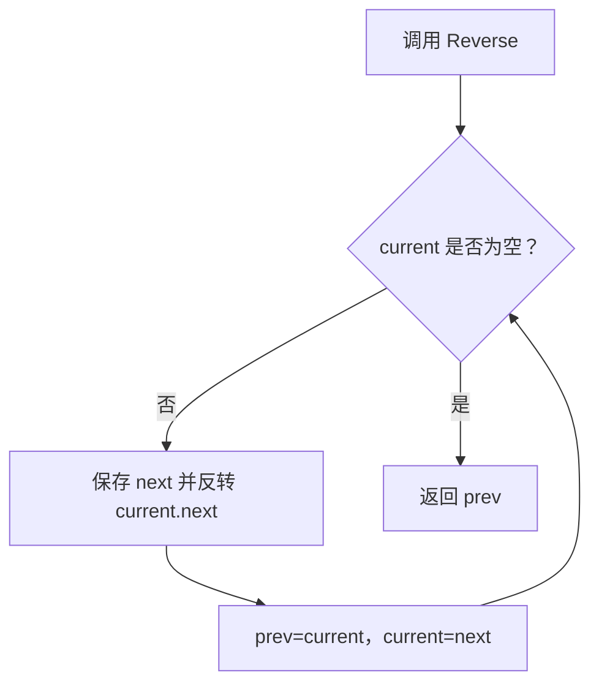
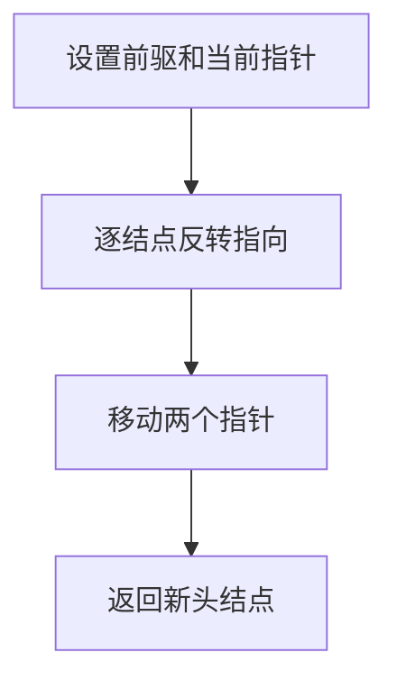

# 6-1 单链表逆转

- **分值：** 20分

## 题目描述

本题要求实现一个函数，将给定的单链表逆转。

## 函数接口定义

```java
static class ListNode {
    int data;
    ListNode next;
    ListNode(int data) { this.data = data; }
}
static ListNode Reverse(ListNode L);
```

ListNode 的 data 保存结点数据，next 指向下一个结点；空指针用 null 表示。

## 裁判测试程序样例

```java
import java.util.*;

public class Main {
    static class ListNode {
        int data; ListNode next;
        ListNode(int data) { this.data = data; }
    }

    static ListNode Reverse(ListNode L) {
        ListNode prev = null;
        while (L != null) {
            ListNode next = L.next;
            L.next = prev;
            prev = L;
            L = next;
        }
        return prev;
    }

    static void print(ListNode p) {
        boolean first = true;
        while (p != null) {
            if (!first) System.out.print(" ");
            System.out.print(p.data);
            first = false;
            p = p.next;
        }
        System.out.println();
    }

    public static void main(String[] args) {
        Scanner sc = new Scanner(System.in);
        int n = sc.nextInt();
        ListNode dummy = new ListNode(0), tail = dummy;
        for (int i = 0; i < n; i++) {
            tail.next = new ListNode(sc.nextInt());
            tail = tail.next;
        }
        ListNode oldHead = dummy.next;
        ListNode newHead = Reverse(oldHead);
        print(oldHead);
        print(newHead);
    }
}
```

## 输入样例
```
5
1 3 4 5 2
```

## 输出样例
```
1
2 5 4 3 1
```

### 函数部分

```java
static ListNode Reverse(ListNode L) {
    ListNode prev = null;
    while (L != null) {
        ListNode next = L.next;
        L.next = prev;
        prev = L;
        L = next;
    }
    return prev;
}
```
### 解题思路

反转链表只需维护 `prev`、`current` 和 `next` 三个指针。每次保存后继，将当前结点指向前驱，再向后移动，最后返回新的头结点。

函数只处理接口规定的输入结构，不重复编写裁判程序中的读入、建表和输出逻辑。

### 代码流程说明

1. 读取函数参数中给出的数据结构起点或边界。
2. 按接口约定遍历、查找或修改数据结构。
3. 遇到空结构、非法位置或边界值时返回题目规定的结果。
4. 返回函数结果；需要打印时只打印题目要求的内容。

### 代码流程图



### 解题流程图



### 复杂度分析

时间 O(n)，空间 O(1)

### 常见易错点

- 修改 Next 前必须先保存后继；空链表直接返回 NULL；返回值是新头结点，原头结点不再是链表头。
- 只提交题目要求的函数，保留接口名称、参数类型和返回类型不变。
- 空结构、单元素结构和边界位置应分别检查。
