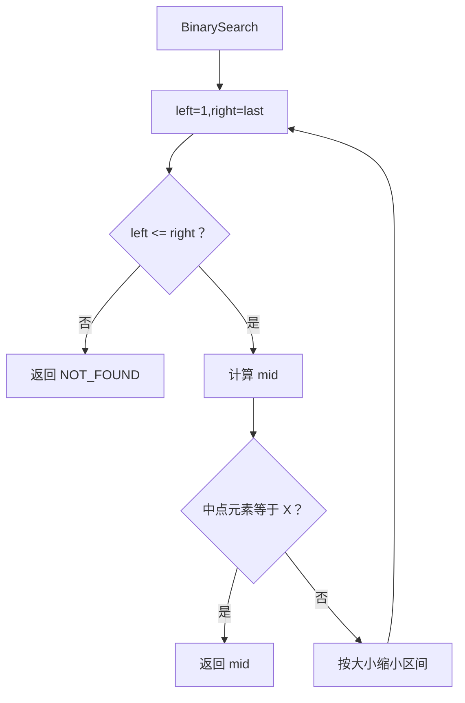
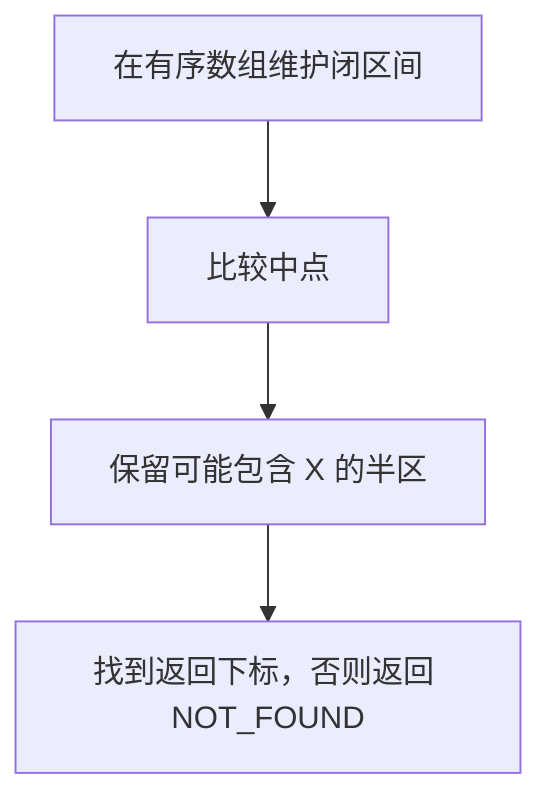

# 6-10 二分查找

- **分值：** 20分

## 题目描述

本题要求实现二分查找算法。

## 函数接口定义

```java
static final int NOT_FOUND = 0;
static class SortedList {
    int[] data;
    int last;
    SortedList(int[] data, int last) {
        this.data = data;
        this.last = last;
    }
}
static int BinarySearch(SortedList L, int X);
```

数据按非递减顺序排列，元素从下标 1 开始存储。找不到时返回 NOT_FOUND。

## 裁判测试程序样例

```java
import java.util.*;

public class Main {
    static final int NOT_FOUND = 0;
    static class SortedList {
        int[] data; int last;
        SortedList(int[] data, int last) { this.data = data; this.last = last; }
    }

    static int BinarySearch(SortedList l, int x) {
        int left = 1, right = l.last;
        while (left <= right) {
            int mid = left + (right - left) / 2;
            if (l.data[mid] == x) return mid;
            if (l.data[mid] < x) left = mid + 1;
            else right = mid - 1;
        }
        return NOT_FOUND;
    }

    public static void main(String[] args) {
        Scanner sc = new Scanner(System.in);
        int n = sc.nextInt();
        int[] data = new int[n + 1];
        for (int i = 1; i <= n; i++) data[i] = sc.nextInt();
        System.out.println(BinarySearch(new SortedList(data, n), sc.nextInt()));
    }
}
```

## 输入样例
```
5
12 31 55 89 101
31
```

## 输出样例
```
2
```

## 输入样例
```
3
26 78 233
31
```

## 输出样例
```
0
```

**鸣谢宁波大学 Eyre-lemon-郎俊杰 同学修正原题！**

### 函数部分

```java
static int BinarySearch(SortedList l, int x) {
    int left = 1, right = l.last;
    while (left <= right) {
        int mid = left + (right - left) / 2;
        if (l.data[mid] == x) return mid;
        if (l.data[mid] < x) left = mid + 1;
        else right = mid - 1;
    }
    return NOT_FOUND;
}
```
### 解题思路

列表从下标 1 开始存储时，维护闭区间 `[Left, Right]`。取中点与 X 比较，缩小一半区间；找到后返回下标，否则返回 `NotFound`。

函数只处理接口规定的输入结构，不重复编写裁判程序中的读入、建表和输出逻辑。

### 代码流程说明

1. 读取函数参数中给出的数据结构起点或边界。
2. 按接口约定遍历、查找或修改数据结构。
3. 遇到空结构、非法位置或边界值时返回题目规定的结果。
4. 返回函数结果；需要打印时只打印题目要求的内容。

### 代码流程图



### 解题流程图



### 复杂度分析

时间 O(log n)，空间 O(1)

### 常见易错点

- 不要从下标 0 开始；区间缩小必须排除 mid；空表时 right 小于 left；数组必须已按非递减序排列。
- 只提交题目要求的函数，保留接口名称、参数类型和返回类型不变。
- 空结构、单元素结构和边界位置应分别检查。
