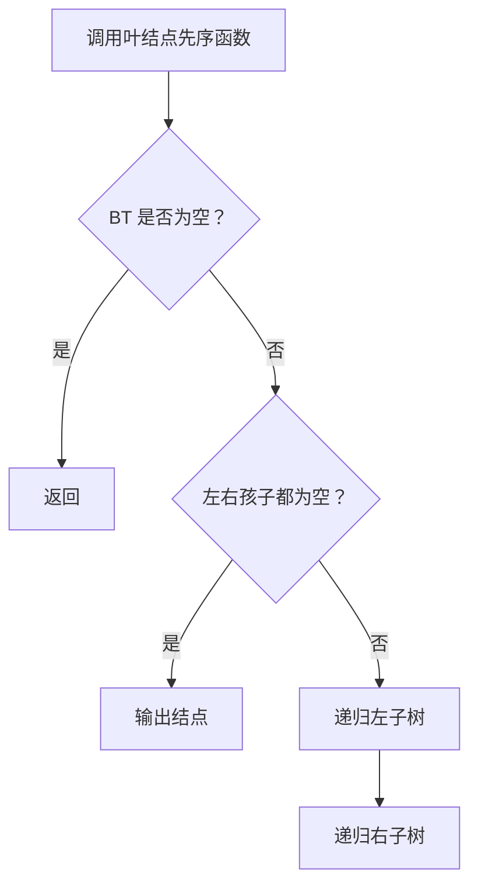
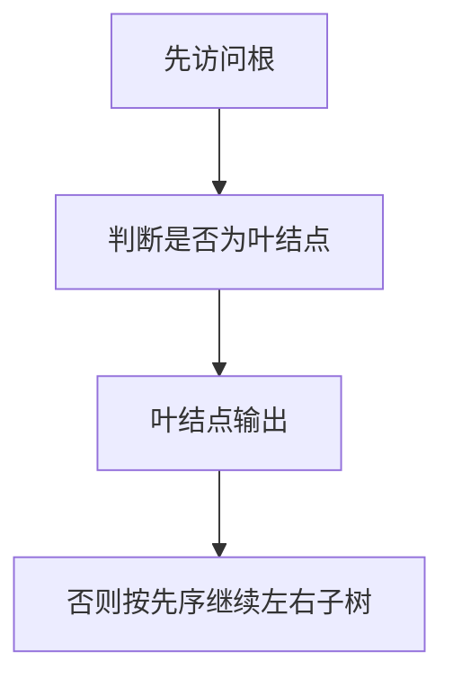

# 6-11 先序输出叶结点

- **分值：** 15分

## 题目描述

本题要求按照先序遍历的顺序输出给定二叉树的叶结点。

## 函数接口定义

```java
static class TreeNode {
    char data;
    TreeNode left, right;
    TreeNode(char data) { this.data = data; }
}
static void PreorderPrintLeaves(TreeNode BT);
```

函数按先序遇到叶结点时输出一个空格和该结点字符。

## 裁判测试程序样例

```java
public class Main {
    static class TreeNode {
        char data; TreeNode left, right;
        TreeNode(char data) { this.data = data; }
    }

    static void PreorderPrintLeaves(TreeNode bt) {
        if (bt == null) return;
        if (bt.left == null && bt.right == null) {
            System.out.print(" " + bt.data);
            return;
        }
        PreorderPrintLeaves(bt.left);
        PreorderPrintLeaves(bt.right);
    }

    static TreeNode sampleTree() {
        TreeNode a = new TreeNode('A');
        a.left = new TreeNode('B');
        a.right = new TreeNode('C');
        a.left.left = new TreeNode('D');
        a.left.right = new TreeNode('F');
        a.left.right.left = new TreeNode('E');
        a.right.left = new TreeNode('G');
        a.right.right = new TreeNode('I');
        a.right.left.right = new TreeNode('H');
        return a;
    }

    public static void main(String[] args) {
        System.out.print("Leaf nodes are:");
        PreorderPrintLeaves(sampleTree());
        System.out.println();
    }
}
```

## 输出样例


```
Leaf nodes are: D E H I
```

### 函数部分

```java
static void PreorderPrintLeaves(TreeNode bt) {
    if (bt == null) return;
    if (bt.left == null && bt.right == null) {
        System.out.print(" " + bt.data);
        return;
    }
    PreorderPrintLeaves(bt.left);
    PreorderPrintLeaves(bt.right);
}
```

### 解题思路

先序遍历中，左右孩子都为空的结点就是叶结点。按根、左、右顺序递归访问即可得到叶结点的先序顺序。

函数只处理接口规定的数据结构，不重复编写裁判程序中的建树和输出逻辑。

### 代码流程说明

1. 接收函数参数并检查空结构。
2. 按接口约定遍历或递归处理数据。
3. 返回结果，或按题目要求输出结点内容。

### 代码流程图



### 解题流程图



### 复杂度分析

时间 O(n)，空间 O(h)

### 常见易错点

- 只有左右孩子都为空才是叶结点；不能把只有一个孩子的结点输出；输出空格要避免格式错误。
- 只提交题目要求的函数，保留方法名、参数和返回类型不变。
- 空树、单结点树和边界情况应分别检查。
