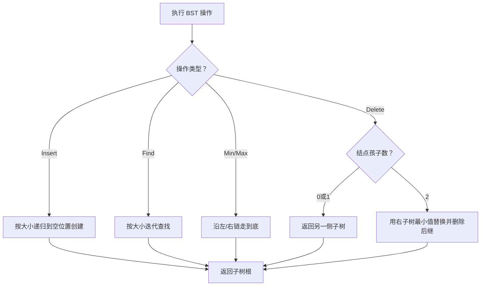
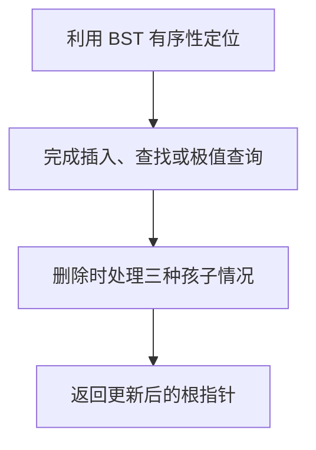

# 6-12 二叉搜索树的操作集

- **分值：** 30分

## 题目描述

本题要求实现给定二叉搜索树的5种常用操作。

## 函数接口定义

```java
static class TreeNode {
    int data;
    TreeNode left, right;
    TreeNode(int data) { this.data = data; }
}
static TreeNode Insert(TreeNode BST, int X);
static TreeNode Delete(TreeNode BST, int X);
static TreeNode Find(TreeNode BST, int X);
static TreeNode FindMin(TreeNode BST);
static TreeNode FindMax(TreeNode BST);
```

Insert 和 Delete 返回修改后的子树根；Find、FindMin、FindMax 找不到时返回 null。

## 裁判测试程序样例

```java
import java.util.*;

public class Main {
    static class TreeNode {
        int data; TreeNode left, right;
        TreeNode(int data) { this.data = data; }
    }

    static TreeNode Insert(TreeNode bst, int x) {
        if (bst == null) return new TreeNode(x);
        if (x < bst.data) bst.left = Insert(bst.left, x);
        else if (x > bst.data) bst.right = Insert(bst.right, x);
        return bst;
    }

    static TreeNode Delete(TreeNode bst, int x) {
        if (bst == null) { System.out.println("Not Found"); return null; }
        if (x < bst.data) bst.left = Delete(bst.left, x);
        else if (x > bst.data) bst.right = Delete(bst.right, x);
        else if (bst.left == null) return bst.right;
        else if (bst.right == null) return bst.left;
        else {
            TreeNode next = FindMin(bst.right);
            bst.data = next.data;
            bst.right = DeleteExisting(bst.right, next.data);
        }
        return bst;
    }

    static TreeNode DeleteExisting(TreeNode bst, int x) {
        if (x < bst.data) bst.left = DeleteExisting(bst.left, x);
        else if (x > bst.data) bst.right = DeleteExisting(bst.right, x);
        else if (bst.left == null) return bst.right;
        else if (bst.right == null) return bst.left;
        else {
            TreeNode next = FindMin(bst.right);
            bst.data = next.data;
            bst.right = DeleteExisting(bst.right, next.data);
        }
        return bst;
    }

    static TreeNode Find(TreeNode bst, int x) {
        while (bst != null) {
            if (x == bst.data) return bst;
            bst = x < bst.data ? bst.left : bst.right;
        }
        return null;
    }

    static TreeNode FindMin(TreeNode bst) {
        if (bst == null) return null;
        while (bst.left != null) bst = bst.left;
        return bst;
    }

    static TreeNode FindMax(TreeNode bst) {
        if (bst == null) return null;
        while (bst.right != null) bst = bst.right;
        return bst;
    }

    static void preorder(TreeNode p) {
        if (p == null) return;
        System.out.print(" " + p.data);
        preorder(p.left); preorder(p.right);
    }

    static void inorder(TreeNode p) {
        if (p == null) return;
        inorder(p.left); System.out.print(" " + p.data); inorder(p.right);
    }

    public static void main(String[] args) {
        Scanner sc = new Scanner(System.in);
        TreeNode bst = null;
        int n = sc.nextInt();
        while (n-- > 0) bst = Insert(bst, sc.nextInt());
        System.out.print("Preorder:"); preorder(bst); System.out.println();
        TreeNode min = FindMin(bst), max = FindMax(bst);
        n = sc.nextInt();
        while (n-- > 0) {
            int x = sc.nextInt();
            TreeNode p = Find(bst, x);
            if (p == null) System.out.println(x + " is not found");
            else {
                System.out.println(x + " is found");
                if (p == min) System.out.println(x + " is the smallest key");
                if (p == max) System.out.println(x + " is the largest key");
            }
        }
        n = sc.nextInt();
        while (n-- > 0) bst = Delete(bst, sc.nextInt());
        System.out.print("Inorder:"); inorder(bst); System.out.println();
    }
}
```

## 输入样例
```
10
5 8 6 2 4 1 0 10 9 7
5
6 3 10 0 5
5
5 7 0 10 3
```

## 输出样例
```
Preorder: 5 2 1 0 4 8 6 7 10 9
6 is found
3 is not found
10 is found
10 is the largest key
0 is found
0 is the smallest key
5 is found
Not Found
Inorder: 1 2 4 6 8 9
```

### 函数部分

```java
static TreeNode Insert(TreeNode bst, int x) {
    if (bst == null) return new TreeNode(x);
    if (x < bst.data) bst.left = Insert(bst.left, x);
    else if (x > bst.data) bst.right = Insert(bst.right, x);
    return bst;
}

static TreeNode Delete(TreeNode bst, int x) {
    if (bst == null) { System.out.println("Not Found"); return null; }
    if (x < bst.data) bst.left = Delete(bst.left, x);
    else if (x > bst.data) bst.right = Delete(bst.right, x);
    else if (bst.left == null) return bst.right;
    else if (bst.right == null) return bst.left;
    else {
        TreeNode next = FindMin(bst.right);
        bst.data = next.data;
        bst.right = DeleteExisting(bst.right, next.data);
    }
    return bst;
}

static TreeNode DeleteExisting(TreeNode bst, int x) {
    if (x < bst.data) bst.left = DeleteExisting(bst.left, x);
    else if (x > bst.data) bst.right = DeleteExisting(bst.right, x);
    else if (bst.left == null) return bst.right;
    else if (bst.right == null) return bst.left;
    else {
        TreeNode next = FindMin(bst.right);
        bst.data = next.data;
        bst.right = DeleteExisting(bst.right, next.data);
    }
    return bst;
}

static TreeNode Find(TreeNode bst, int x) {
    while (bst != null) {
        if (x == bst.data) return bst;
        bst = x < bst.data ? bst.left : bst.right;
    }
    return null;
}

static TreeNode FindMin(TreeNode bst) {
    if (bst == null) return null;
    while (bst.left != null) bst = bst.left;
    return bst;
}

static TreeNode FindMax(TreeNode bst) {
    if (bst == null) return null;
    while (bst.right != null) bst = bst.right;
    return bst;
}
```
### 解题思路

插入、查找、最小值和最大值都利用 BST 的有序性质递归或迭代完成。删除时分三种情况：无左子树、无右子树直接返回另一侧；两个孩子都存在时，用右子树最小结点替换当前值，再删除该后继。

函数只处理接口规定的输入结构，不重复编写裁判程序中的读入、建表和输出逻辑。

### 代码流程说明

1. 读取函数参数中给出的数据结构起点或边界。
2. 按接口约定遍历、查找或修改数据结构。
3. 遇到空结构、非法位置或边界值时返回题目规定的结果。
4. 返回函数结果；需要打印时只打印题目要求的内容。

### 代码流程图



### 解题流程图



### 复杂度分析

平均时间 O(log n)，最坏 O(n)；递归空间 O(h)

### 常见易错点

- 删除后必须返回新的子树根；两个孩子时要复制后继值并再次删除后继；重复键的放置规则要一致；FindMin/FindMax 处理空树要返回 NULL。
- 只提交题目要求的函数，保留接口名称、参数类型和返回类型不变。
- 空结构、单元素结构和边界位置应分别检查。
