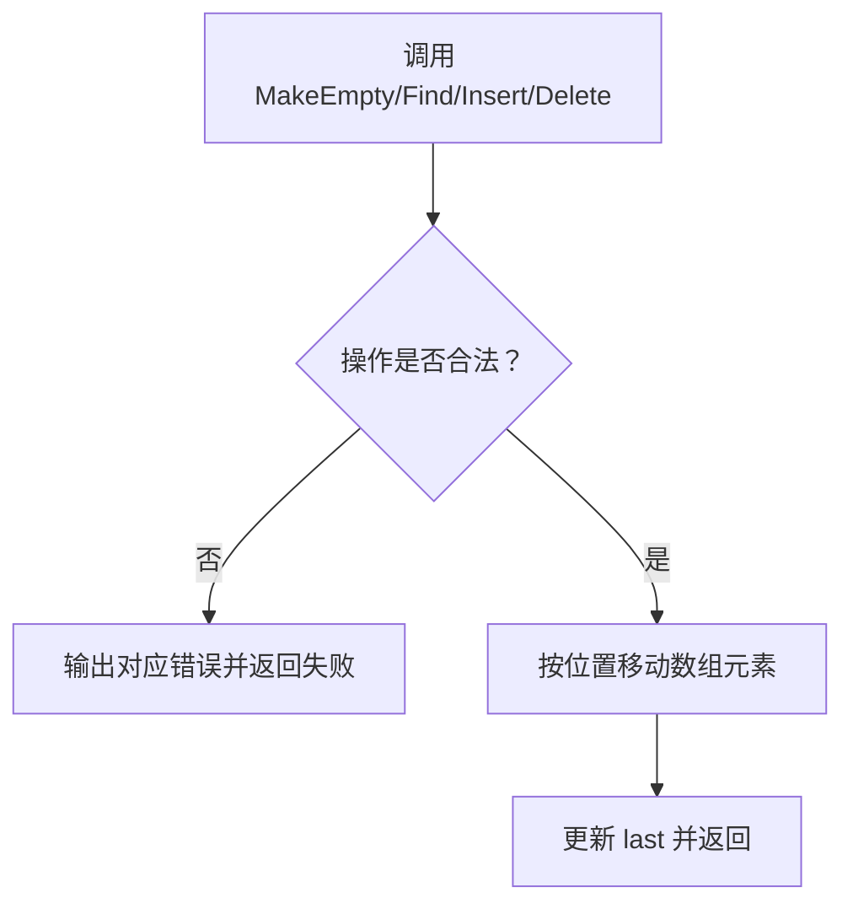
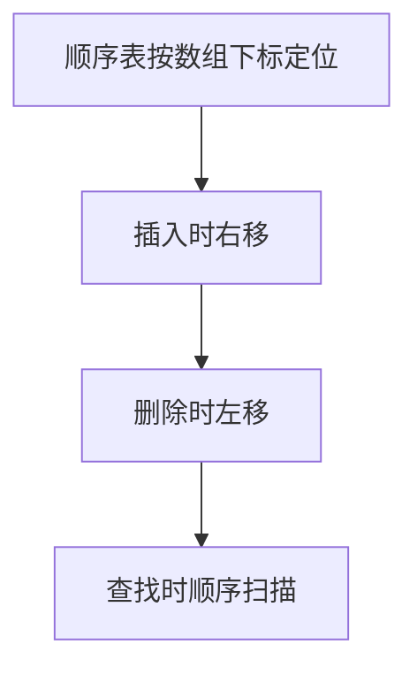

# 6-2 顺序表操作集

- **分值：** 20分

## 题目描述

本题要求实现顺序表的操作集。

## 函数接口定义

```java
// 实现原理：顺序表按数组下标管理。Find 顺序扫描；Insert 检查容量和位置后，将插入点及其后的元素右移；Delete 检查位置后左移覆盖被删元素，并减少
// LastIndex。
static final int MAXSIZE = 5;
static final int ERROR = -1;

static class ArrayListData {
  int[] data = new int[MAXSIZE];
  int last = -1;
}

static ArrayListData MakeEmpty();

static int Find(ArrayListData L, int X);

static boolean Insert(ArrayListData L, int X, int P);

static boolean Delete(ArrayListData L, int P);
```

last 保存最后一个有效元素的下标，位置从 0 开始。

## 裁判测试程序样例

```java
// 实现原理：顺序表按数组下标管理。Find 顺序扫描；Insert 检查容量和位置后，将插入点及其后的元素右移；Delete 检查位置后左移覆盖被删元素，并减少
// LastIndex。
import java.util.*;

public class Main {
  static final int MAXSIZE = 5, ERROR = -1;

  static class ArrayListData {
    int[] data = new int[MAXSIZE];
    int last = -1;
  }

  static ArrayListData MakeEmpty() {
    return new ArrayListData();
  }

  static int Find(ArrayListData L, int x) {
    for (int i = 0; i <= L.last; i++) if (L.data[i] == x) return i;
    return ERROR;
  }

  static boolean Insert(ArrayListData L, int x, int p) {
    if (L.last + 1 == MAXSIZE) {
      System.out.print("FULL");
      return false;
    }
    if (p < 0 || p > L.last + 1) {
      System.out.print("ILLEGAL POSITION");
      return false;
    }
    for (int i = L.last; i >= p; i--) L.data[i + 1] = L.data[i];
    L.data[p] = x;
    L.last++;
    return true;
  }

  static boolean Delete(ArrayListData L, int p) {
    if (p < 0 || p > L.last) {
      System.out.print("POSITION " + p + " EMPTY");
      return false;
    }
    for (int i = p; i < L.last; i++) L.data[i] = L.data[i + 1];
    L.last--;
    return true;
  }

  public static void main(String[] args) {
    Scanner sc = new Scanner(System.in);
    ArrayListData l = MakeEmpty();
    int n = sc.nextInt();
    while (n-- > 0) {
      int x = sc.nextInt();
      if (!Insert(l, x, 0)) System.out.print(" Insertion Error: " + x + " is not in.\n");
    }
    n = sc.nextInt();
    while (n-- > 0) {
      int x = sc.nextInt(), p = Find(l, x);
      if (p == ERROR) System.out.println("Finding Error: " + x + " is not in.");
      else System.out.println(x + " is at position " + p + ".");
    }
    n = sc.nextInt();
    while (n-- > 0) {
      int p = sc.nextInt();
      if (!Delete(l, p)) System.out.print(" Deletion Error.\n");
      if (!Insert(l, 0, p)) System.out.print(" Insertion Error: 0 is not in.\n");
    }
  }
}
```

## 输入样例
```
6
1 2 3 4 5 6
3
6 5 1
2
-1 6
```

## 输出样例
```
FULL Insertion Error: 6 is not in.
Finding Error: 6 is not in.
5 is at position 0.
1 is at position 4.
POSITION -1 EMPTY Deletion Error.
FULL Insertion Error: 0 is not in.
POSITION 6 EMPTY Deletion Error.
FULL Insertion Error: 0 is not in.
```

### 函数部分

```java
// 实现原理：顺序表按数组下标管理。Find 顺序扫描；Insert 检查容量和位置后，将插入点及其后的元素右移；Delete 检查位置后左移覆盖被删元素，并减少
// LastIndex。
static ArrayListData MakeEmpty() {
  return new ArrayListData();
}

static int Find(ArrayListData L, int x) {
  for (int i = 0; i <= L.last; i++) if (L.data[i] == x) return i;
  return ERROR;
}

static boolean Insert(ArrayListData L, int x, int p) {
  if (L.last + 1 == MAXSIZE) {
    System.out.print("FULL");
    return false;
  }
  if (p < 0 || p > L.last + 1) {
    System.out.print("ILLEGAL POSITION");
    return false;
  }
  for (int i = L.last; i >= p; i--) L.data[i + 1] = L.data[i];
  L.data[p] = x;
  L.last++;
  return true;
}

static boolean Delete(ArrayListData L, int p) {
  if (p < 0 || p > L.last) {
    System.out.print("POSITION " + p + " EMPTY");
    return false;
  }
  for (int i = p; i < L.last; i++) L.data[i] = L.data[i + 1];
  L.last--;
  return true;
}
```
### 解题思路

顺序表按数组下标管理。`Find` 顺序扫描；`Insert` 检查容量和位置后，将插入点及其后的元素右移；`Delete` 检查位置后左移覆盖被删元素，并减少 LastIndex。

函数只处理接口规定的输入结构，不重复编写裁判程序中的读入、建表和输出逻辑。

### 代码流程说明

1. 读取函数参数中给出的数据结构起点或边界。
2. 按接口约定遍历、查找或修改数据结构。
3. 遇到空结构、非法位置或边界值时返回题目规定的结果。
4. 返回函数结果；需要打印时只打印题目要求的内容。

### 代码流程图



### 解题流程图



### 复杂度分析

查找 O(n)，插入/删除 O(n)，额外空间 O(1)

### 常见易错点

- 位置边界要区分首位、末位和表尾后一位；移动方向错误会覆盖数据；满表插入和空表删除要返回失败。
- 只提交题目要求的函数，保留接口名称、参数类型和返回类型不变。
- 空结构、单元素结构和边界位置应分别检查。
