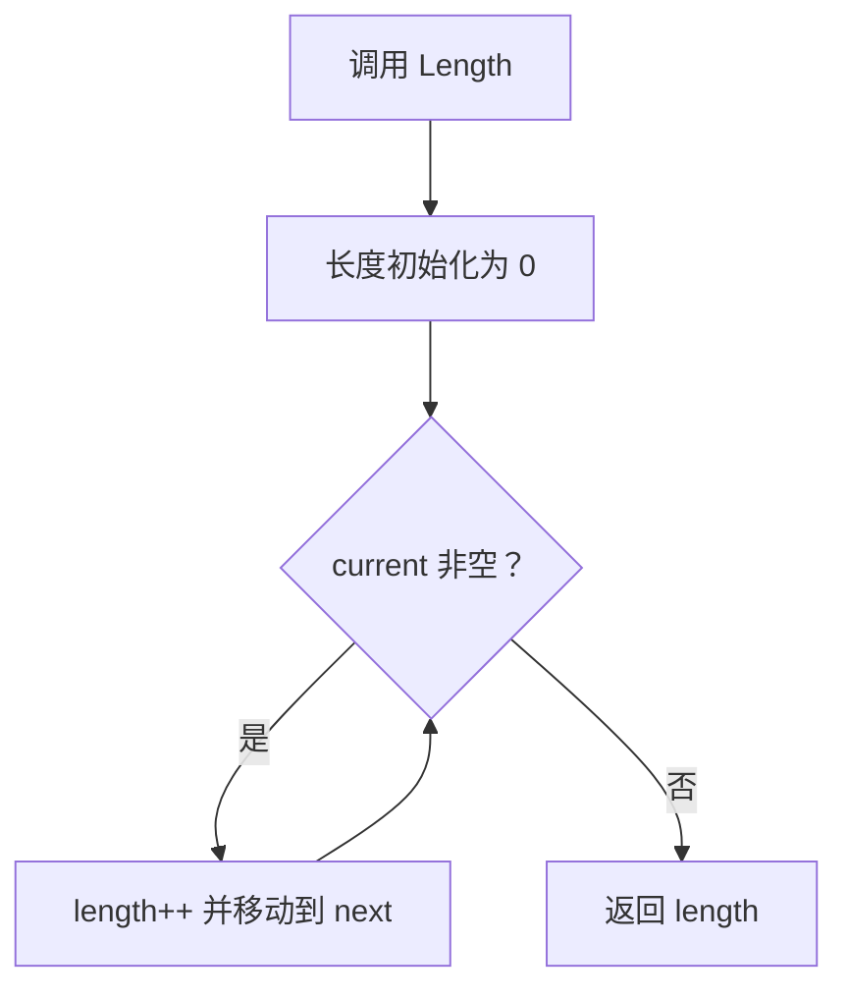
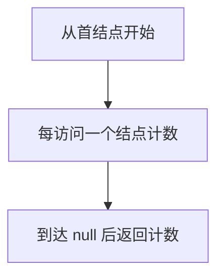

# 6-3 求链式表的表长

- **分值：** 10分

## 题目描述

本题要求实现一个函数，求链式表的表长。

## 函数接口定义

```java
// 实现原理：从链表头开始顺序移动指针，每访问一个结点计数一次，直到 NULL，计数值就是表长。
static class ListNode {
  int data;
  ListNode next;

  ListNode(int data) {
    this.data = data;
  }
}

static int Length(ListNode L);
```

函数返回从 L 开始的有效结点数量；空链表长度为 0。

## 裁判测试程序样例

```java
// 实现原理：从链表头开始顺序移动指针，每访问一个结点计数一次，直到 NULL，计数值就是表长。
import java.util.*;

public class Main {
  static class ListNode {
    int data;
    ListNode next;

    ListNode(int data) {
      this.data = data;
    }
  }

  static int Length(ListNode L) {
    int length = 0;
    for (ListNode p = L; p != null; p = p.next) length++;
    return length;
  }

  public static void main(String[] args) {
    Scanner sc = new Scanner(System.in);
    ListNode dummy = new ListNode(0), tail = dummy;
    while (sc.hasNextInt()) {
      int x = sc.nextInt();
      if (x < 0) break;
      tail.next = new ListNode(x);
      tail = tail.next;
    }
    System.out.println(Length(dummy.next));
  }
}
```

## 输入样例
```
1 3 4 5 2 -1
```

## 输出样例
```
5
```

### 函数部分

```java
// 实现原理：从链表头开始顺序移动指针，每访问一个结点计数一次，直到 NULL，计数值就是表长。
static int Length(ListNode L) {
  int length = 0;
  for (ListNode p = L; p != null; p = p.next) length++;
  return length;
}
```
### 解题思路

从链表头开始顺序移动指针，每访问一个结点计数一次，直到 NULL，计数值就是表长。

函数只处理接口规定的输入结构，不重复编写裁判程序中的读入、建表和输出逻辑。

### 代码流程说明

1. 读取函数参数中给出的数据结构起点或边界。
2. 按接口约定遍历、查找或修改数据结构。
3. 遇到空结构、非法位置或边界值时返回题目规定的结果。
4. 返回函数结果；需要打印时只打印题目要求的内容。

### 代码流程图



### 解题流程图



### 复杂度分析

时间 O(n)，空间 O(1)

### 常见易错点

- 不要把头结点（若题目无头结点）额外计数；空链表长度为 0；遍历后必须移动到 Next。
- 只提交题目要求的函数，保留接口名称、参数类型和返回类型不变。
- 空结构、单元素结构和边界位置应分别检查。
