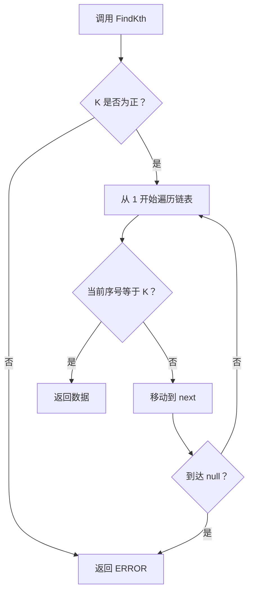
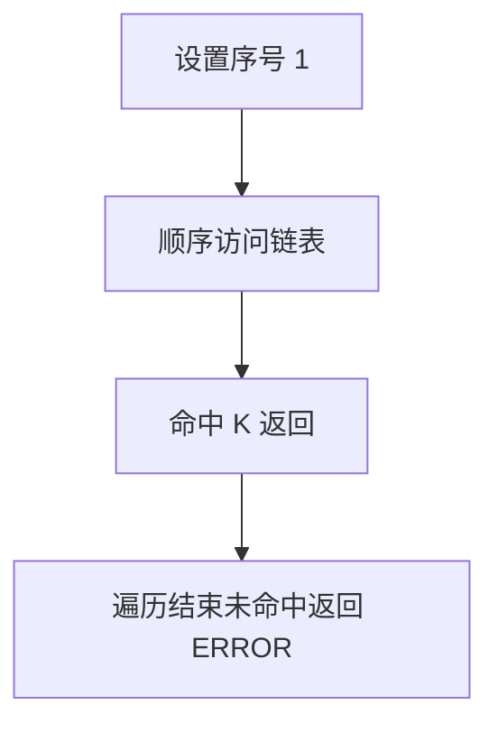

# 6-4 链式表的按序号查找

- **分值：** 10分

## 题目描述

本题要求实现一个函数，找到并返回链式表的第K个元素。

## 函数接口定义

```java
static final int ERROR = -1;
static class ListNode {
    int data;
    ListNode next;
    ListNode(int data) { this.data = data; }
}
static int FindKth(ListNode L, int K);
```

K 从 1 开始计数；找不到时返回 ERROR。

## 裁判测试程序样例

```java
import java.util.*;

public class Main {
    static final int ERROR = -1;
    static class ListNode {
        int data; ListNode next;
        ListNode(int data) { this.data = data; }
    }

    static int FindKth(ListNode L, int k) {
        if (k <= 0) return ERROR;
        for (int index = 1; L != null; L = L.next, index++)
            if (index == k) return L.data;
        return ERROR;
    }

    public static void main(String[] args) {
        Scanner sc = new Scanner(System.in);
        int k = sc.nextInt();
        ListNode dummy = new ListNode(0), tail = dummy;
        while (sc.hasNextInt()) {
            int x = sc.nextInt();
            if (x < 0) break;
            tail.next = new ListNode(x);
            tail = tail.next;
        }
        int ans = FindKth(dummy.next, k);
        System.out.println(ans == ERROR ? "ERROR" : ans);
    }
}
```

## 输入样例
```
1 3 4 5 2 -1
6
3 6 1 5 4 2
```

## 输出样例
```
4 NA 1 2 5 3
```

### 函数部分

```java
static int FindKth(ListNode L, int k) {
    if (k <= 0) return ERROR;
    for (int index = 1; L != null; L = L.next, index++)
        if (index == k) return L.data;
    return ERROR;
}
```
### 解题思路

链式表不支持随机访问，因此从首结点开始计数。计数达到 K 时返回当前数据；走到链尾仍未达到 K，则返回 `ERROR`。

函数只处理接口规定的输入结构，不重复编写裁判程序中的读入、建表和输出逻辑。

### 代码流程说明

1. 读取函数参数中给出的数据结构起点或边界。
2. 按接口约定遍历、查找或修改数据结构。
3. 遇到空结构、非法位置或边界值时返回题目规定的结果。
4. 返回函数结果；需要打印时只打印题目要求的内容。

### 代码流程图



### 解题流程图



### 复杂度分析

时间 O(min(K,n))，空间 O(1)

### 常见易错点

- K 通常从 1 开始而不是 0；不能使用数组下标直接访问链表；K 超出长度、K 非法和空链表都应返回 ERROR。
- 只提交题目要求的函数，保留接口名称、参数类型和返回类型不变。
- 空结构、单元素结构和边界位置应分别检查。
