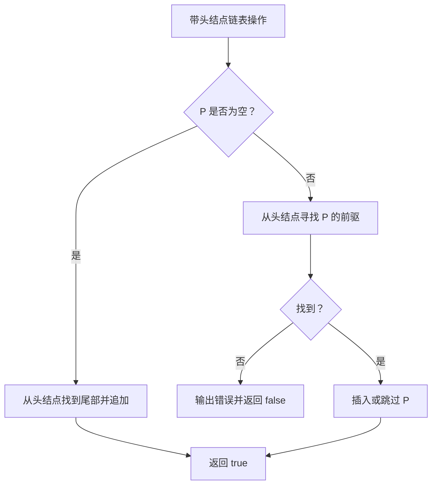
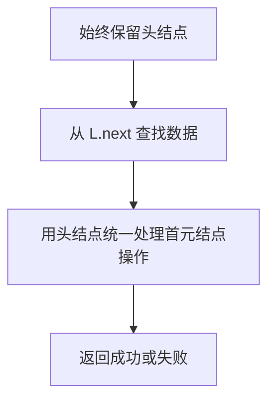

## 6-6 带头结点的链式表操作集

- **分值：** 20分

## 题目描述

本题要求实现带头结点的链式表操作集。

## 函数接口定义

```java
// 实现原理：带头结点链表的首元结点是 L->Next，头结点本身不存有效数据。所有操作先从头结点或其后开始查找前驱，插入删除无需改变头指针。
static class ListNode {
  int data;
  ListNode next;

  ListNode(int data) {
    this.data = data;
  }
}

static ListNode MakeEmpty();

static ListNode Find(ListNode L, int X);

static boolean Insert(ListNode L, int X, ListNode P);

static boolean Delete(ListNode L, ListNode P);
```

L 是带头结点的链表，头结点不保存有效数据；首个数据结点为 L.next。

## 裁判测试程序样例

```java
// 实现原理：带头结点链表的首元结点是 L->Next，头结点本身不存有效数据。所有操作先从头结点或其后开始查找前驱，插入删除无需改变头指针。
import java.util.*;

public class Main {
  static class ListNode {
    int data;
    ListNode next;

    ListNode(int data) {
      this.data = data;
    }
  }

  static ListNode MakeEmpty() {
    return new ListNode(0);
  }

  static ListNode Find(ListNode L, int x) {
    for (ListNode p = L.next; p != null; p = p.next) if (p.data == x) return p;
    return null;
  }

  static boolean Insert(ListNode L, int x, ListNode p) {
    if (L == null) return false;
    if (p == null) {
      ListNode tail = L;
      while (tail.next != null) tail = tail.next;
      tail.next = new ListNode(x);
      return true;
    }
    ListNode prev = L;
    while (prev.next != null && prev.next != p) prev = prev.next;
    if (prev.next != p) {
      System.out.println("Wrong Position for Insertion");
      return false;
    }
    ListNode node = new ListNode(x);
    node.next = p;
    prev.next = node;
    return true;
  }

  static boolean Delete(ListNode L, ListNode p) {
    if (L == null || p == null) {
      System.out.println("Wrong Position for Deletion");
      return false;
    }
    ListNode prev = L;
    while (prev.next != null && prev.next != p) prev = prev.next;
    if (prev.next != p) {
      System.out.println("Wrong Position for Deletion");
      return false;
    }
    prev.next = p.next;
    return true;
  }

  public static void main(String[] args) {
    Scanner sc = new Scanner(System.in);
    ListNode head = MakeEmpty();
    int n = sc.nextInt();
    while (n-- > 0) {
      if (!Insert(head, sc.nextInt(), head.next)) System.out.println("Wrong Answer");
    }
    int x = 0;
    n = sc.nextInt();
    while (n-- > 0) {
      x = sc.nextInt();
      ListNode p = Find(head, x);
      if (p == null) System.out.println("Finding Error: " + x + " is not in.");
      else {
        boolean ok = Delete(head, p);
        System.out.println(x + " is found and deleted.");
        if (!ok) System.out.println("Wrong Answer.");
      }
    }
    boolean ok = Insert(head, x, null);
    if (!ok) System.out.println("Wrong Answer");
    else System.out.println(x + " is inserted as the last element.");
    ListNode invalid = new ListNode(0);
    if (Insert(head, x, invalid)) System.out.println("Wrong Answer");
    if (Delete(head, invalid)) System.out.println("Wrong Answer");
    for (ListNode p = head.next; p != null; p = p.next) System.out.print(p.data + " ");
  }
}
```

## 输入样例
```
6
12 2 4 87 10 2
4
2 12 87 5
```

## 输出样例
```
2 is found and deleted.
12 is found and deleted.
87 is found and deleted.
Finding Error: 5 is not in.
5 is inserted as the last element.
Wrong Position for Insertion
Wrong Position for Deletion
10 4 2 5
```

## 函数部分

```java
// 实现原理：带头结点链表的首元结点是 L->Next，头结点本身不存有效数据。所有操作先从头结点或其后开始查找前驱，插入删除无需改变头指针。
static ListNode MakeEmpty() {
  return new ListNode(0);
}

static ListNode Find(ListNode L, int x) {
  for (ListNode p = L.next; p != null; p = p.next) if (p.data == x) return p;
  return null;
}

static boolean Insert(ListNode L, int x, ListNode p) {
  if (L == null) return false;
  if (p == null) {
    ListNode tail = L;
    while (tail.next != null) tail = tail.next;
    tail.next = new ListNode(x);
    return true;
  }
  ListNode prev = L;
  while (prev.next != null && prev.next != p) prev = prev.next;
  if (prev.next != p) {
    System.out.println("Wrong Position for Insertion");
    return false;
  }
  ListNode node = new ListNode(x);
  node.next = p;
  prev.next = node;
  return true;
}

static boolean Delete(ListNode L, ListNode p) {
  if (L == null || p == null) {
    System.out.println("Wrong Position for Deletion");
    return false;
  }
  ListNode prev = L;
  while (prev.next != null && prev.next != p) prev = prev.next;
  if (prev.next != p) {
    System.out.println("Wrong Position for Deletion");
    return false;
  }
  prev.next = p.next;
  return true;
}
```
## 解题思路

带头结点链表的首元结点是 `L->Next`，头结点本身不存有效数据。所有操作先从头结点或其后开始查找前驱，插入删除无需改变头指针。

函数只处理接口规定的输入结构，不重复编写裁判程序中的读入、建表和输出逻辑。

## 代码流程说明

1. 读取函数参数中给出的数据结构起点或边界。
2. 按接口约定遍历、查找或修改数据结构。
3. 遇到空结构、非法位置或边界值时返回题目规定的结果。
4. 返回函数结果；需要打印时只打印题目要求的内容。

## 代码流程图



## 解题流程图



## 复杂度分析

查找、插入、删除均为 O(n)，额外空间 O(1)（不计新结点）

## 常见易错点

- 不要把头结点作为数据结点输出；P 的合法范围是首元结点到链尾；删除时不能释放头结点；空表判断应使用 L->Next。
- 只提交题目要求的函数，保留接口名称、参数类型和返回类型不变。
- 空结构、单元素结构和边界位置应分别检查。
