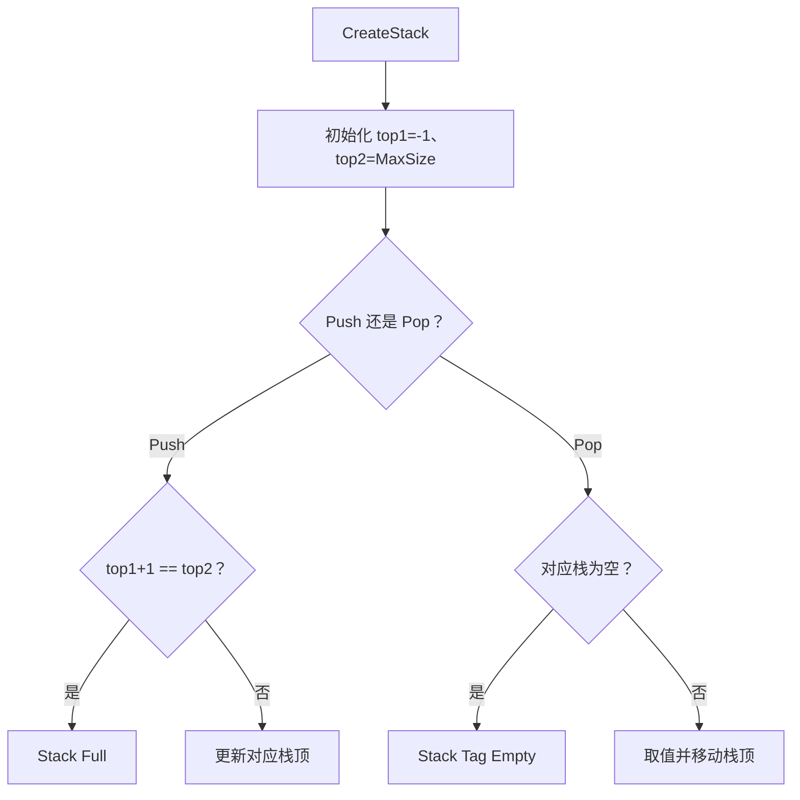
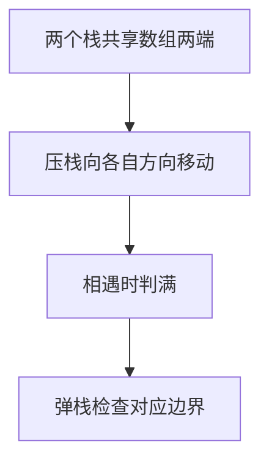

## 6-7 在一个数组中实现两个堆栈

- **分值：** 20分

## 题目描述

本题要求在一个数组中实现两个堆栈。

## 函数接口定义

```java
// 实现原理：两个栈共享一个数组：栈 1 从低下标向上增长，栈 2 从高下标向下增长。只要两个栈顶之间仍有空位就能压栈；分别根据 Tag 更新对应栈顶，弹出时检查对应栈空。
static final int ERROR = 100000000;

static class TwoStack {
  int[] data;
  int top1, top2;

  TwoStack(int maxSize) {
    data = new int[maxSize];
    top1 = -1;
    top2 = maxSize;
  }
}

static TwoStack CreateStack(int MaxSize);

static boolean Push(TwoStack S, int X, int Tag);

static int Pop(TwoStack S, int Tag);
```

栈 1 从数组左端增长，栈 2 从右端增长；Tag 只能为 1 或 2。

## 裁判测试程序样例

```java
// 实现原理：两个栈共享一个数组：栈 1 从低下标向上增长，栈 2 从高下标向下增长。只要两个栈顶之间仍有空位就能压栈；分别根据 Tag 更新对应栈顶，弹出时检查对应栈空。
import java.util.*;

public class Main {
  static final int ERROR = 100000000;

  static class TwoStack {
    int[] data;
    int top1, top2;

    TwoStack(int n) {
      data = new int[n];
      top1 = -1;
      top2 = n;
    }
  }

  static TwoStack CreateStack(int maxSize) {
    return new TwoStack(maxSize);
  }

  static boolean Push(TwoStack s, int x, int tag) {
    if (s.top1 + 1 == s.top2) {
      System.out.print("Stack Full");
      return false;
    }
    if (tag == 1) s.data[++s.top1] = x;
    else if (tag == 2) s.data[--s.top2] = x;
    else return false;
    return true;
  }

  static int Pop(TwoStack s, int tag) {
    if (tag == 1) {
      if (s.top1 < 0) {
        System.out.print("Stack 1 Empty");
        return ERROR;
      }
      return s.data[s.top1--];
    }
    if (tag == 2) {
      if (s.top2 == s.data.length) {
        System.out.print("Stack 2 Empty");
        return ERROR;
      }
      return s.data[s.top2++];
    }
    return ERROR;
  }

  static void PrintStack(TwoStack s, int tag) {
    System.out.print("Pop from Stack " + tag + ":");
    if (tag == 1) {
      for (int i = s.top1; i >= 0; i--) System.out.print(" " + s.data[i]);
    } else {
      for (int i = s.top2; i < s.data.length; i++) System.out.print(" " + s.data[i]);
    }
    System.out.println();
  }

  public static void main(String[] args) {
    Scanner sc = new Scanner(System.in);
    TwoStack s = CreateStack(sc.nextInt());
    while (sc.hasNext()) {
      String op = sc.next();
      if (op.equalsIgnoreCase("End")) break;
      int tag = sc.nextInt();
      if (op.equalsIgnoreCase("Push")) {
        int x = sc.nextInt();
        if (!Push(s, x, tag)) System.out.println("Stack " + tag + " is Full!");
      } else if (op.equalsIgnoreCase("Pop")) {
        int x = Pop(s, tag);
        if (x == ERROR) System.out.println("Stack " + tag + " is Empty!");
      }
    }
    PrintStack(s, 1);
    PrintStack(s, 2);
  }
}
```

## 输入样例
```
5
Push 1 1
Pop 2
Push 2 11
Push 1 2
Push 2 12
Pop 1
Push 2 13
Push 2 14
Push 1 3
Pop 2
End
```

## 输出样例
```
Stack 2 Empty
Stack 2 is Empty!
Stack Full
Stack 1 is Full!
Pop from Stack 1: 1
Pop from Stack 2: 13 12 11
```

## 函数部分

```java
// 实现原理：两个栈共享一个数组：栈 1 从低下标向上增长，栈 2 从高下标向下增长。只要两个栈顶之间仍有空位就能压栈；分别根据 Tag 更新对应栈顶，弹出时检查对应栈空。
static TwoStack CreateStack(int maxSize) {
  return new TwoStack(maxSize);
}

static boolean Push(TwoStack s, int x, int tag) {
  if (s.top1 + 1 == s.top2) {
    System.out.print("Stack Full");
    return false;
  }
  if (tag == 1) s.data[++s.top1] = x;
  else if (tag == 2) s.data[--s.top2] = x;
  else return false;
  return true;
}

static int Pop(TwoStack s, int tag) {
  if (tag == 1) {
    if (s.top1 < 0) {
      System.out.print("Stack 1 Empty");
      return ERROR;
    }
    return s.data[s.top1--];
  }
  if (tag == 2) {
    if (s.top2 == s.data.length) {
      System.out.print("Stack 2 Empty");
      return ERROR;
    }
    return s.data[s.top2++];
  }
  return ERROR;
}
```
## 解题思路

两个栈共享一个数组：栈 1 从低下标向上增长，栈 2 从高下标向下增长。只要两个栈顶之间仍有空位就能压栈；分别根据 Tag 更新对应栈顶，弹出时检查对应栈空。

函数只处理接口规定的输入结构，不重复编写裁判程序中的读入、建表和输出逻辑。

## 代码流程说明

1. 读取函数参数中给出的数据结构起点或边界。
2. 按接口约定遍历、查找或修改数据结构。
3. 遇到空结构、非法位置或边界值时返回题目规定的结果。
4. 返回函数结果；需要打印时只打印题目要求的内容。

## 代码流程图



## 解题流程图



## 复杂度分析

每次 Push/Pop O(1)，空间 O(MaxSize)

## 常见易错点

- 两个栈共享的是同一个空位判断；栈 2 的增长方向与栈 1 相反；Tag 只能是 1 或 2；空栈弹出要返回 ERROR。
- 只提交题目要求的函数，保留接口名称、参数类型和返回类型不变。
- 空结构、单元素结构和边界位置应分别检查。
