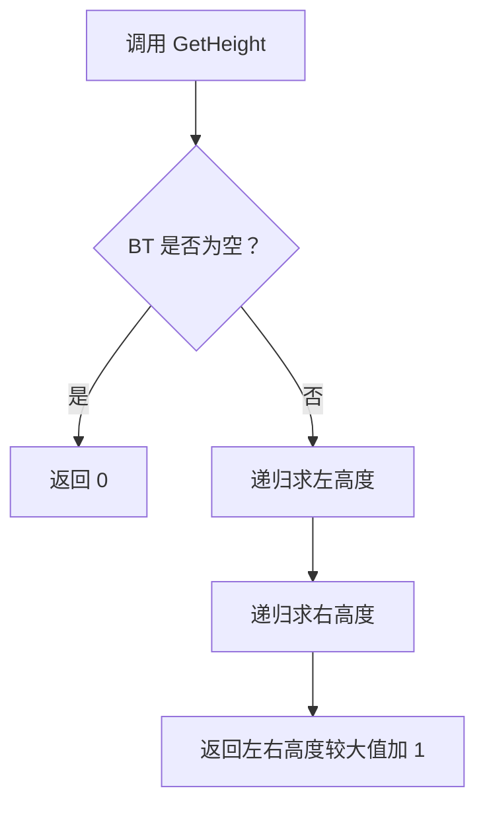
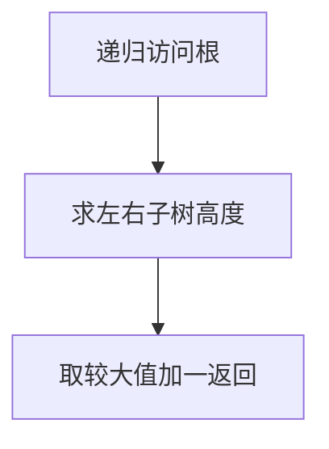

# 6-8 求二叉树高度

- **分值：** 20分

## 题目描述

本题要求给定二叉树的高度。

## 函数接口定义

```java
static class TreeNode {
    char data;
    TreeNode left, right;
    TreeNode(char data) { this.data = data; }
}
static int GetHeight(TreeNode BT);
```

空树高度为 0，只有根结点的树高度为 1。

## 裁判测试程序样例

```java
public class Main {
    static class TreeNode {
        char data; TreeNode left, right;
        TreeNode(char data) { this.data = data; }
    }

    static int GetHeight(TreeNode bt) {
        if (bt == null) return 0;
        return 1 + Math.max(GetHeight(bt.left), GetHeight(bt.right));
    }

    static TreeNode sampleTree() {
        TreeNode a = new TreeNode('A');
        a.left = new TreeNode('B');
        a.right = new TreeNode('C');
        a.left.left = new TreeNode('D');
        a.left.right = new TreeNode('F');
        a.left.right.left = new TreeNode('E');
        a.right.left = new TreeNode('G');
        a.right.right = new TreeNode('I');
        a.right.left.right = new TreeNode('H');
        return a;
    }

    public static void main(String[] args) {
        System.out.println(GetHeight(sampleTree()));
    }
}
```

## 输出样例


```
4
```

### 函数部分

```java
static int GetHeight(TreeNode bt) {
    if (bt == null) return 0;
    return 1 + Math.max(GetHeight(bt.left), GetHeight(bt.right));
}
```

### 解题思路

二叉树高度的递归定义是：空树高度为 0，非空树高度为左右子树高度较大者加 1。

函数只处理接口规定的数据结构，不重复编写裁判程序中的建树和输出逻辑。

### 代码流程说明

1. 接收函数参数并检查空结构。
2. 按接口约定遍历或递归处理数据。
3. 返回结果，或按题目要求输出结点内容。

### 代码流程图



### 解题流程图



### 复杂度分析

时间 O(n)，空间 O(h)

### 常见易错点

- 空树不能返回 1；高度按结点层数计算；递归时要同时检查左右子树。
- 只提交题目要求的函数，保留方法名、参数和返回类型不变。
- 空树、单结点树和边界情况应分别检查。
