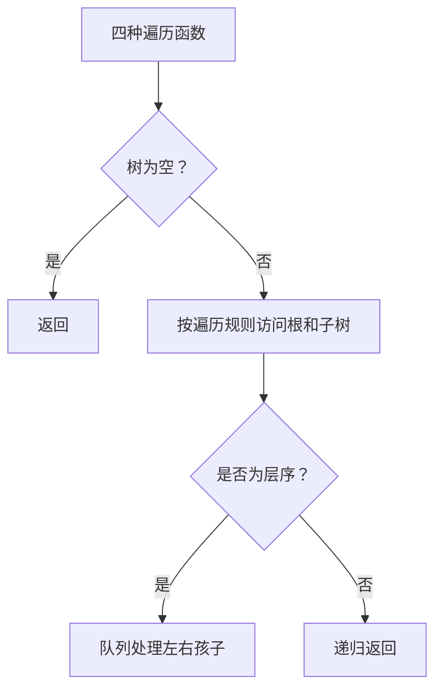
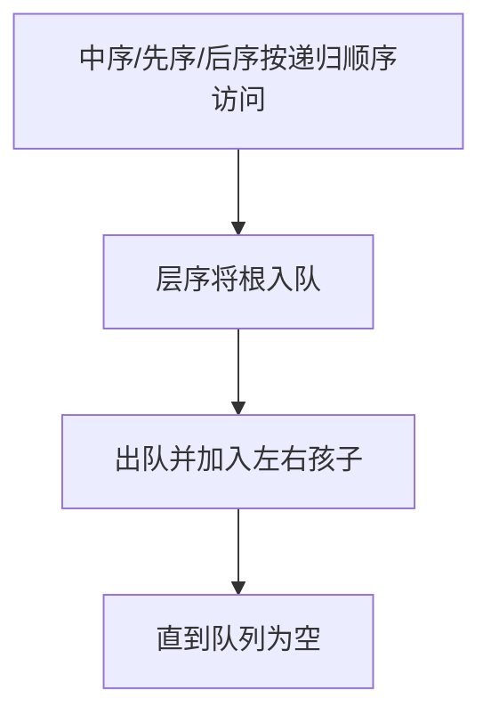

## 6-9 二叉树的遍历

- **分值：** 25分

## 题目描述

本题要求给定二叉树的4种遍历。

## 函数接口定义

```java
// 实现原理：前三种遍历按递归定义实现；层序遍历使用队列，从根开始逐层访问。空树不输出任何数据。
static class TreeNode {
  char data;
  TreeNode left, right;

  TreeNode(char data) {
    this.data = data;
  }
}

static void InorderTraversal(TreeNode BT);

static void PreorderTraversal(TreeNode BT);

static void PostorderTraversal(TreeNode BT);

static void LevelorderTraversal(TreeNode BT);
```

四个函数分别按中序、先序、后序和层序输出结点。

## 裁判测试程序样例

```java
// 实现原理：前三种遍历按递归定义实现；层序遍历使用队列，从根开始逐层访问。空树不输出任何数据。
import java.util.*;

public class Main {
  static class TreeNode {
    char data;
    TreeNode left, right;

    TreeNode(char data) {
      this.data = data;
    }
  }

  static void InorderTraversal(TreeNode bt) {
    if (bt == null) return;
    InorderTraversal(bt.left);
    System.out.print(" " + bt.data);
    InorderTraversal(bt.right);
  }

  static void PreorderTraversal(TreeNode bt) {
    if (bt == null) return;
    System.out.print(" " + bt.data);
    PreorderTraversal(bt.left);
    PreorderTraversal(bt.right);
  }

  static void PostorderTraversal(TreeNode bt) {
    if (bt == null) return;
    PostorderTraversal(bt.left);
    PostorderTraversal(bt.right);
    System.out.print(" " + bt.data);
  }

  static void LevelorderTraversal(TreeNode bt) {
    if (bt == null) return;
    java.util.Queue<TreeNode> q = new java.util.ArrayDeque<>();
    q.offer(bt);
    while (!q.isEmpty()) {
      TreeNode p = q.poll();
      System.out.print(" " + p.data);
      if (p.left != null) q.offer(p.left);
      if (p.right != null) q.offer(p.right);
    }
  }

  static TreeNode sampleTree() {
    TreeNode a = new TreeNode('A');
    a.left = new TreeNode('B');
    a.right = new TreeNode('C');
    a.left.left = new TreeNode('D');
    a.left.right = new TreeNode('F');
    a.left.right.left = new TreeNode('E');
    a.right.left = new TreeNode('G');
    a.right.right = new TreeNode('I');
    a.right.left.right = new TreeNode('H');
    return a;
  }

  public static void main(String[] args) {
    TreeNode root = sampleTree();
    System.out.print("Inorder:");
    InorderTraversal(root);
    System.out.println();
    System.out.print("Preorder:");
    PreorderTraversal(root);
    System.out.println();
    System.out.print("Postorder:");
    PostorderTraversal(root);
    System.out.println();
    System.out.print("Levelorder:");
    LevelorderTraversal(root);
    System.out.println();
  }
}
```

## 输出样例


```
Inorder: D B E F A G H C I
Preorder: A B D F E C G H I
Postorder: D E F B H G I C A
Levelorder: A B C D F G I E H
```

## 函数部分

```java
// 实现原理：前三种遍历按递归定义实现；层序遍历使用队列，从根开始逐层访问。空树不输出任何数据。
static void InorderTraversal(TreeNode bt) {
  if (bt == null) return;
  InorderTraversal(bt.left);
  System.out.print(" " + bt.data);
  InorderTraversal(bt.right);
}

static void PreorderTraversal(TreeNode bt) {
  if (bt == null) return;
  System.out.print(" " + bt.data);
  PreorderTraversal(bt.left);
  PreorderTraversal(bt.right);
}

static void PostorderTraversal(TreeNode bt) {
  if (bt == null) return;
  PostorderTraversal(bt.left);
  PostorderTraversal(bt.right);
  System.out.print(" " + bt.data);
}

static void LevelorderTraversal(TreeNode bt) {
  if (bt == null) return;
  java.util.Queue<TreeNode> q = new java.util.ArrayDeque<>();
  q.offer(bt);
  while (!q.isEmpty()) {
    TreeNode p = q.poll();
    System.out.print(" " + p.data);
    if (p.left != null) q.offer(p.left);
    if (p.right != null) q.offer(p.right);
  }
}
```

## 解题思路

前三种遍历按递归定义实现；层序遍历使用队列，从根开始逐层访问。空树不输出任何数据。

函数只处理接口规定的数据结构，不重复编写裁判程序中的建树和输出逻辑。

## 代码流程说明

1. 接收函数参数并检查空结构。
2. 按接口约定遍历或递归处理数据。
3. 返回结果，或按题目要求输出结点内容。

## 代码流程图



## 解题流程图



## 复杂度分析

深度遍历 O(n) 时间、O(h) 栈空间；层序遍历 O(n) 时间、O(w) 队列空间

## 常见易错点

- 遍历顺序不能混淆；层序遍历必须先入队根；输出空格格式要统一；空树要安全返回。
- 只提交题目要求的函数，保留方法名、参数和返回类型不变。
- 空树、单结点树和边界情况应分别检查。
