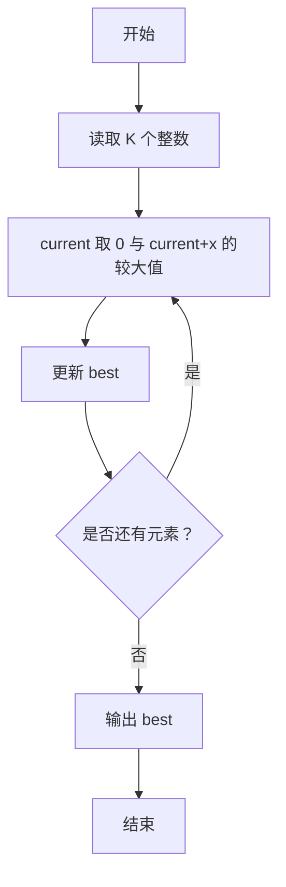
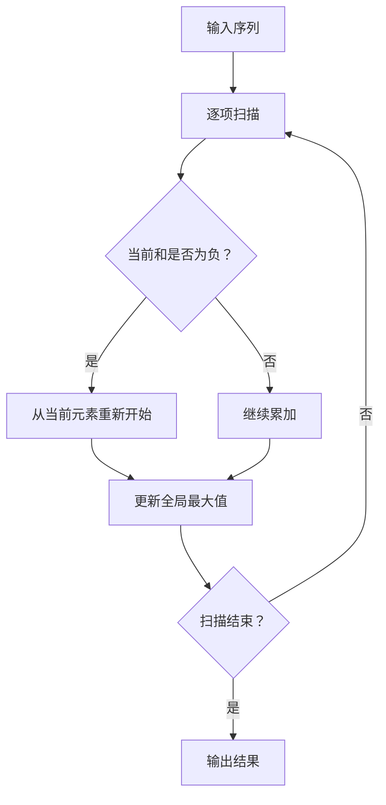

# 7-1 最大子列和问题

- **分值：** 20分

## 题目描述

给定$$K$$个整数组成的序列{ $$N_1$$, $$N_2$$, ..., $$N_K$$ }，“连续子列”被定义为{ $$N_i$$, $$N_{i+1}$$, ..., $$N_j$$ }，其中 $$1 \le i \le j \le K$$。“最大子列和”则被定义为所有连续子列元素的和中最大者。例如给定序列{ -2, 11, -4, 13, -5, -2 }，其连续子列{ 11, -4, 13 }有最大的和20。现要求你编写程序，计算给定整数序列的最大子列和。

本题旨在测试各种不同的算法在各种数据情况下的表现。各组测试数据特点如下：

- 数据1：与样例等价，测试基本正确性；
- 数据2：10<sup>2</sup>个随机整数；
- 数据3：10<sup>3</sup>个随机整数；
- 数据4：10<sup>4</sup>个随机整数；
- 数据5：10<sup>5</sup>个随机整数；

## 输入格式

输入第1行给出正整数$$K$$ ($$\le 100000$$)；第2行给出$$K$$个整数，其间以空格分隔。

## 输出格式

在一行中输出最大子列和。如果序列中所有整数皆为负数，则输出0。

## 输入样例

```
6
-2 11 -4 13 -5 -2
```

## 输出样例

```
20
```

### 解题思路

使用 Kadane 动态规划。`current` 表示以当前位置结尾的最大子列和；若此前和为负，就从当前元素重新开始，否则继续累加。用 `best` 保存全局最大值，并按题意将全负序列的结果保留为 0。

### 代码流程说明

1. 读取题目要求的输入并建立必要的数据结构。
2. 按上述算法处理数据，维护中间结果和边界条件。
3. 按题目规定的顺序与格式输出结果。

### 代码实现

```java
// 实现原理：使用 Kadane 动态规划。current 表示以当前位置结尾的最大子列和；若此前和为负，就从当前元素重新开始，否则继续累加。用 best
// 保存全局最大值，并按题意将全负序列的结果保留为 0。
static long maxSubArray(long[] a) {
  long current = 0, best = 0;
  for (long x : a) {
    current = Math.max(0, current + x);
    best = Math.max(best, current);
  }
  return best;
}
```
### 代码流程图



### 解题流程图



### 复杂度分析

时间 O(K)，空间 O(1)。

### 常见易错点

- 不要使用 O(K²) 枚举所有区间；`current` 和 `best` 要使用足够大的整数类型；全负时不能输出最大负数。
- 输入规模较大时，应选择与数据范围匹配的复杂度和数值类型。
- 输出分隔符、换行和特殊结果必须严格遵循题目格式。
