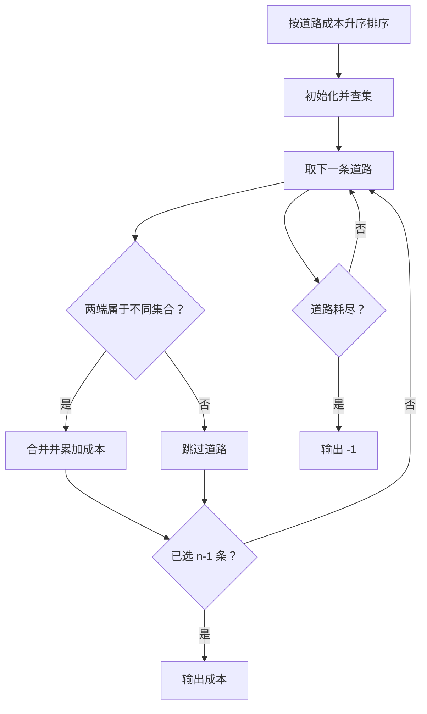
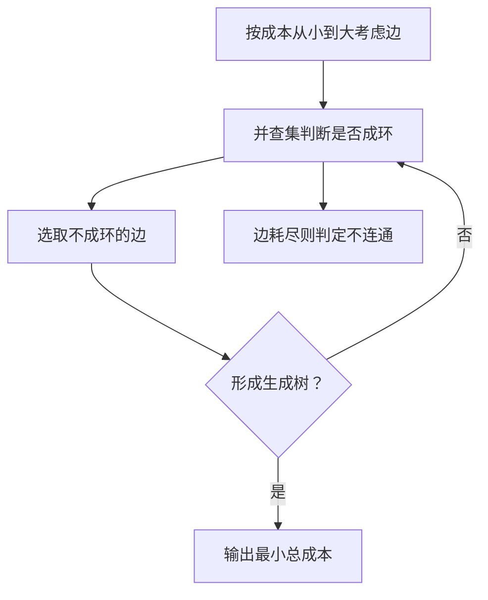

## 7-10 公路村村通

- **分值：** 30分

## 题目描述

现有村落间道路的统计数据表中，列出了有可能建设成标准公路的若干条道路的成本，求使每个村落都有公路连通所需要的最低成本。

## 输入格式

输入数据包括城镇数目正整数 $$n$$（$$\le 1000$$）和候选道路数目 $$m$$（$$\le 3n$$）；随后的 $$m$$ 行对应 $$m$$ 条道路，每行给出 3 个正整数，分别是该条道路直接连通的两个城镇的编号以及该道路改建的预算成本。为简单起见，城镇从 1 到 $$n$$ 编号。

## 输出格式

输出村村通需要的最低成本。如果输入数据不足以保证畅通，则输出 $$-1$$，表示需要建设更多公路。

## 输入样例
```
6 15
1 2 5
1 3 3
1 4 7
1 5 4
1 6 2
2 3 4
2 4 6
2 5 2
2 6 6
3 4 6
3 5 1
3 6 1
4 5 10
4 6 8
5 6 3
```

## 输出样例
```
12
```

## 解题思路

把候选道路按成本递增排序，使用并查集维护已连通的村庄。依次尝试加入连接两个不同集合的道路，直到选出 `n-1` 条；若最终不足则图不连通，输出 -1。

## 代码流程说明

1. 读取题目要求的输入并建立必要的数据结构。
2. 按上述算法处理数据，维护中间结果和边界条件。
3. 按题目规定的顺序与格式输出结果。

## 代码实现

```java
// 实现原理：把候选道路按成本递增排序，使用并查集维护已连通的村庄。依次尝试加入连接两个不同集合的道路，直到选出 n-1 条；若最终不足则图不连通，输出 -1。
static class DSU {
  int[] p;

  DSU(int n) {
    p = new int[n];
    for (int i = 0; i < n; i++) p[i] = i;
  }

  int find(int x) {
    return p[x] == x ? x : (p[x] = find(p[x]));
  }

  boolean union(int a, int b) {
    a = find(a);
    b = find(b);
    if (a == b) return false;
    p[a] = b;
    return true;
  }
}

static long mst(int n, int[][] roads) {
  // 先按题目要求排序，使后续扫描或贪心选择保持正确顺序。
  // 先按题目要求排序，使后续扫描或贪心选择保持正确顺序。
// 先按题目要求排序，使后续扫描或贪心选择保持正确顺序。
// 先按题目要求排序，使后续扫描或贪心选择保持正确顺序。
  Arrays.sort(roads, Comparator.comparingInt(e -> e[2]));
  DSU dsu = new DSU(n + 1);
  long cost = 0;
  int used = 0;
  for (int[] e : roads)
    if (dsu.union(e[0], e[1])) {
      cost += e[2];
      if (++used == n - 1) return cost;
    }
  return -1;
}
```
## 代码流程图



## 解题流程图



## 复杂度分析

Kruskal 排序和并查集处理时间 O(m log m)，空间 O(n)。

## 常见易错点

- 并查集要进行路径压缩和按秩/大小合并；同一连通分量的边不能重复计入；不要忘记判断无法形成生成树的情况。
- 输入规模较大时，应选择与数据范围匹配的复杂度和数值类型。
- 输出分隔符、换行和特殊结果必须严格遵循题目格式。
