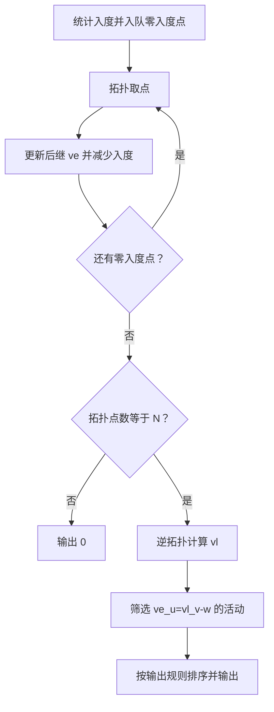
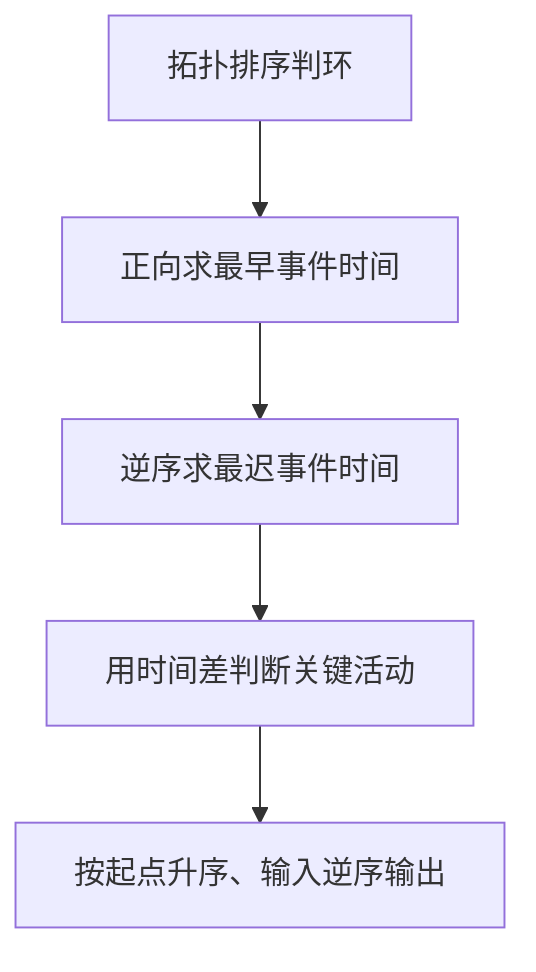

## 7-11 关键活动

- **分值：** 30分

## 题目描述

假定一个工程项目由一组子任务构成，子任务之间有的可以并行执行，有的必须在完成了其它一些子任务后才能执行。“任务调度”包括一组子任务、以及每个子任务可以执行所依赖的子任务集。

比如完成一个专业的所有课程学习和毕业设计可以看成一个本科生要完成的一项工程，各门课程可以看成是子任务。有些课程可以同时开设，比如英语和C程序设计，它们没有必须先修哪门的约束；有些课程则不可以同时开设，因为它们有先后的依赖关系，比如C程序设计和数据结构两门课，必须先学习前者。

但是需要注意的是，对一组子任务，并不是任意的任务调度都是一个可行的方案。比如方案中存在“子任务A依赖于子任务B，子任务B依赖于子任务C，子任务C又依赖于子任务A”，那么这三个任务哪个都不能先执行，这就是一个不可行的方案。

任务调度问题中，如果还给出了完成每个子任务需要的时间，则我们可以算出完成整个工程需要的最短时间。在这些子任务中，有些任务即使推迟几天完成，也不会影响全局的工期；但是有些任务必须准时完成，否则整个项目的工期就要因此延误，这种任务就叫“关键活动”。

请编写程序判定一个给定的工程项目的任务调度是否可行；如果该调度方案可行，则计算完成整个工程项目需要的最短时间，并输出所有的关键活动。

## 输入格式

输入第1行给出两个正整数N(\le 100)和M，其中N是任务交接点（即衔接相互依赖的两个子任务的节点，例如：若任务2要在任务1完成后才开始，则两任务之间必有一个交接点）的数量。交接点按1 ~ N编号，M是子任务的数量，依次编号为1 ~ M。随后M行，每行给出了3个正整数，分别是该任务开始和完成涉及的交接点编号以及该任务所需的时间，整数间用空格分隔。

## 输出格式

如果任务调度不可行，则输出0；否则第1行输出完成整个工程项目需要的时间，第2行开始输出所有关键活动，每个关键活动占一行，按格式“V->W”输出，其中V和W为该任务开始和完成涉及的交接点编号。关键活动输出的顺序规则是：任务开始的交接点编号小者优先，起点编号相同时，与输入时任务的顺序相反。

## 输入样例
```
7 8
1 2 4
1 3 3
2 4 5
3 4 3
4 5 1
4 6 6
5 7 5
6 7 2
```

## 输出样例
```
17
1->2
2->4
4->6
6->7
```

## 解题思路

将活动看作有向边，先进行拓扑排序并计算各事件的最早发生时间 `ve`；若无法处理全部顶点说明有环。再按逆拓扑序计算最迟时间 `vl`，活动满足 `ve[u] == vl[v] - w` 时为关键活动。

## 代码流程说明

1. 读取题目要求的输入并建立必要的数据结构。
2. 按上述算法处理数据，维护中间结果和边界条件。
3. 按题目规定的顺序与格式输出结果。

## 代码实现

```java
// 实现原理：将活动看作有向边，先进行拓扑排序并计算各事件的最早发生时间 ve；若无法处理全部顶点说明有环。再按逆拓扑序计算最迟时间 vl，活动满足 ve[u] == vl[v]
// - w 时为关键活动。
static class Activity {
  int from, to, time, order;

  Activity(int from, int to, int time, int order) {
    this.from = from;
    this.to = to;
    this.time = time;
    this.order = order;
  }
}

static List<Activity> criticalActivities(int n, List<Activity>[] g) {
  int[] indegree = new int[n];
  for (List<Activity> es : g) for (Activity e : es) indegree[e.to]++;
  // 用队列/栈保存尚未处理的元素，保证遍历或模拟的处理顺序。
  // 用队列/栈保存尚未处理的元素，保证遍历或模拟的处理顺序。
// 用队列/栈保存尚未处理的元素，保证遍历或模拟的处理顺序。
// 用队列/栈保存尚未处理的元素，保证遍历或模拟的处理顺序。
  ArrayDeque<Integer> q = new ArrayDeque<>();
  for (int i = 0; i < n; i++) if (indegree[i] == 0) q.offer(i);
  int[] ve = new int[n], topo = new int[n];
  int count = 0;
  while (!q.isEmpty()) {
    int u = q.poll();
    topo[count++] = u;
    for (Activity e : g[u]) {
      ve[e.to] = Math.max(ve[e.to], ve[u] + e.time);
      if (--indegree[e.to] == 0) q.offer(e.to);
    }
  }
  if (count != n) return null;
  int finish = Arrays.stream(ve).max().orElse(0);
  int[] vl = new int[n];
  // 先统一设置初始状态，再在遍历中逐步更新可达结果。
  // 先统一设置初始状态，再在遍历中逐步更新可达结果。
// 先统一设置初始状态，再在遍历中逐步更新可达结果。
// 先统一设置初始状态，再在遍历中逐步更新可达结果。
  Arrays.fill(vl, finish);
  for (int i = n - 1; i >= 0; i--) {
    int u = topo[i];
    for (Activity e : g[u]) vl[u] = Math.min(vl[u], vl[e.to] - e.time);
  }
  List<Activity> ans = new ArrayList<>();
  for (List<Activity> es : g)
    for (Activity e : es) if (ve[e.from] == vl[e.to] - e.time) ans.add(e);
  ans.sort(
      (a, b) ->
          a.from != b.from ? Integer.compare(a.from, b.from) : Integer.compare(b.order, a.order));
  return ans;
}
```
## 代码流程图



## 解题流程图



## 复杂度分析

拓扑、逆拓扑和筛选时间 O(N+M)，关键活动排序最多 O(M log M)，空间 O(N+M)。

## 常见易错点

- 拓扑排序中要处理多个入度为 0 的点；计算 vl 必须逆拓扑；关键活动判断要使用事件最早/最迟时间；输出顺序不能用普通边序直接替代。
- 输入规模较大时，应选择与数据范围匹配的复杂度和数值类型。
- 输出分隔符、换行和特殊结果必须严格遵循题目格式。
