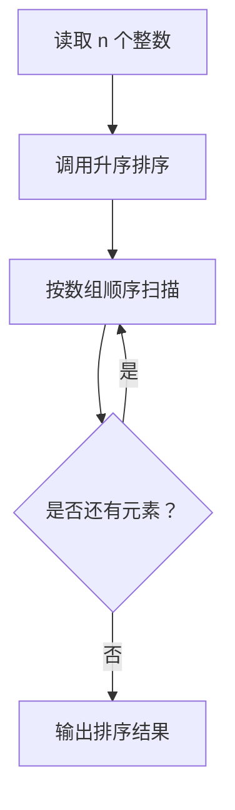
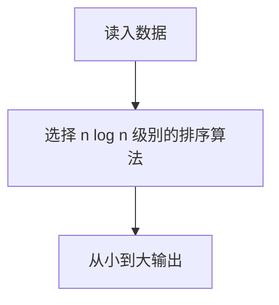

# 7-12 排序

- **分值：** 25分

## 题目描述

给定 $$n$$ 个（长整型范围内的）整数，要求输出从小到大排序后的结果。

本题旨在测试各种不同的排序算法在各种数据情况下的表现。各组测试数据特点如下：

<li>数据1：只有1个元素；
<li>数据2：11个不相同的整数，测试基本正确性；
<li>数据3：10<sup>3</sup>个随机整数；
<li>数据4：10<sup>4</sup>个随机整数；
<li>数据5：10<sup>5</sup>个随机整数；
<li>数据6：10<sup>5</sup>个顺序整数；
<li>数据7：10<sup>5</sup>个逆序整数；
<li>数据8：10<sup>5</sup>个基本有序的整数；
<li>数据9：10<sup>5</sup>个随机正整数，每个数字不超过1000。

## 输入格式

输入第一行给出正整数 $$n$$（$$\le 10^5$$），随后一行给出 $$n$$ 个（长整型范围内的）整数，其间以空格分隔。

## 输出格式

在一行中输出从小到大排序后的结果，数字间以 1 个空格分隔，行末不得有多余空格。

## 输入样例
```
11
4 981 10 -17 0 -20 29 50 8 43 -5
```

## 输出样例
```
-20 -17 -5 0 4 8 10 29 43 50 981
```

### 解题思路

题目数据规模达到 10^5，采用基于比较的高效排序。Java 中可使用 `Arrays.sort`，或实现归并排序；输出时按下标控制空格。

### 代码流程说明

1. 读取题目要求的输入并建立必要的数据结构。
2. 按上述算法处理数据，维护中间结果和边界条件。
3. 按题目规定的顺序与格式输出结果。

### 代码实现

```java
static void sort(long[] a) {
    Arrays.sort(a);
}

```
### 代码流程图



### 解题流程图



### 复杂度分析

Arrays.sort 时间 O(n log n)，空间 O(n)（按 Java 实现及输出缓冲情况计）。

### 常见易错点

- 输入值可能超出 32 位整数；不要使用冒泡等 O(n²) 算法；注意行尾不能多空格。
- 输入规模较大时，应选择与数据范围匹配的复杂度和数值类型。
- 输出分隔符、换行和特殊结果必须严格遵循题目格式。
