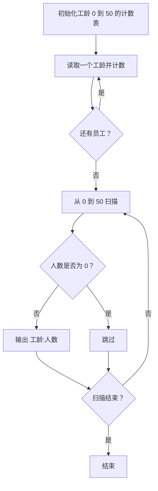
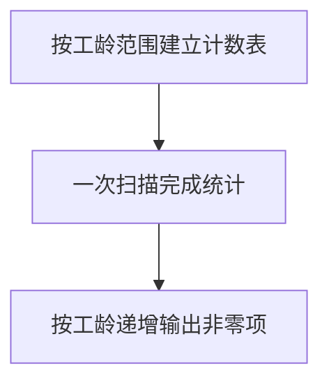

## 7-13 统计工龄

- **分值：** 20分

## 题目描述

给定公司 n 名员工的工龄，要求按工龄增序输出每个工龄段有多少员工。

## 输入格式

输入首先给出正整数 n（\le 10^5），即员工总人数；随后给出 n 个整数，即每个员工的工龄，范围在 [0, 50]。

## 输出格式

按工龄的递增顺序输出每个工龄的员工个数，格式为：“工龄:人数”。每项占一行。如果人数为 0 则不输出该项。

## 输入样例
```
8
10 2 0 5 7 2 5 2
```

## 输出样例
```
0:1
2:3
5:2
7:1
10:1

```

## 解题思路

工龄范围固定为 0 到 50，使用计数数组 `count[51]`。每读入一个工龄就累加对应计数，最后从小到大扫描并输出非零项。

## 代码流程说明

1. 读取题目要求的输入并建立必要的数据结构。
2. 按上述算法处理数据，维护中间结果和边界条件。
3. 按题目规定的顺序与格式输出结果。

## 代码实现

```java
// 实现原理：工龄范围固定为 0 到 50，使用计数数组 count[51]。每读入一个工龄就累加对应计数，最后从小到大扫描并输出非零项。
static int[] countAges(int[] ages) {
  int[] count = new int[51];
  for (int age : ages) count[age]++;
  return count;
}
```
## 代码流程图



## 解题流程图



## 复杂度分析

统计和扫描时间 O(n+R)，其中 R=51；空间 O(R)。

## 常见易错点

- 数组下标要覆盖 0 和 50；只输出人数非零的工龄；输出格式是冒号而不是空格。
- 输入规模较大时，应选择与数据范围匹配的复杂度和数值类型。
- 输出分隔符、换行和特殊结果必须严格遵循题目格式。
