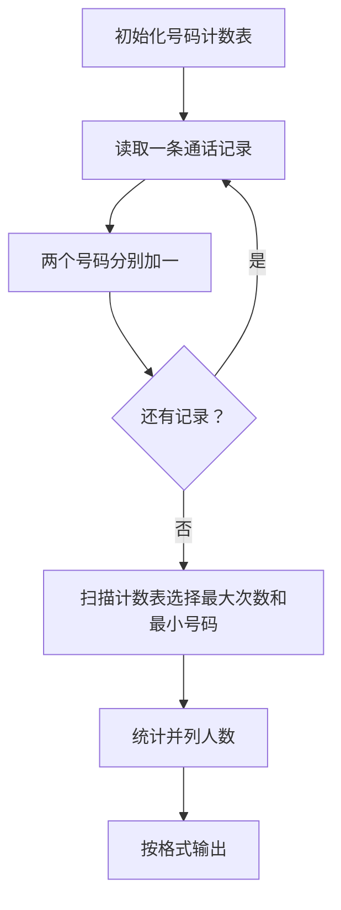
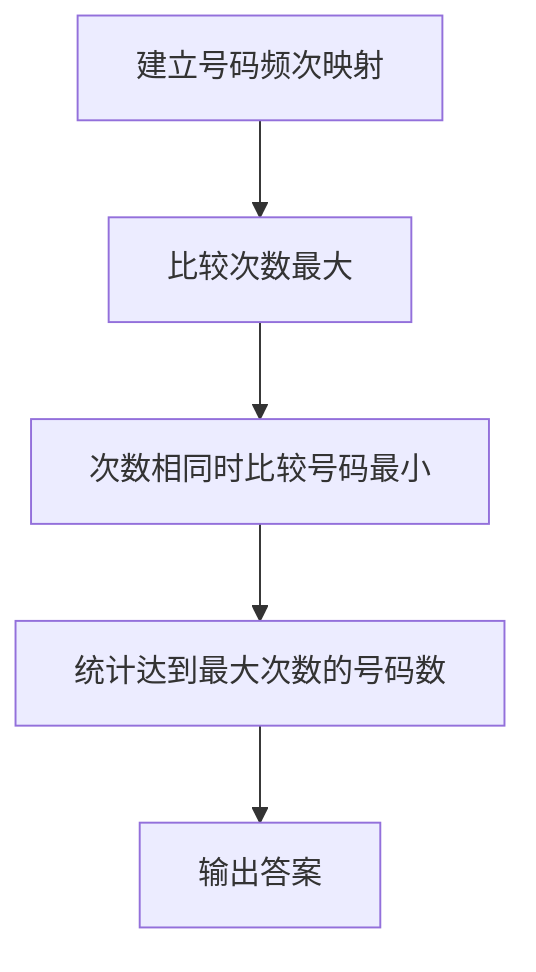

# 7-14 电话聊天狂人

- **分值：** 25分

## 题目描述

给定大量手机用户通话记录，找出其中通话次数最多的聊天狂人。

## 输入格式

输入首先给出正整数$$N$$（$$\le 10^5$$），为通话记录条数。随后$$N$$行，每行给出一条通话记录。简单起见，这里只列出拨出方和接收方的11位数字构成的手机号码，其中以空格分隔。

## 输出格式

在一行中给出聊天狂人的手机号码及其通话次数，其间以空格分隔。如果这样的人不唯一，则输出狂人中最小的号码及其通话次数，并且附加给出并列狂人的人数。

## 输入样例
```
4
13005711862 13588625832
13505711862 13088625832
13588625832 18087925832
15005713862 13588625832
```

## 输出样例
```
13588625832 3
```

### 解题思路

用哈希表统计每个电话号码出现次数。每条记录的两个号码都计数；扫描统计结果时维护最大次数和最小号码，最后根据是否有并列决定输出格式。

### 代码流程说明

1. 读取题目要求的输入并建立必要的数据结构。
2. 按上述算法处理数据，维护中间结果和边界条件。
3. 按题目规定的顺序与格式输出结果。

### 代码实现

```java
// 实现原理：用哈希表统计每个电话号码出现次数。每条记录的两个号码都计数；扫描统计结果时维护最大次数和最小号码，最后根据是否有并列决定输出格式。
static class CallResult {
  String number;
  int calls, people;
}

static CallResult mostCalled(String[][] records) {
  Map<String, Integer> count = new HashMap<>();
  for (String[] r : records) {
    count.merge(r[0], 1, Integer::sum);
    count.merge(r[1], 1, Integer::sum);
  }
  CallResult ans = new CallResult();
  ans.number = "";
  for (Map.Entry<String, Integer> e : count.entrySet()) {
    if (e.getValue() > ans.calls
        || e.getValue() == ans.calls && e.getKey().compareTo(ans.number) < 0) {
      ans.number = e.getKey();
      ans.calls = e.getValue();
    }
  }
  for (int v : count.values()) if (v == ans.calls) ans.people++;
  return ans;
}
```
### 代码流程图



### 解题流程图



### 复杂度分析

哈希统计期望时间 O(N)，空间 O(U)，U 为不同号码数。

### 常见易错点

- 号码应作为字符串保存以保留前导零；一条记录中的两个号码都要计数；并列时按数值/字典序选择最小号码，并正确输出并列人数。
- 输入规模较大时，应选择与数据范围匹配的复杂度和数值类型。
- 输出分隔符、换行和特殊结果必须严格遵循题目格式。
