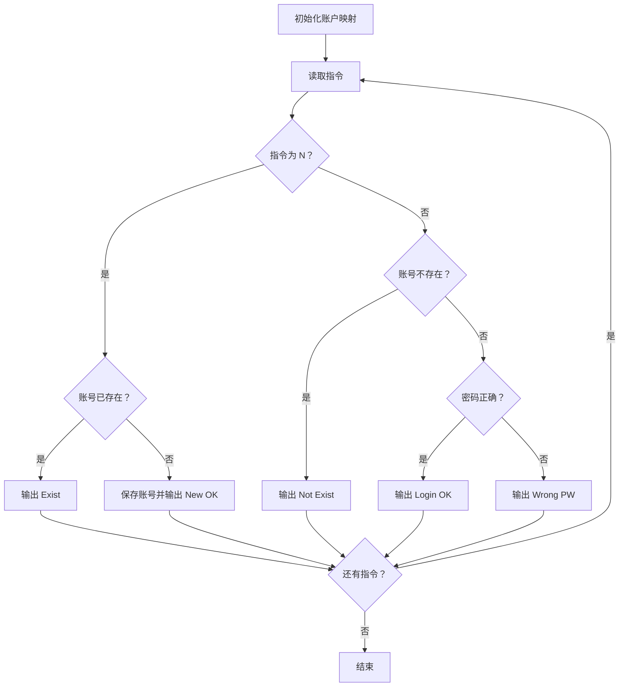
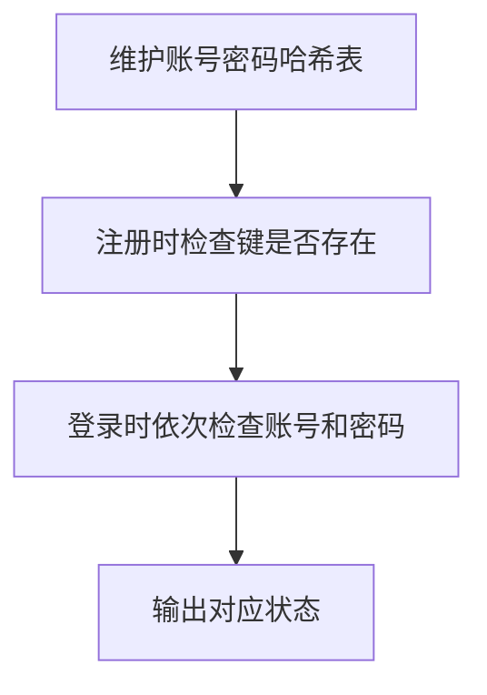

## 7-15 QQ帐户的申请与登陆

- **分值：** 25分

## 题目描述

实现QQ新帐户申请和老帐户登陆的简化版功能。最大挑战是：据说现在的QQ号码已经有10位数了。

## 输入格式

输入首先给出一个正整数$$N$$（$$\le 10^5$$），随后给出$$N$$行指令。每行指令的格式为：“命令符（空格）QQ号码（空格）密码”。其中命令符为“N”（代表New）时表示要新申请一个QQ号，后面是新帐户的号码和密码；命令符为“L”（代表Login）时表示是老帐户登陆，后面是登陆信息。QQ号码为一个不超过10位、但大于1000（据说QQ老总的号码是1001）的整数。密码为不小于6位、不超过16位、且不包含空格的字符串。

## 输出格式

针对每条指令，给出相应的信息：

1）若新申请帐户成功，则输出“New: OK”；<br>
2）若新申请的号码已经存在，则输出“ERROR: Exist”；<br>
3）若老帐户登陆成功，则输出“Login: OK”；<br>
4）若老帐户QQ号码不存在，则输出“ERROR: Not Exist”；<br>
5）若老帐户密码错误，则输出“ERROR: Wrong PW”。

## 输入样例
```
5
L 1234567890 myQQ@qq.com
N 1234567890 myQQ@qq.com
N 1234567890 myQQ@qq.com
L 1234567890 myQQ@qq
L 1234567890 myQQ@qq.com
```

## 输出样例
```
ERROR: Not Exist
New: OK
ERROR: Exist
ERROR: Wrong PW
Login: OK
```

## 解题思路

用哈希表保存 QQ 号码到密码的映射。`N` 指令只在号码不存在时插入；`L` 指令先判断号码是否存在，再比较密码并输出对应结果。

## 代码流程说明

1. 读取题目要求的输入并建立必要的数据结构。
2. 按上述算法处理数据，维护中间结果和边界条件。
3. 按题目规定的顺序与格式输出结果。

## 代码实现

```java
// 实现原理：用哈希表保存 QQ 号码到密码的映射。N 指令只在号码不存在时插入；L 指令先判断号码是否存在，再比较密码并输出对应结果。
static void processAccounts(String[] commands, String[] ids, String[] passwords) {
  Map<String, String> account = new HashMap<>();
  StringBuilder out = new StringBuilder();
  for (int i = 0; i < commands.length; i++) {
    if (commands[i].equals("N")) {
      if (account.containsKey(ids[i])) out.append("ERROR: Exist\n");
      else {
        account.put(ids[i], passwords[i]);
        out.append("New: OK\n");
      }
    } else if (!account.containsKey(ids[i])) out.append("ERROR: Not Exist\n");
    else if (!account.get(ids[i]).equals(passwords[i])) out.append("ERROR: Wrong PW\n");
    else out.append("Login: OK\n");
  }
  System.out.print(out);
}
```
## 代码流程图



## 解题流程图



## 复杂度分析

哈希表处理期望时间 O(N)，空间 O(U)，U 为不同账号数。

## 常见易错点

- QQ 号码建议以字符串读取，避免长整数溢出和格式损失；注册成功后才写入；登录错误的判断顺序要区分“不存在”和“密码错误”。
- 输入规模较大时，应选择与数据范围匹配的复杂度和数值类型。
- 输出分隔符、换行和特殊结果必须严格遵循题目格式。
