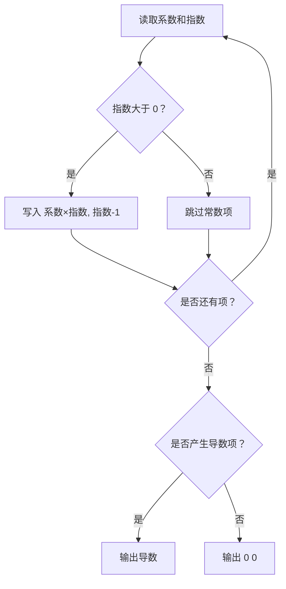
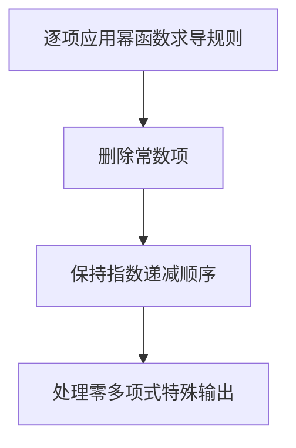

## 7-16 一元多项式求导

- **分值：** 20分

## 题目描述

设计函数求一元多项式的导数。

## 输入格式

以指数递降方式输入多项式非零项系数和指数（绝对值均为不超过1000的整数）。数字间以空格分隔。
注意：零多项式用 `0 0` 表示。

## 输出格式

以与输入相同的格式输出导数多项式非零项的系数和指数。数字间以空格分隔，但结尾不能有多余空格。

## 输入样例
```
3 4 -5 2 6 1 -2 0
```

## 输出样例
```
12 3 -10 1 6 0
```

## 解题思路

多项式按指数递减给出，逐项读取系数 `c` 和指数 `e`。当 `e > 0` 时导数项为 `c*e, e-1`；指数为 0 的常数项导数为 0，不输出。零多项式要单独处理。

## 代码流程说明

1. 读取题目要求的输入并建立必要的数据结构。
2. 按上述算法处理数据，维护中间结果和边界条件。
3. 按题目规定的顺序与格式输出结果。

## 代码实现

```java
// 实现原理：多项式按指数递减给出，逐项读取系数 c 和指数 e。当 e > 0 时导数项为 c*e, e-1；指数为 0 的常数项导数为 0，不输出。零多项式要单独处理。
static List<long[]> derivative(long[] terms) {
  List<long[]> result = new ArrayList<>();
  for (int i = 0; i < terms.length; i += 2) {
    long coefficient = terms[i], exponent = terms[i + 1];
    if (exponent > 0) result.add(new long[] {coefficient * exponent, exponent - 1});
  }
  if (result.isEmpty()) result.add(new long[] {0, 0});
  return result;
}
```
## 代码流程图



## 解题流程图



## 复杂度分析

设输入项数为 T，时间 O(T)，结果空间 O(T)。

## 常见易错点

- 常数项必须跳过；系数要乘以原指数；输入是直到 EOF，不要错误读取一个不存在的项；零多项式格式固定为 `0 0`。
- 输入规模较大时，应选择与数据范围匹配的复杂度和数值类型。
- 输出分隔符、换行和特殊结果必须严格遵循题目格式。
