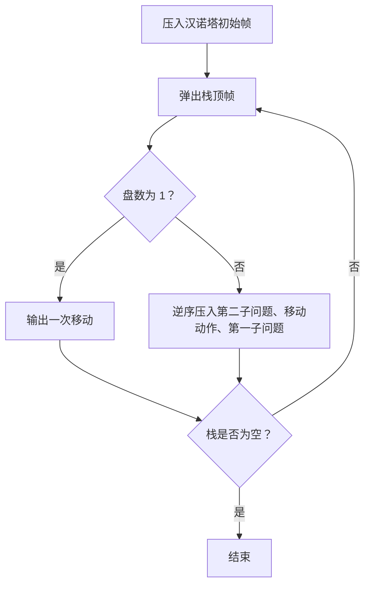
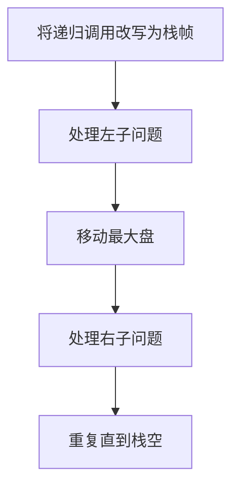

# 7-17 汉诺塔的非递归实现

- **分值：** 25分

## 题目描述

借助堆栈以非递归（循环）方式求解汉诺塔的问题（n, a, b, c），即将N个盘子从起始柱（标记为“a”）通过借助柱（标记为“b”）移动到目标柱（标记为“c”），并保证每个移动符合汉诺塔问题的要求。

## 输入格式

输入为一个正整数N，即起始柱上的盘数。

## 输出格式

每个操作（移动）占一行，按`柱1 -> 柱2`的格式输出。

## 输入样例
```
3
```

## 输出样例
```
a -> c
a -> b
c -> b
a -> c
b -> a
b -> c
a -> c
```

### 解题思路

用显式栈保存递归调用帧 `(n, from, help, to, state)`，模拟“先移动 n-1，再移动最大盘，再移动 n-1”的递归过程。这样既不调用递归，也能保持移动顺序。

### 代码流程说明

1. 读取题目要求的输入并建立必要的数据结构。
2. 按上述算法处理数据，维护中间结果和边界条件。
3. 按题目规定的顺序与格式输出结果。

### 代码实现

```java
// 实现原理：用显式栈保存递归调用帧 (n, from, help, to, state)，模拟“先移动 n-1，再移动最大盘，再移动
// n-1”的递归过程。这样既不调用递归，也能保持移动顺序。
static class Frame {
  int n;
  char from, help, to;

  Frame(int n, char from, char help, char to) {
    this.n = n;
    this.from = from;
    this.help = help;
    this.to = to;
  }
}

static List<String> hanoi(int n) {
  List<String> answer = new ArrayList<>();
  // 用队列/栈保存尚未处理的元素，保证遍历或模拟的处理顺序。
  // 用队列/栈保存尚未处理的元素，保证遍历或模拟的处理顺序。
// 用队列/栈保存尚未处理的元素，保证遍历或模拟的处理顺序。
// 用队列/栈保存尚未处理的元素，保证遍历或模拟的处理顺序。
  ArrayDeque<Frame> stack = new ArrayDeque<>();
  stack.push(new Frame(n, 'a', 'b', 'c'));
  while (!stack.isEmpty()) {
    Frame f = stack.pop();
    if (f.n == 1) {
      answer.add(f.from + " -> " + f.to);
      continue;
    }
    stack.push(new Frame(f.n - 1, f.help, f.from, f.to));
    stack.push(new Frame(1, f.from, f.help, f.to));
    stack.push(new Frame(f.n - 1, f.from, f.to, f.help));
  }
  return answer;
}
```
### 代码流程图



### 解题流程图



### 复杂度分析

移动次数为 2^n-1，时间和输出存储均为 O(2^n)，递归模拟栈空间 O(n)。

### 常见易错点

- 压栈顺序必须与递归执行顺序相反；`n=1` 是基本情况；柱子参数在两次子问题中要正确交换；不要把递归调用本身混入“非递归”实现。
- 输入规模较大时，应选择与数据范围匹配的复杂度和数值类型。
- 输出分隔符、换行和特殊结果必须严格遵循题目格式。
