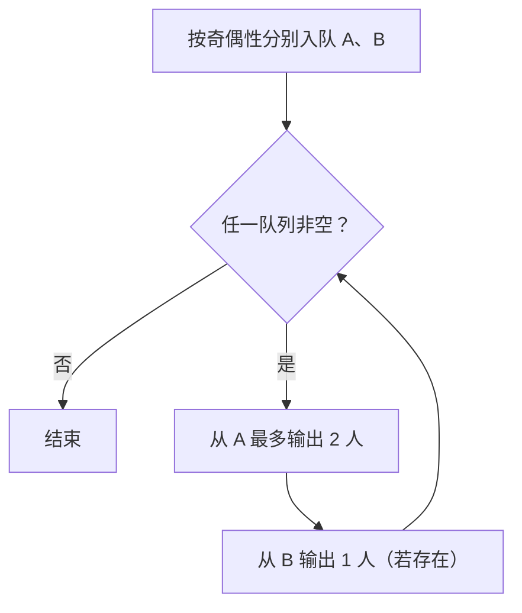
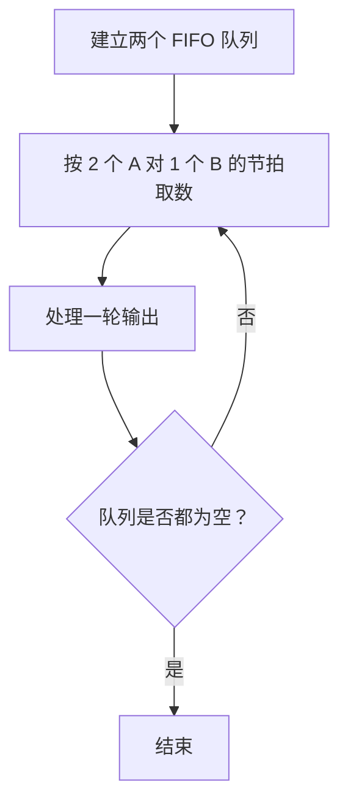

## 7-18 银行业务队列简单模拟

- **分值：** 25分

## 题目描述

设某银行有A、B两个业务窗口，且处理业务的速度不一样，其中A窗口处理速度是B窗口的2倍 —— 即当A窗口每处理完2个顾客时，B窗口处理完1个顾客。给定到达银行的顾客序列，请按业务完成的顺序输出顾客序列。假定不考虑顾客先后到达的时间间隔，并且当不同窗口同时处理完2个顾客时，A窗口顾客优先输出。

## 输入格式

输入为一行正整数，其中第1个数字N($$\le$$1000)为顾客总数，后面跟着N位顾客的编号。编号为奇数的顾客需要到A窗口办理业务，为偶数的顾客则去B窗口。数字间以空格分隔。

## 输出格式

按业务处理完成的顺序输出顾客的编号。数字间以空格分隔，但最后一个编号后不能有多余的空格。

## 输入样例
```
8 2 1 3 9 4 11 13 15
```

## 输出样例
```
1 3 2 9 11 4 13 15
```

## 解题思路

将奇数顾客和偶数顾客分别放入两个队列。A 窗口每轮最多完成两位奇数顾客，B 窗口每轮完成一位偶数顾客；每轮先输出 A 的第一位，再输出 A 的第二位，最后输出 B 的一位，从而实现同时完成时 A 优先。

## 代码流程说明

1. 读取题目要求的输入并建立必要的数据结构。
2. 按上述算法处理数据，维护中间结果和边界条件。
3. 按题目规定的顺序与格式输出结果。

## 代码实现

```java
// 实现原理：将奇数顾客和偶数顾客分别放入两个队列。A 窗口每轮最多完成两位奇数顾客，B 窗口每轮完成一位偶数顾客；每轮先输出 A 的第一位，再输出 A 的第二位，最后输出 B
// 的一位，从而实现同时完成时 A 优先。
static List<Integer> serviceOrder(int[] customers) {
  // 用队列/栈保存尚未处理的元素，保证遍历或模拟的处理顺序。
  // 用队列/栈保存尚未处理的元素，保证遍历或模拟的处理顺序。
// 用队列/栈保存尚未处理的元素，保证遍历或模拟的处理顺序。
// 用队列/栈保存尚未处理的元素，保证遍历或模拟的处理顺序。
  ArrayDeque<Integer> a = new ArrayDeque<>(), b = new ArrayDeque<>();
  for (int x : customers) (x % 2 == 1 ? a : b).offer(x);
  List<Integer> result = new ArrayList<>();
  while (!a.isEmpty() || !b.isEmpty()) {
    for (int i = 0; i < 2 && !a.isEmpty(); i++) result.add(a.poll());
    if (!b.isEmpty()) result.add(b.poll());
  }
  return result;
}
```
## 代码流程图



## 解题流程图



## 复杂度分析

每个顾客入队和出队一次，时间 O(n)，空间 O(n)。

## 常见易错点

- 窗口服务节拍要保持“2 个 A 对 1 个 B”；A 队列不足两人时不能输出占位；最后剩余顾客要继续按窗口规则处理。
- 输入规模较大时，应选择与数据范围匹配的复杂度和数值类型。
- 输出分隔符、换行和特殊结果必须严格遵循题目格式。
