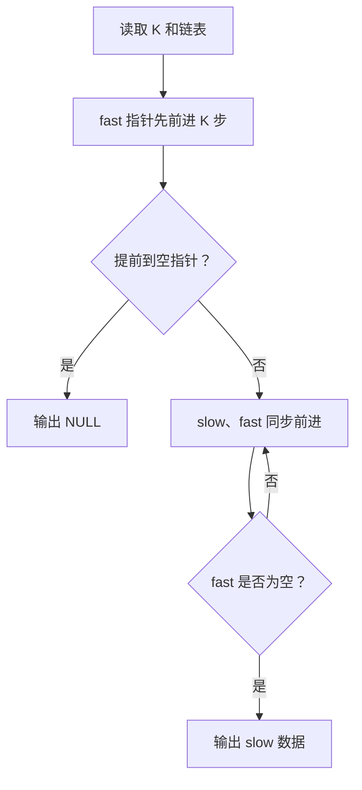
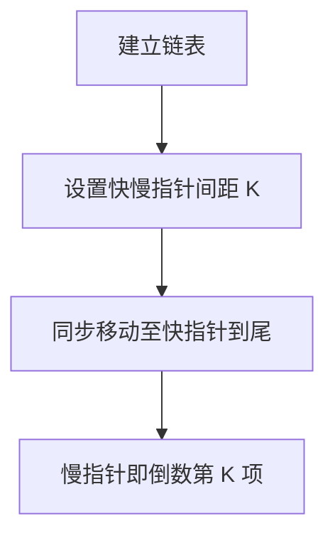

## 7-19 求链式线性表的倒数第K项

- **分值：** 20分

## 题目描述

给定一系列正整数，请设计一个尽可能高效的算法，查找倒数第K个位置上的数字。

## 输入格式

输入首先给出一个正整数K，随后是若干非负整数，最后以一个负整数表示结尾（该负数不算在序列内，不要处理）。

## 输出格式

输出倒数第K个位置上的数据。如果这个位置不存在，输出错误信息`NULL`。

## 输入样例
```
4 1 2 3 4 5 6 7 8 9 0 -1
```

## 输出样例
```
7
```

## 解题思路

采用“快慢指针”思想：先让快指针前进 K 个结点，再让快慢指针同步前进，快指针到达链尾时慢指针正好指向倒数第 K 个结点。若不足 K 个结点则输出 NULL。

## 代码流程说明

1. 读取题目要求的输入并建立必要的数据结构。
2. 按上述算法处理数据，维护中间结果和边界条件。
3. 按题目规定的顺序与格式输出结果。

## 代码实现

```java
// 实现原理：采用“快慢指针”思想：先让快指针前进 K 个结点，再让快慢指针同步前进，快指针到达链尾时慢指针正好指向倒数第 K 个结点。若不足 K 个结点则输出 NULL。
static class ListNode {
  int data;
  ListNode next;

  ListNode(int data) {
    this.data = data;
  }
}

static Integer kthFromEnd(ListNode head, int k) {
  ListNode fast = head, slow = head;
  for (int i = 0; i < k; i++) {
    if (fast == null) return null;
    fast = fast.next;
  }
  while (fast != null) {
    fast = fast.next;
    slow = slow.next;
  }
  return slow == null ? null : slow.data;
}
```
## 代码流程图



## 解题流程图



## 复杂度分析

快慢指针各扫描一次，时间 O(n)，空间 O(1)。

## 常见易错点

- K 个结点的偏移量要与“倒数第 K 个”定义一致；负数结束标志不能加入链表；先判断链表长度不足，再解引用指针。
- 输入规模较大时，应选择与数据范围匹配的复杂度和数值类型。
- 输出分隔符、换行和特殊结果必须严格遵循题目格式。
