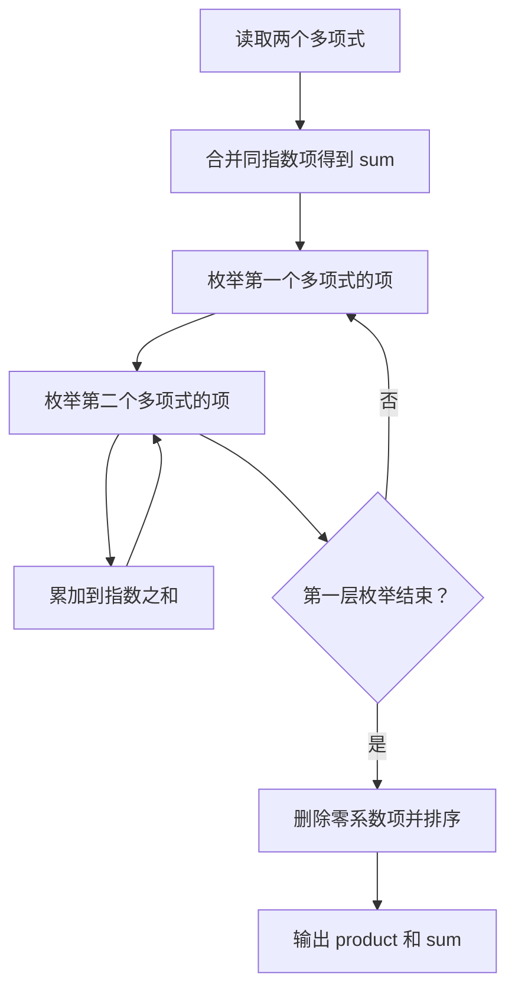
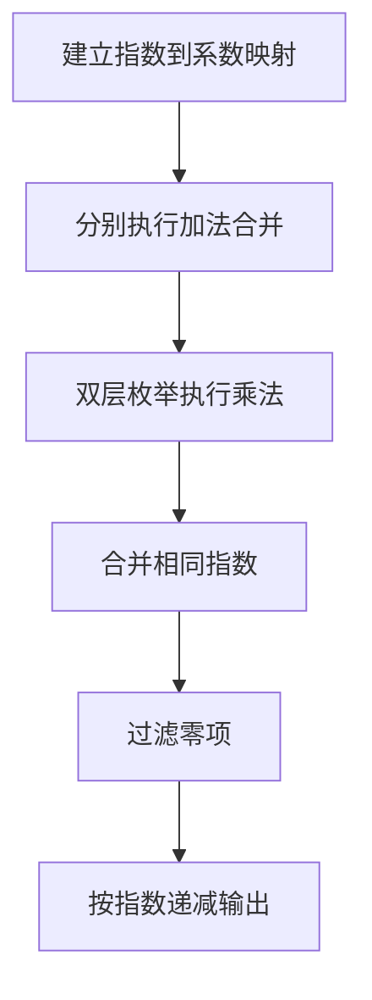

# 7-2 一元多项式的乘法与加法运算

- **分值：** 20分

## 题目描述

设计函数分别求两个一元多项式的乘积与和。

## 输入格式

输入分2行，每行分别先给出多项式非零项的个数，再以指数递降方式输入一个多项式非零项系数和指数（绝对值均为不超过1000的整数）。数字间以空格分隔。

## 输出格式

输出分2行，分别以指数递降方式输出乘积多项式以及和多项式非零项的系数和指数。数字间以空格分隔，但结尾不能有多余空格。零多项式应输出`0 0`。

## 输入样例
```
4 3 4 -5 2  6 1  -2 0
3 5 20  -7 4  3 1
```

## 输出样例
```
15 24 -25 22 30 21 -10 20 -21 8 35 6 -33 5 14 4 -15 3 18 2 -6 1
5 20 -4 4 -5 2 9 1 -2 0
```

### 解题思路

将每个多项式表示为“指数 → 系数”的映射。加法直接合并同指数项；乘法枚举两个非零项，将系数乘积累加到指数之和的位置，最后按指数递减输出并删除系数为 0 的项。

### 代码流程说明

1. 读取题目要求的输入并建立必要的数据结构。
2. 按上述算法处理数据，维护中间结果和边界条件。
3. 按题目规定的顺序与格式输出结果。

### 代码实现

```java
// 实现原理：将每个多项式表示为“指数 → 系数”的映射。加法直接合并同指数项；乘法枚举两个非零项，将系数乘积累加到指数之和的位置，最后按指数递减输出并删除系数为 0 的项。
static TreeMap<Integer, Integer> add(TreeMap<Integer, Integer> a, TreeMap<Integer, Integer> b) {
  TreeMap<Integer, Integer> r = new TreeMap<>(Collections.reverseOrder());
  r.putAll(a);
  for (Map.Entry<Integer, Integer> e : b.entrySet())
    r.merge(e.getKey(), e.getValue(), Integer::sum);
  r.entrySet().removeIf(e -> e.getValue() == 0);
  return r;
}

static TreeMap<Integer, Integer> multiply(
    TreeMap<Integer, Integer> a, TreeMap<Integer, Integer> b) {
  TreeMap<Integer, Integer> r = new TreeMap<>(Collections.reverseOrder());
  for (Map.Entry<Integer, Integer> x : a.entrySet())
    for (Map.Entry<Integer, Integer> y : b.entrySet())
      r.merge(x.getKey() + y.getKey(), x.getValue() * y.getValue(), Integer::sum);
  r.entrySet().removeIf(e -> e.getValue() == 0);
  return r;
}
```
### 代码流程图



### 解题流程图



### 复杂度分析

设两多项式项数为 P、Q，时间 O(PQ log(PQ))，空间 O(PQ)。

### 常见易错点

- 乘法指数应相加而不是相乘；合并后系数为 0 的项不能输出；零多项式必须输出 `0 0`；输出项之间不能多空格。
- 输入规模较大时，应选择与数据范围匹配的复杂度和数值类型。
- 输出分隔符、换行和特殊结果必须严格遵循题目格式。
