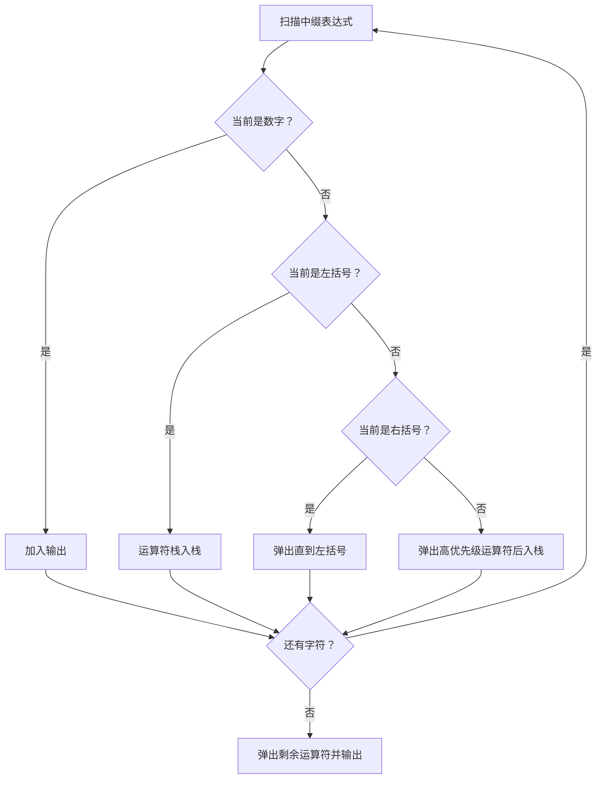
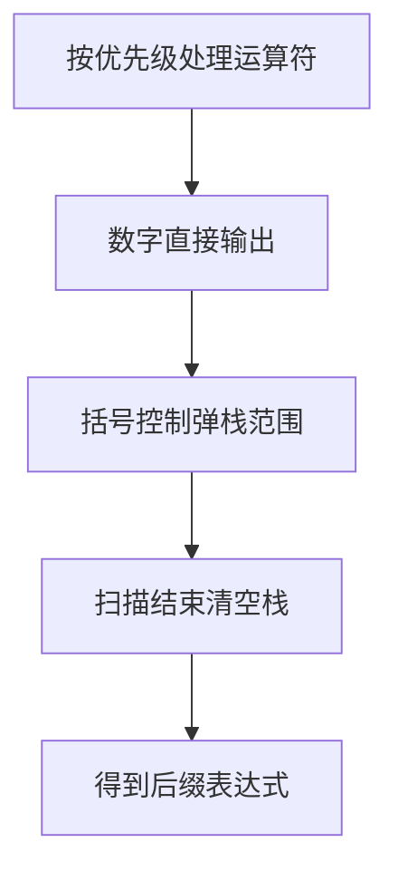

# 7-20 表达式转换

- **分值：** 25分

## 题目描述

算术表达式有前缀表示法、中缀表示法和后缀表示法等形式。日常使用的算术表达式是采用中缀表示法，即二元运算符位于两个运算数中间。请设计程序将中缀表达式转换为后缀表达式。

## 输入格式

输入在一行中给出不含空格的中缀表达式，可包含`+`、`-`、`*`、`/`以及左右括号`()`，表达式不超过20个字符。

## 输出格式

在一行中输出转换后的后缀表达式，要求不同对象（运算数、运算符号）之间以空格分隔，但结尾不得有多余空格。

## 输入样例
```
2+3*(7-4)+8/4
```

## 输出样例
```
2 3 7 4 - * + 8 4 / +
```

### 解题思路

使用调度场算法。数字直接输出；左括号入栈；右括号弹出直到左括号；运算符弹出栈顶所有优先级不低于自己的运算符，再入栈。最后清空运算符栈。

### 代码流程说明

1. 读取题目要求的输入并建立必要的数据结构。
2. 按上述算法处理数据，维护中间结果和边界条件。
3. 按题目规定的顺序与格式输出结果。

### 代码实现

```java
static String toPostfix(String expression) {
    Map<Character, Integer> priority = Map.of('+', 1, '-', 1, '*', 2, '/', 2);
    ArrayDeque<Character> ops = new ArrayDeque<>();
    List<String> out = new ArrayList<>();
    for (int i = 0; i < expression.length(); i++) {
        char c = expression.charAt(i);
        if (Character.isDigit(c)) out.add(String.valueOf(c));
        else if (c == '(') ops.push(c);
        else if (c == ')') {
            while (ops.peek() != '(') out.add(String.valueOf(ops.pop()));
            ops.pop();
        } else {
            while (!ops.isEmpty() && ops.peek() != '(' &&
                   priority.get(ops.peek()) >= priority.get(c))
                out.add(String.valueOf(ops.pop()));
            ops.push(c);
        }
    }
    while (!ops.isEmpty()) out.add(String.valueOf(ops.pop()));
    return String.join(" ", out);
}
```
### 代码流程图



### 解题流程图



### 复杂度分析

扫描表达式一次，时间 O(L)，运算符栈和输出空间 O(L)。

### 常见易错点

- 括号不能输出；弹出条件应使用“不低于当前优先级”；最后必须清空栈；输出对象之间空格统一处理，避免行尾多余空格。
- 输入规模较大时，应选择与数据范围匹配的复杂度和数值类型。
- 输出分隔符、换行和特殊结果必须严格遵循题目格式。
