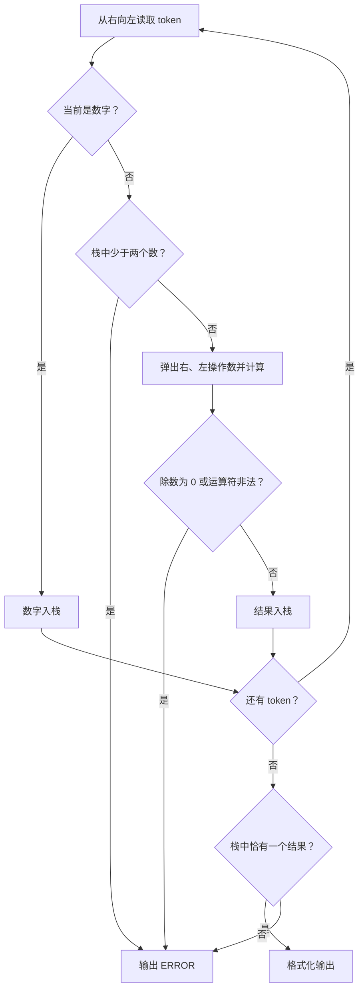
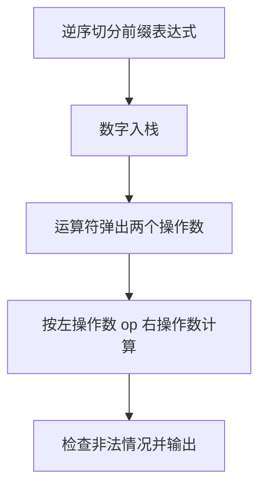

# 7-21 求前缀表达式的值

- **分值：** 25分

## 题目描述

算术表达式有前缀表示法、中缀表示法和后缀表示法等形式。前缀表达式指二元运算符位于两个运算数之前，例如`2+3*(7-4)+8/4`的前缀表达式是：`+ + 2 * 3 - 7 4 / 8 4`。请设计程序计算前缀表达式的结果值。

## 输入格式

输入在一行内给出不超过30个字符的前缀表达式，只包含`+`、`-`、`*`、`/`以及运算数，不同对象（运算数、运算符号）之间以空格分隔。

## 输出格式

输出前缀表达式的运算结果，保留小数点后1位，或错误信息`ERROR`。

## 输入样例
```
+ + 2 * 3 - 7 4 / 8 4
```

## 输出样例
```
13.0
```

### 解题思路

前缀表达式从右向左扫描。数字压栈；遇到运算符弹出两个操作数，先弹出的为左操作数、后弹出的为右操作数，计算后再压栈。操作数不足、除数为 0 或最终栈中结果数不为 1 时输出 ERROR。

### 代码流程说明

1. 读取题目要求的输入并建立必要的数据结构。
2. 按上述算法处理数据，维护中间结果和边界条件。
3. 按题目规定的顺序与格式输出结果。

### 代码实现

```java
// 实现原理：前缀表达式从右向左扫描。数字压栈；遇到运算符弹出两个操作数，先弹出的为左操作数、后弹出的为右操作数，计算后再压栈。操作数不足、除数为 0 或最终栈中结果数不为 1
// 时输出 ERROR。
static Double evalPrefix(String expression) {
  // 用队列/栈保存尚未处理的元素，保证遍历或模拟的处理顺序。
  // 用队列/栈保存尚未处理的元素，保证遍历或模拟的处理顺序。
// 用队列/栈保存尚未处理的元素，保证遍历或模拟的处理顺序。
// 用队列/栈保存尚未处理的元素，保证遍历或模拟的处理顺序。
  ArrayDeque<Double> stack = new ArrayDeque<>();
  String[] tokens = expression.trim().split("\\s+");
  try {
    for (int i = tokens.length - 1; i >= 0; i--) {
      String t = tokens[i];
      if (t.matches("[-+]?\\d+(\\.\\d+)?")) stack.push(Double.parseDouble(t));
      else {
        if (stack.size() < 2) return null;
        double a = stack.pop(), b = stack.pop();
        if (t.equals("/") && a == 0) return null;
        switch (t) {
          case "+":
            stack.push(b + a);
            break;
          case "-":
            stack.push(b - a);
            break;
          case "*":
            stack.push(b * a);
            break;
          case "/":
            stack.push(b / a);
            break;
          default:
            return null;
        }
      }
    }
    return stack.size() == 1 ? stack.pop() : null;
  } catch (RuntimeException e) {
    return null;
  }
}
```
### 代码流程图



### 解题流程图



### 复杂度分析

扫描 token 一次，时间 O(L)，栈空间 O(L)。

### 常见易错点

- 前缀求值必须从右向左；操作数顺序不能颠倒；除法要使用浮点数；要检查除零、缺少操作数和多余操作数。
- 输入规模较大时，应选择与数据范围匹配的复杂度和数值类型。
- 输出分隔符、换行和特殊结果必须严格遵循题目格式。
