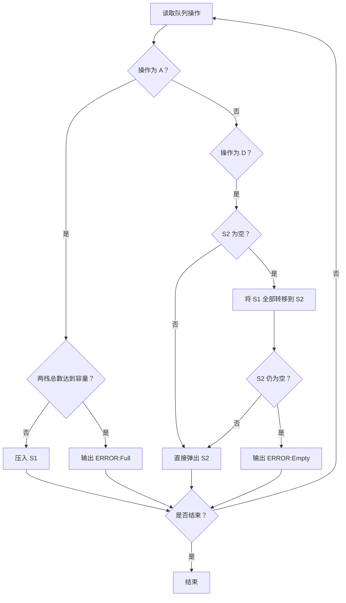
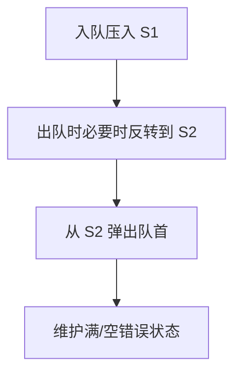

# 7-22 堆栈模拟队列

- **分值：** 25分

## 题目描述

设已知有两个堆栈S1和S2，请用这两个堆栈模拟出一个队列Q。

所谓用堆栈模拟队列，实际上就是通过调用堆栈的下列操作函数:

- `int IsFull(Stack S)`：判断堆栈`S`是否已满，返回1或0；
- `int IsEmpty (Stack S )`：判断堆栈`S`是否为空，返回1或0；
- `void Push(Stack S, ElementType item )`：将元素`item`压入堆栈`S`；
- `ElementType Pop(Stack S )`：删除并返回`S`的栈顶元素。

实现队列的操作，即入队`void AddQ(ElementType item)`和出队`ElementType DeleteQ()`。

## 输入格式

输入首先给出两个正整数`N1`和`N2`，表示堆栈`S1`和`S2`的最大容量。随后给出一系列的队列操作：`A  item`表示将`item`入列（这里假设`item`为整型数字）；`D`表示出队操作；`T`表示输入结束。

## 输出格式

对输入中的每个`D`操作，输出相应出队的数字，或者错误信息`ERROR:Empty`。如果入队操作无法执行，也需要输出`ERROR:Full`。每个输出占1行。

## 输入样例
```
3 2
A 1 A 2 A 3 A 4 A 5 D A 6 D A 7 D A 8 D D D D T
```

## 输出样例
```
ERROR:Full
1
ERROR:Full
2
3
4
7
8
ERROR:Empty
```

### 解题思路

用 S1 作为入队栈、S2 作为出队栈。入队时只有当两栈元素总数小于总容量才压入 S1；出队时若 S2 为空则把 S1 全部转移到 S2，再从 S2 弹出。

### 代码流程说明

1. 读取题目要求的输入并建立必要的数据结构。
2. 按上述算法处理数据，维护中间结果和边界条件。
3. 按题目规定的顺序与格式输出结果。

### 代码实现

```java
// 实现原理：用 S1 作为入队栈、S2 作为出队栈。入队时只有当两栈元素总数小于总容量才压入 S1；出队时若 S2 为空则把 S1 全部转移到 S2，再从 S2 弹出。
static class QueueByStacks {
  // 用队列/栈保存尚未处理的元素，保证遍历或模拟的处理顺序。
  // 用队列/栈保存尚未处理的元素，保证遍历或模拟的处理顺序。
// 用队列/栈保存尚未处理的元素，保证遍历或模拟的处理顺序。
// 用队列/栈保存尚未处理的元素，保证遍历或模拟的处理顺序。
  ArrayDeque<Integer> in = new ArrayDeque<>(), out = new ArrayDeque<>();
  int capacity;

  QueueByStacks(int capacity) {
    this.capacity = capacity;
  }

  boolean add(int x) {
    if (in.size() + out.size() == capacity) return false;
    in.push(x);
    return true;
  }

  Integer poll() {
    if (out.isEmpty()) while (!in.isEmpty()) out.push(in.pop());
    return out.isEmpty() ? null : out.pop();
  }
}
```
### 代码流程图



### 解题流程图



### 复杂度分析

每个元素至多在两个栈之间搬移一次，操作均摊 O(1)，空间 O(capacity)。

### 常见易错点

- 容量判断是两栈总容量；只有 S2 为空时才转移，避免破坏顺序；满栈/空队列时要输出准确错误信息。
- 输入规模较大时，应选择与数据范围匹配的复杂度和数值类型。
- 输出分隔符、换行和特殊结果必须严格遵循题目格式。
