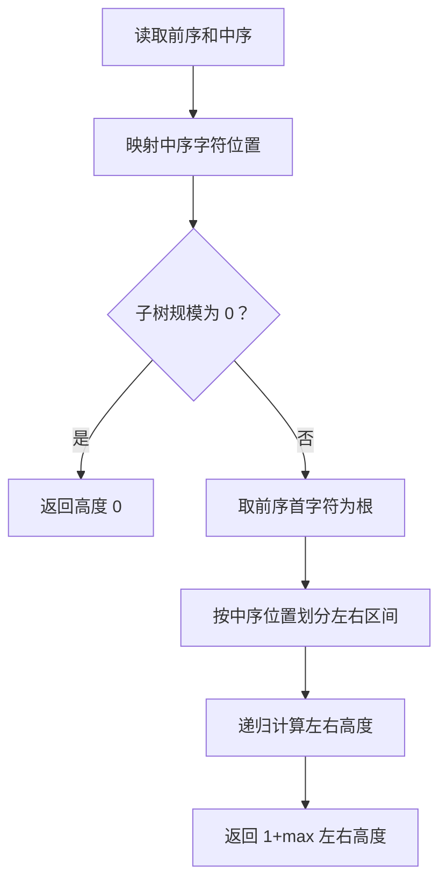
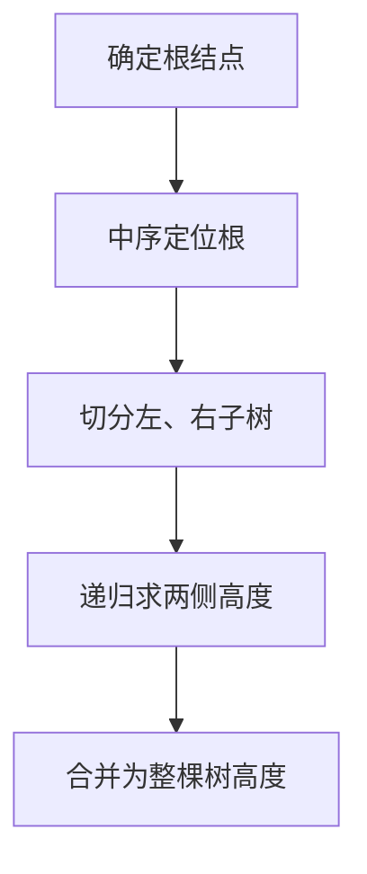

## 7-23 还原二叉树

- **分值：** 25分

## 题目描述

给定一棵二叉树的前序遍历序列和中序遍历序列，要求计算该二叉树的高度。

## 输入格式

输入首先给出正整数 $n$（$$\le$$50），为树中结点总数。随后 2 行先后给出前序和中序遍历序列，均是长度为 $n$ 的不包含重复英文字母（区别大小写）的字符串。

## 输出格式

输出为一个整数，即该二叉树的高度。

## 输入样例
```
9
ABDFGHIEC
FDHGIBEAC
```

## 输出样例
```
5
```

## 解题思路

前序首元素是根。在中序序列中找到根的位置，左侧为左子树、右侧为右子树；递归处理两个区间并返回 `1 + max(leftHeight,rightHeight)`。用位置映射可快速定位根。

## 代码流程说明

1. 读取题目要求的输入并建立必要的数据结构。
2. 按上述算法处理数据，维护中间结果和边界条件。
3. 按题目规定的顺序与格式输出结果。

## 代码实现

```java
// 实现原理：前序首元素是根。在中序序列中找到根的位置，左侧为左子树、右侧为右子树；递归处理两个区间并返回 1 +
// max(leftHeight,rightHeight)。用位置映射可快速定位根。
static int height(String preorder, String inorder) {
  if (preorder.isEmpty()) return 0;
  Map<Character, Integer> pos = new HashMap<>();
  for (int i = 0; i < inorder.length(); i++) pos.put(inorder.charAt(i), i);
  return height(preorder, 0, 0, preorder.length(), pos);
}

static int height(String pre, int pl, int il, int size, Map<Character, Integer> pos) {
  if (size == 0) return 0;
  int mid = pos.get(pre.charAt(pl));
  int left = mid - il;
  return 1
      + Math.max(
          height(pre, pl + 1, il, left, pos),
          height(pre, pl + 1 + left, mid + 1, size - left - 1, pos));
}
```
## 代码流程图



## 解题流程图



## 复杂度分析

建立位置表并递归划分子树，时间 O(n)，空间 O(n)。

## 常见易错点

- 前序和中序区间边界要保持一致；空树高度按 0 处理；不要把结点数或边数误作为高度。
- 输入规模较大时，应选择与数据范围匹配的复杂度和数值类型。
- 输出分隔符、换行和特殊结果必须严格遵循题目格式。
