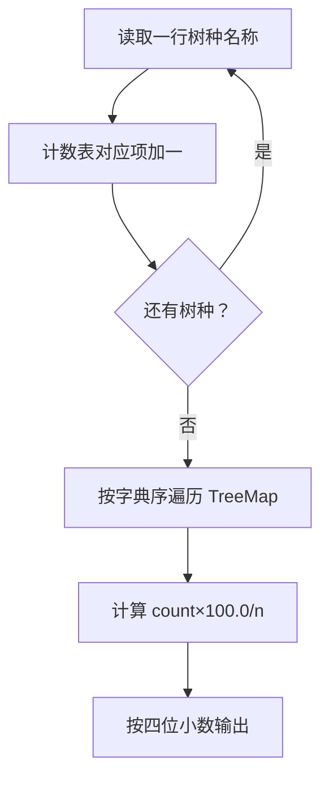
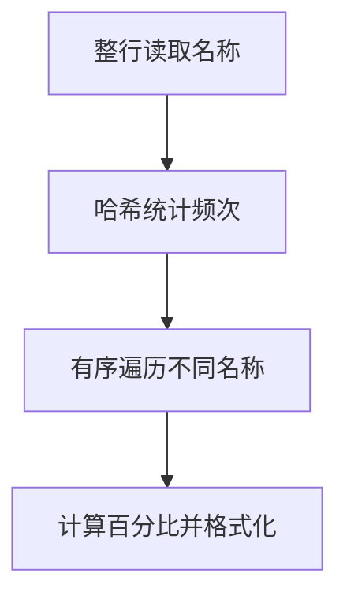

## 7-24 树种统计

- **分值：** 25分

## 题目描述

随着卫星成像技术的应用，自然资源研究机构可以识别每一棵树的种类。请编写程序帮助研究人员统计每种树的数量，计算每种树占总数的百分比。

## 输入格式

输入首先给出正整数 n（\le 10^5），随后 n 行，每行给出卫星观测到的一棵树的种类名称。种类名称由不超过 30 个英文字母和空格组成（大小写有区分）。

## 输出格式

按字典序递增输出各种树的种类名称及其所占总数的百分比，其间以空格分隔，保留小数点后 4 位。

## 输入样例
```
29
Red Alder
Ash
Aspen
Basswood
Ash
Beech
Yellow Birch
Ash
Cherry
Cottonwood
Ash
Cypress
Red Elm
Gum
Hackberry
White Oak
Hickory
Pecan
Hard Maple
White Oak
Soft Maple
Red Oak
Red Oak
White Oak
Poplan
Sassafras
Sycamore
Black Walnut
Willow
```

## 输出样例
```
Ash 13.7931%
Aspen 3.4483%
Basswood 3.4483%
Beech 3.4483%
Black Walnut 3.4483%
Cherry 3.4483%
Cottonwood 3.4483%
Cypress 3.4483%
Gum 3.4483%
Hackberry 3.4483%
Hard Maple 3.4483%
Hickory 3.4483%
Pecan 3.4483%
Poplan 3.4483%
Red Alder 3.4483%
Red Elm 3.4483%
Red Oak 6.8966%
Sassafras 3.4483%
Soft Maple 3.4483%
Sycamore 3.4483%
White Oak 10.3448%
Willow 3.4483%
Yellow Birch 3.4483%
```

**鸣谢青岛大学周强老师修正题面！**

## 解题思路

用映射统计每个树种出现次数，再使用有序映射或排序后的键按字典序输出。百分比为 `count * 100.0 / n`，保留四位小数。

## 代码流程说明

1. 读取题目要求的输入并建立必要的数据结构。
2. 按上述算法处理数据，维护中间结果和边界条件。
3. 按题目规定的顺序与格式输出结果。

## 代码实现

```java
// 实现原理：用映射统计每个树种出现次数，再使用有序映射或排序后的键按字典序输出。百分比为 count * 100.0 / n，保留四位小数。
static void printSpecies(List<String> trees) {
  Map<String, Integer> count = new TreeMap<>();
  for (String tree : trees) count.merge(tree, 1, Integer::sum);
  for (Map.Entry<String, Integer> e : count.entrySet()) {
    double percent = e.getValue() * 100.0 / trees.size();
    System.out.printf(Locale.ROOT, "%s %.4f%%%n", e.getKey(), percent);
  }
}
```
## 代码流程图



## 解题流程图



## 复杂度分析

设不同树种数为 U，哈希/树表统计时间 O(n log U)，空间 O(U)。

## 常见易错点

- 树种名称要整行读取并保留空格；大小写按题意区分；百分比计算必须使用浮点数；格式化时固定四位小数。
- 输入规模较大时，应选择与数据范围匹配的复杂度和数值类型。
- 输出分隔符、换行和特殊结果必须严格遵循题目格式。
