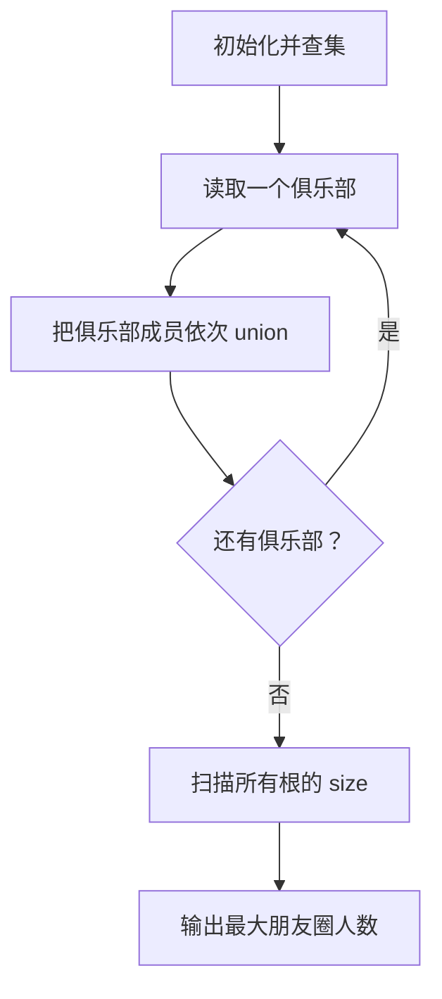
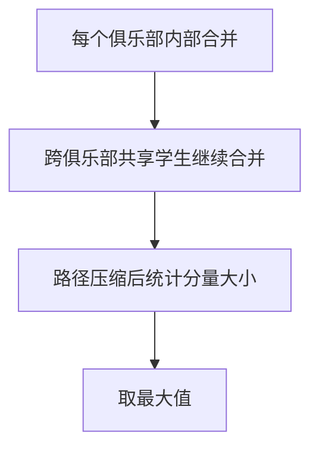

# 7-25 朋友圈

- **分值：** 25分

## 题目描述

某学校有N个学生，形成M个俱乐部。每个俱乐部里的学生有着一定相似的兴趣爱好，形成一个朋友圈。一个学生可以同时属于若干个不同的俱乐部。根据“我的朋友的朋友也是我的朋友”这个推论可以得出，如果A和B是朋友，且B和C是朋友，则A和C也是朋友。请编写程序计算最大朋友圈中有多少人。

## 输入格式

输入的第一行包含两个正整数N（$$\le$$30000）和M（$$\le$$1000），分别代表学校的学生总数和俱乐部的个数。后面的M行每行按以下格式给出1个俱乐部的信息，其中学生从1~N编号：

`第i个俱乐部的人数Mi（空格）学生1（空格）学生2 … 学生Mi`

## 输出格式

输出给出一个整数，表示在最大朋友圈中有多少人。

## 输入样例
```
7 4
3 1 2 3
2 1 4
3 5 6 7
1 6
```

## 输出样例
```
4
```

### 解题思路

把每个俱乐部中的学生两两合并，或用“俱乐部第一个成员作为代表”依次合并其余成员。并查集维护朋友圈连通分量，最后扫描各集合大小取最大值。

### 代码流程说明

1. 读取题目要求的输入并建立必要的数据结构。
2. 按上述算法处理数据，维护中间结果和边界条件。
3. 按题目规定的顺序与格式输出结果。

### 代码实现

```java
static class UnionFind {
    int[] parent, size;
    UnionFind(int n) {
        parent = new int[n + 1]; size = new int[n + 1];
        for (int i = 1; i <= n; i++) { parent[i] = i; size[i] = 1; }
    }
    int find(int x) { return parent[x] == x ? x : (parent[x] = find(parent[x])); }
    void union(int a, int b) {
        a = find(a); b = find(b);
        if (a == b) return;
        if (size[a] < size[b]) { int t = a; a = b; b = t; }
        parent[b] = a; size[a] += size[b];
    }

    int largest() {
        int answer = 0;
        for (int i = 1; i < parent.length; i++)
            if (find(i) == i) answer = Math.max(answer, size[i]);
        return answer;
    }
}
```
### 代码流程图



### 解题流程图



### 复杂度分析

设俱乐部成员总出现次数为 S，并查集时间 O((S+n)α(n))，空间 O(n)。

### 常见易错点

- 同一学生可加入多个俱乐部，必须合并而非重复计数；并查集编号从 1 开始；要对路径压缩后的根统计大小。
- 输入规模较大时，应选择与数据范围匹配的复杂度和数值类型。
- 输出分隔符、换行和特殊结果必须严格遵循题目格式。
