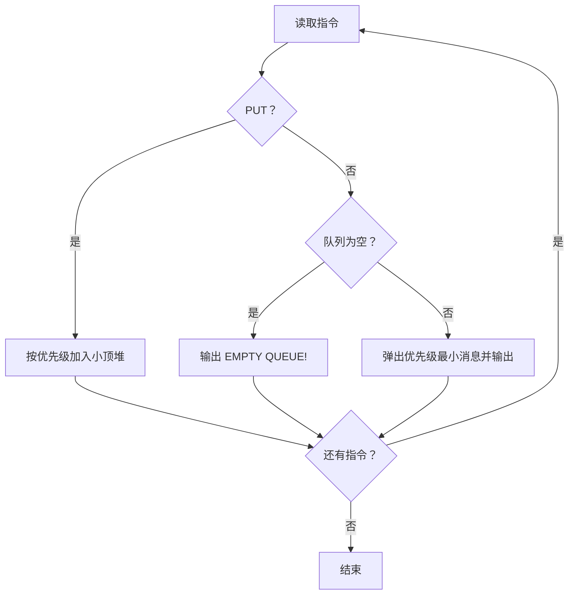
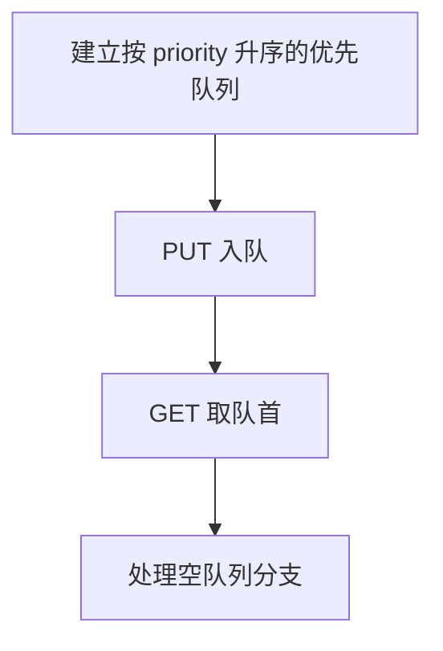

# 7-26 Windows消息队列

- **分值：** 25分

## 题目描述

消息队列是 Windows 系统的基础。对于每个进程，系统维护一个消息队列。如果在进程中有特定事件发生，如点击鼠标、文字改变等，系统将把这个消息连同表示此消息优先级高低的正整数（称为优先级值）加到队列当中。同时，如果队列不是空的，这一进程循环地从队列中按照优先级获取消息。请注意优先级值低意味着优先级高。请编辑程序模拟消息队列，将消息加到队列中以及从队列中获取消息。

## 输入格式

输入第 1 行给出正整数 $n$（$$\le 10^5$$），随后 $n$ 行，每行给出一个指令——`GET` 或 `PUT`，分别表示从队列中取出消息或将消息添加到队列中。如果指令是 `PUT`，后面就有一个消息名称、以及一个正整数表示消息的优先级，此数越小表示优先级越高。消息名称是长度不超过 10 个字符且不含空格的字符串；题目保证队列中消息的优先级无重复，且输入至少有一个 `GET`。

## 输出格式

对于每个 `GET` 指令，在一行中输出消息队列中优先级最高的消息的名称和参数。如果消息队列中没有消息，输出 `EMPTY QUEUE!`。对于 `PUT` 指令则没有输出。

## 输入样例
```
9
PUT msg1 5
PUT msg2 4
GET
PUT msg3 2
PUT msg4 4
GET
GET
GET
GET
```

## 输出样例
```
msg2
msg3
msg4
msg1
EMPTY QUEUE!
```

### 解题思路

使用按优先级升序的优先队列模拟消息队列。`PUT` 插入消息，`GET` 取出优先级最小的消息；由于题目保证优先级不重复，不需要额外处理同优先级顺序。

### 代码流程说明

1. 读取题目要求的输入并建立必要的数据结构。
2. 按上述算法处理数据，维护中间结果和边界条件。
3. 按题目规定的顺序与格式输出结果。

### 代码实现

```java
static class Message {
    String name;
    int priority;
    Message(String name, int priority) { this.name = name; this.priority = priority; }
}

static void processMessages(String[][] commands) {
    PriorityQueue<Message> q = new PriorityQueue<>(Comparator.comparingInt(m -> m.priority));
    for (String[] c : commands) {
        if (c[0].equals("PUT")) q.offer(new Message(c[1], Integer.parseInt(c[2])));
        else if (q.isEmpty()) System.out.println("EMPTY QUEUE!");
        else System.out.println(q.poll().name);
    }
}
```
### 代码流程图



### 解题流程图



### 复杂度分析

每次 PUT/GET 为 O(log U)，总时间 O(N log U)，空间 O(U)。

### 常见易错点

- 优先级数值越小越优先；GET 要先判断空队列；输出只包含消息名。
- 输入规模较大时，应选择与数据范围匹配的复杂度和数值类型。
- 输出分隔符、换行和特殊结果必须严格遵循题目格式。
