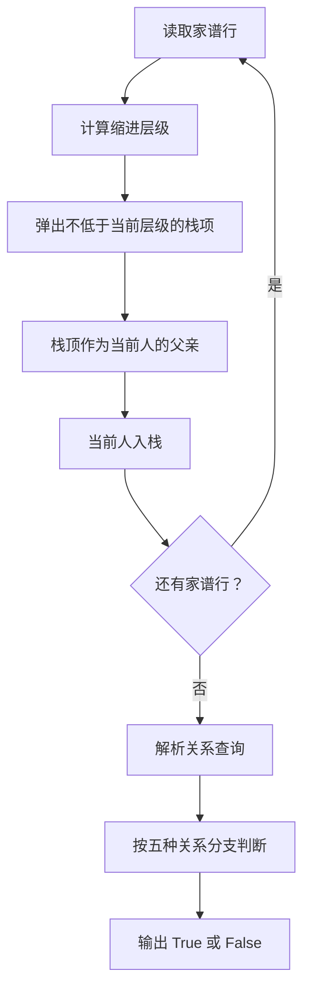
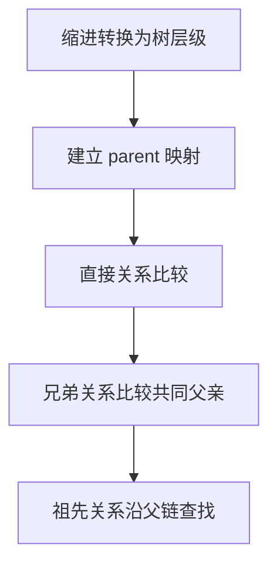

# 7-27 家谱处理

- **分值：** 30分

## 题目描述

人类学研究对于家族很感兴趣，于是研究人员搜集了一些家族的家谱进行研究。实验中，使用计算机处理家谱。为了实现这个目的，研究人员将家谱转换为文本文件。下面为家谱文本文件的实例：

```
LaoLi
  DaLi
    XiaoMing
    XiaoHong
  ErLi
    MeiMei
```

家谱文本文件中，每一行包含一个人的名字。第一行中的名字是这个家族最早的祖先。家谱仅包含最早祖先的后代，而他们的丈夫或妻子不出现在家谱中。每个人的子女比父母多缩进 2 个空格。以上述家谱文本文件为例，`LaoLi` 是这个家族最早的祖先，他有两个孩子 `DaLi` 和 `ErLi`，`DaLi` 有两个孩子 `XiaoMing` 和 `XiaoHong`，`ErLi` 只有一个孩子 `MeiMei`。

在实验中，研究人员还收集了家庭文件，并提取了家谱中有关两个人关系的陈述语句。下面为家谱中关系的陈述语句实例：

```
LaoLi is the parent of DaLi （老李与大李是父子关系）
DaLi is a sibling of ErLi  （大李与二李是兄弟姊妹关系）
MeiMei is a descendant of DaLi （梅梅是大李的后代）
```

研究人员需要判断每个陈述语句是真还是假，请编写程序帮助研究人员判断。

## 输入格式

输入第 1 行给出 2 个正整数 $$n$$（$$2\le n\le 100$$）和 $$m$$（$$\le 100$$），其中 $$n$$ 为家谱中名字的数量，$$m$$ 为家谱中陈述语句的数量。

接下来输入的每行不超过 70 个字符。名字的字符串由不超过 10 个英文字母组成。在家谱中的第一行给出的名字前没有缩进空格。家谱中的其他名字至少缩进 2 个空格，即他们是家谱中最早祖先（第一行给出的名字）的后代，且如果家谱中一个名字前缩进 $$k$$ 个空格，则下一行中名字至多缩进 $$k+2$$ 个空格。

在一个家谱中同样的名字不会出现两次，且家谱中没有出现的名字不会出现在陈述语句中。每句陈述语句格式如下（括号内为解释文字，不是格式的一部分），其中 `X` 和 `Y` 为家谱中的不同名字：
```
X is a child of Y （X是Y的孩子）
X is the parent of Y （X是Y的父母）
X is a sibling of Y （X是Y的兄弟姊妹）
X is a descendant of Y （X是Y的后代）
X is an ancestor of Y （X是Y的祖先）
```

## 输出格式

对于测试用例中的每句陈述语句，如果陈述为真，在一行中输出 `True`；如果陈述为假，在一行中输出 `False`。

## 输入样例
```
6 5
LaoLi
  DaLi
    XiaoMing
    XiaoHong
  ErLi
    MeiMei
DaLi is a child of LaoLi
DaLi is an ancestor of XiaoHong
DaLi is a sibling of ErLi
ErLi is the parent of XiaoMing
LaoLi is a descendant of XiaoHong
```

## 输出样例
```
True
True
True
False
False
```

### 解题思路

解析家谱行首空格数得到层级，用栈维护每一层当前结点的祖先关系。建立 `parent` 映射和深度；查询时根据关系类型判断直接父子、同父兄弟或祖先后代关系。

### 代码流程说明

1. 读取题目要求的输入并建立必要的数据结构。
2. 按上述算法处理数据，维护中间结果和边界条件。
3. 按题目规定的顺序与格式输出结果。

### 代码实现

```java
// 实现原理：解析家谱行首空格数得到层级，用栈维护每一层当前结点的祖先关系。建立 parent 映射和深度；查询时根据关系类型判断直接父子、同父兄弟或祖先后代关系。
static Map<String, String> buildParents(List<String> lines) {
  Map<String, String> parent = new HashMap<>();
  // 用队列/栈保存尚未处理的元素，保证遍历或模拟的处理顺序。
  // 用队列/栈保存尚未处理的元素，保证遍历或模拟的处理顺序。
// 用队列/栈保存尚未处理的元素，保证遍历或模拟的处理顺序。
// 用队列/栈保存尚未处理的元素，保证遍历或模拟的处理顺序。
  ArrayDeque<String> stack = new ArrayDeque<>();
  for (String line : lines) {
    int spaces = 0;
    while (spaces < line.length() && line.charAt(spaces) == ' ') spaces++;
    String name = line.substring(spaces);
    while (stack.size() > spaces / 2) stack.pop();
    if (!stack.isEmpty()) parent.put(name, stack.peek());
    stack.push(name);
  }
  return parent;
}

static boolean ancestor(String x, String y, Map<String, String> parent) {
  for (String p = parent.get(y); p != null; p = parent.get(p)) if (p.equals(x)) return true;
  return false;
}

static boolean answerQuery(String statement, Map<String, String> parent) {
  String[] words = statement.trim().split("\\s+");
  String x = words[0], y = words[words.length - 1];
  if (statement.contains(" is a child of ")) return y.equals(parent.get(x));
  if (statement.contains(" is the parent of ")) return x.equals(parent.get(y));
  if (statement.contains(" is a sibling of ")) {
    String px = parent.get(x), py = parent.get(y);
    return px != null && px.equals(py);
  }
  if (statement.contains(" is a descendant of ")) return ancestor(y, x, parent);
  if (statement.contains(" is an ancestor of ")) return ancestor(x, y, parent);
  return false;
}
```
### 代码流程图



### 解题流程图



### 复杂度分析

建树时间 O(n)，一次祖先查询为 O(h)；空间 O(n)，h 为树高。

### 常见易错点

- 缩进空格数要除以 2 得到层级；兄弟必须是不同结点且父亲相同；`child` 与 `parent` 方向不能混淆；关系语句中的名字和关键字要正确解析。
- 输入规模较大时，应选择与数据范围匹配的复杂度和数值类型。
- 输出分隔符、换行和特殊结果必须严格遵循题目格式。
