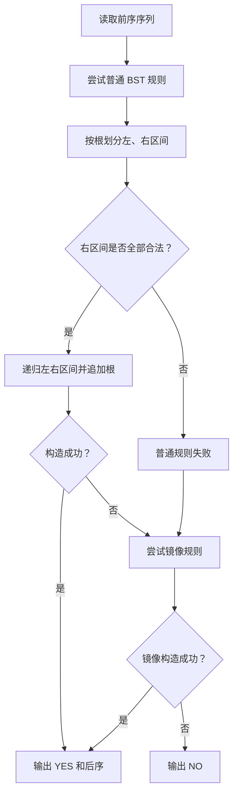
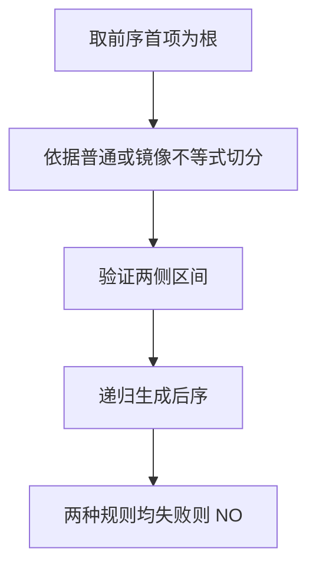

## 7-28 查找树判断

- **分值：** 25分

## 题目描述

对于二叉查找树，我们规定任一结点的左子树仅包含严格小于该结点的键值，而其右子树包含大于或等于该结点的键值。如果我们交换每个节点的左子树和右子树，得到的树叫做镜像二叉查找树。

现在我们给出一个整数键值序列，请编写程序判断该序列是否为某棵二叉查找树或某镜像二叉查找树的前序遍历序列，如果是，则输出对应二叉树的后序遍历序列。

## 输入格式

输入的第一行包含一个正整数 $n$（$\le 1000$），第二行包含 $n$ 个整数，为给出的整数键值序列，数字间以空格分隔。

## 输出格式

输出的第一行首先给出判断结果，如果输入的序列是某棵二叉查找树或某镜像二叉查找树的前序遍历序列，则输出`YES`，否侧输出`NO`。如果判断结果是`YES`，下一行输出对应二叉树的后序遍历序列。数字间以空格分隔，但行尾不能有多余的空格。

## 输入样例1
```
7
8 6 5 7 10 8 11
```

## 输出样例1
```
YES
5 7 6 8 11 10 8
```

## 输入样例2
```
7
8 6 8 5 10 9 11
```

## 输出样例2
```
NO
```

## 解题思路

对序列递归建树并同时生成后序。普通 BST 中左部分严格小于根、右部分大于等于根；镜像 BST 中左部分大于等于根、右部分严格小于根。若两种规则都失败则输出 NO。

## 代码流程说明

1. 读取题目要求的输入并建立必要的数据结构。
2. 按上述算法处理数据，维护中间结果和边界条件。
3. 按题目规定的顺序与格式输出结果。

## 代码实现

```java
// 实现原理：对序列递归建树并同时生成后序。普通 BST 中左部分严格小于根、右部分大于等于根；镜像 BST 中左部分大于等于根、右部分严格小于根。若两种规则都失败则输出 NO。
static boolean buildPost(int[] pre, int left, int right, boolean mirror, List<Integer> post) {
  if (left >= right) return true;
  int root = pre[left], i = left + 1;
  if (!mirror) while (i < right && pre[i] < root) i++;
  else while (i < right && pre[i] >= root) i++;
  for (int j = i; j < right; j++) if (!mirror ? pre[j] < root : pre[j] >= root) return false;
  if (!buildPost(pre, left + 1, i, mirror, post)) return false;
  if (!buildPost(pre, i, right, mirror, post)) return false;
  post.add(root);
  return true;
}
```
## 代码流程图



## 解题流程图



## 复杂度分析

递归分段并扫描左右区间，时间最坏 O(n²)，递归空间 O(n)。

## 常见易错点

- 普通树重复值只能进入右子树，镜像树重复值只能进入左子树；分割后要检查另一侧全部合法；后序输出顺序是左、右、根。
- 输入规模较大时，应选择与数据范围匹配的复杂度和数值类型。
- 输出分隔符、换行和特殊结果必须严格遵循题目格式。
