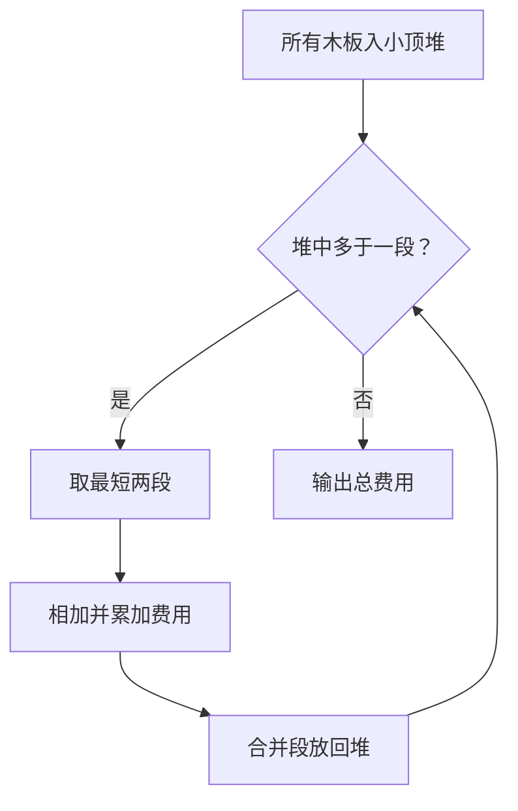
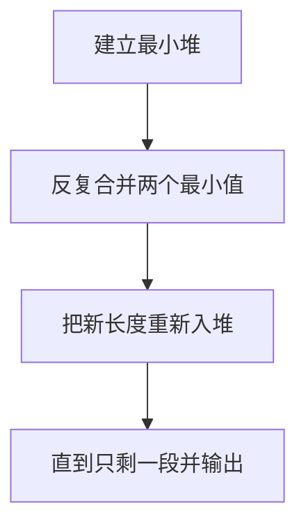

# 7-29 修理牧场

- **分值：** 25分

## 题目描述

农夫要修理牧场的一段栅栏，他测量了栅栏，发现需要 $$n$$ 块木头，每块木头长度为整数 $$l_i$$ 个长度单位，于是他购买了一条很长的、能锯成 $$n$$ 块的木头，即该木头的长度是 $$l_i$$ 的总和。

但是农夫自己没有锯子，请人锯木的酬金跟这段木头的长度成正比。为简单起见，不妨就设酬金等于所锯木头的长度。例如，要将长度为 20 的木头锯成长度为 8、7 和 5 的三段，第一次锯木头花费 20，将木头锯成 12 和 8；第二次锯木头花费 12，将长度为 12 的木头锯成 7 和 5，总花费为 32。如果第一次将木头锯成 15 和 5，则第二次锯木头花费 15，总花费为 35（大于 32）。

请编写程序帮助农夫计算将木头锯成 $$n$$ 块的最少花费。

## 输入格式

输入首先给出正整数 $$n$$（$$\le 10^4$$），表示要将木头锯成 $$n$$ 块。第二行给出 $$n$$ 个正整数（$$\le 50$$），表示每段木块的长度。

## 输出格式

输出一个整数，即将木头锯成 $$n$$ 块的最少花费。

## 输入样例
```
8
4 5 1 2 1 3 1 1
```

## 输出样例
```
49
```

### 解题思路

修理牧场的最小总费用等价于最优合并问题。每次取当前最短的两段合并，再把和放回集合；使用小顶堆可保证每一步最优。

### 代码流程说明

1. 读取题目要求的输入并建立必要的数据结构。
2. 按上述算法处理数据，维护中间结果和边界条件。
3. 按题目规定的顺序与格式输出结果。

### 代码实现

```java
static long repairCost(long[] boards) {
    PriorityQueue<Long> q = new PriorityQueue<>();
    for (long x : boards) q.offer(x);
    long answer = 0;
    while (q.size() > 1) {
        long x = q.poll() + q.poll();
        answer += x;
        q.offer(x);
    }
    return answer;
}
```
### 代码流程图



### 解题流程图



### 复杂度分析

每次合并取出两个最短木段，时间 O(n log n)，空间 O(n)。

### 常见易错点

- 必须每次合并最短的两段；费用可能超过 32 位整数；不能只求所有长度之和。
- 输入规模较大时，应选择与数据范围匹配的复杂度和数值类型。
- 输出分隔符、换行和特殊结果必须严格遵循题目格式。
