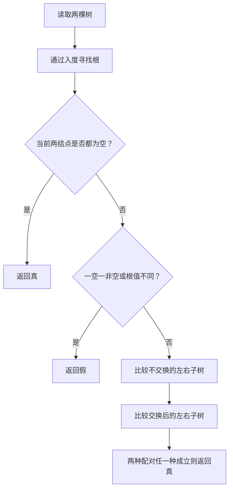
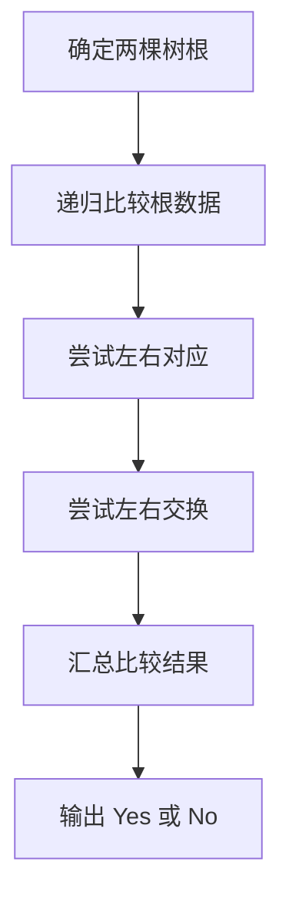

## 7-3 树的同构

- **分值：** 25分

## 题目描述

给定两棵树  $T_1$ 和 $T_2$。如果 $T_1$ 可以通过若干次左右孩子互换就变成 $T_2$，则我们称两棵树是“同构”的。例如图1给出的两棵树就是同构的，因为我们把其中一棵树的结点A、B、G的左右孩子互换后，就得到另外一棵树。而图2就不是同构的。

| 图1 | 图2 |
| :--: | :--: |
|  |  |

现给定两棵树，请你判断它们是否是同构的。

## 输入格式

输入给出2棵二叉树的信息。对于每棵树，首先在一行中给出一个非负整数 $$n$$ ($$\le 10$$)，即该树的结点数（此时假设结点从 0 到 $$n -1$$ 编号）；随后 $$n$$ 行，第 $$i$$ 行对应编号第 $$i$$ 个结点，给出该结点中存储的 1 个英文大写字母、其左孩子结点的编号、右孩子结点的编号。如果孩子结点为空，则在相应位置上给出 “-”。给出的数据间用一个空格分隔。注意：题目保证每个结点中存储的字母是不同的。

## 输出格式

如果两棵树是同构的，输出“Yes”，否则输出“No”。

## 输入样例1（对应图1）
```
8
A 1 2
B 3 4
C 5 -
D - -
E 6 -
G 7 -
F - -
H - -
8
G - 4
B 7 6
F - -
A 5 1
H - -
C 0 -
D - -
E 2 -
```

## 输出样例1
```
Yes
```

## 输入样例2（对应图2）
```
8
B 5 7
F - -
A 0 3
C 6 -
H - -
D - -
G 4 -
E 1 -
8
D 6 -
B 5 -
E - -
H - -
C 0 2
G - 3
F - -
A 1 4
```

## 输出样例2
```
No
```

## 解题思路

用递归判断两棵树是否同构。空树只与空树同构；根值相同后，分别尝试“不交换”和“交换”两种子树配对，只要一种成立即可。根据输入的左右孩子编号先找到各自的根。

## 代码流程说明

1. 读取题目要求的输入并建立必要的数据结构。
2. 按上述算法处理数据，维护中间结果和边界条件。
3. 按题目规定的顺序与格式输出结果。

## 代码实现

```java
// 实现原理：用递归判断两棵树是否同构。空树只与空树同构；根值相同后，分别尝试“不交换”和“交换”两种子树配对，只要一种成立即可。根据输入的左右孩子编号先找到各自的根。
static class Node {
  char data;
  Node left, right;
}

static boolean isomorphic(Node a, Node b) {
  if (a == null || b == null) return a == b;
  if (a.data != b.data) return false;
  return isomorphic(a.left, b.left) && isomorphic(a.right, b.right)
      || isomorphic(a.left, b.right) && isomorphic(a.right, b.left);
}
```
## 代码流程图



## 解题流程图



## 复杂度分析

设两棵树分别有 n、m 个结点；当前未使用等价类缓存，递归最坏时间为指数级，空间 O(n+m)。

## 常见易错点

- 不能把结点编号 0 误当成空指针；先通过入度确定根；交换分支时要同时比较左右子树；遇到空结点必须及时返回。
- 输入规模较大时，应选择与数据范围匹配的复杂度和数值类型。
- 输出分隔符、换行和特殊结果必须严格遵循题目格式。
