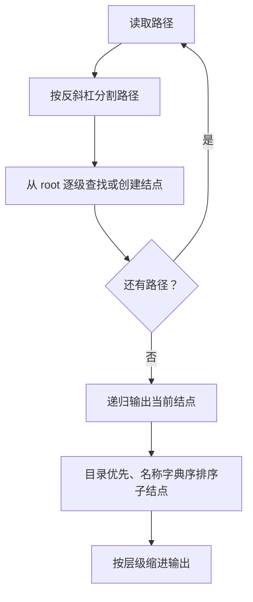
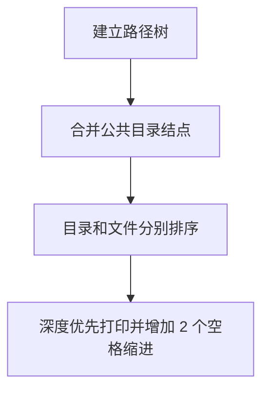

## 7-30 目录树

- **分值：** 30分

## 题目描述

在ZIP归档文件中，保留着所有压缩文件和目录的相对路径和名称。当使用WinZIP等GUI软件打开ZIP归档文件时，可以从这些信息中重建目录的树状结构。请编写程序实现目录的树状结构的重建工作。

## 输入格式

输入首先给出正整数N（$$\le 10^4$$），表示ZIP归档文件中的文件和目录的数量。随后N行，每行有如下格式的文件或目录的相对路径和名称（每行不超过260个字符）：

- 路径和名称中的字符仅包括英文字母（区分大小写）；
- 符号“\”仅作为路径分隔符出现；
- 目录以符号“\”结束；
- 不存在重复的输入项目；
- 整个输入大小不超过2MB。

## 输出格式

假设所有的路径都相对于root目录。从root目录开始，在输出时每个目录首先输出自己的名字，然后以字典序输出所有子目录，然后以字典序输出所有文件。注意，在输出时，应根据目录的相对关系使用空格进行缩进，每级目录或文件比上一级多缩进2个空格。

## 输入样例
```
7
b
c\
ab\cd
a\bc
ab\d
a\d\a
a\d\z\
```

## 输出样例
```
root
  a
    d
      z
      a
    bc
  ab
    cd
    d
  c
  b
```

## 解题思路

把每条路径按反斜杠切分，逐级在目录结点的有序子结点映射中查找或创建。目录和文件统一作为树结点，输出时先打印当前结点，再按题意排序遍历子结点。

## 代码流程说明

1. 读取题目要求的输入并建立必要的数据结构。
2. 按上述算法处理数据，维护中间结果和边界条件。
3. 按题目规定的顺序与格式输出结果。

## 代码实现

```java
// 实现原理：把每条路径按反斜杠切分，逐级在目录结点的有序子结点映射中查找或创建。目录和文件统一作为树结点，输出时先打印当前结点，再按题意排序遍历子结点。
static class Dir {
  String name;
  boolean file;
  TreeMap<String, Dir> children = new TreeMap<>();

  Dir(String name, boolean file) {
    this.name = name;
    this.file = file;
  }
}

static void addPath(Dir root, String path) {
  boolean file = !path.endsWith("\\");
  String[] parts = path.split("\\\\");
  Dir cur = root;
  for (int i = 0; i < parts.length; i++) {
    String part = parts[i];
    boolean isFile = file && i == parts.length - 1;
    Dir next = cur.children.get(part);
    if (next == null) {
      next = new Dir(part, isFile);
      cur.children.put(part, next);
    }
    cur = next;
  }
}

static void printTree(Dir node, int depth) {
  System.out.println("  ".repeat(depth) + node.name);
  List<Dir> children = new ArrayList<>(node.children.values());
  children.sort(Comparator.comparing((Dir x) -> x.file).thenComparing(x -> x.name));
  for (Dir child : children) printTree(child, depth + 1);
}
```
## 代码流程图



## 解题流程图



## 复杂度分析

设目录树结点数为 V，插入和排序打印总时间为 O(V log V)（按各层子结点排序计），空间 O(V)。

## 常见易错点

- 反斜杠是分隔符而非名称字符；目录末尾的反斜杠不能生成空名称；输出目录在文件之前且每层缩进 2 个空格。
- 输入规模较大时，应选择与数据范围匹配的复杂度和数值类型。
- 输出分隔符、换行和特殊结果必须严格遵循题目格式。
