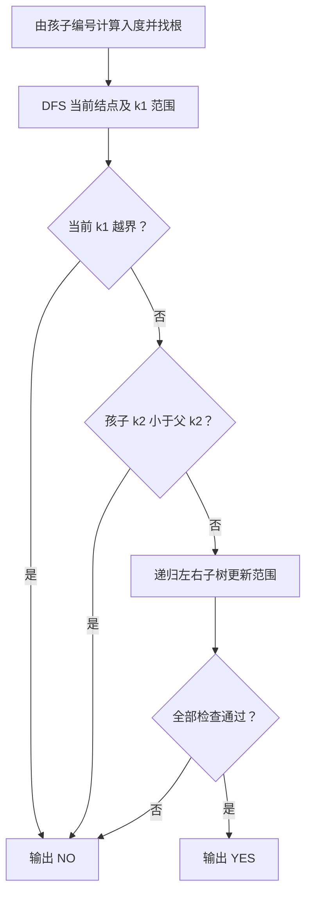
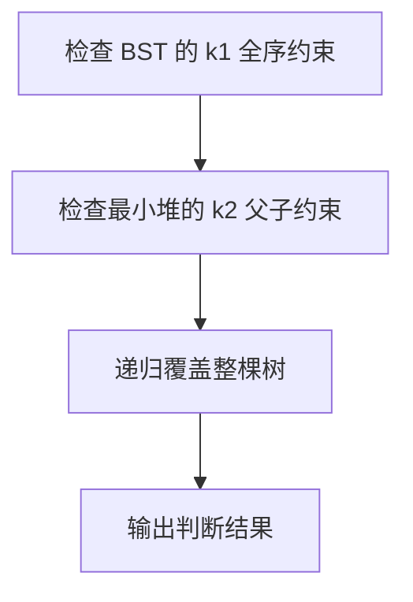

## 7-31 笛卡尔树

- **分值：** 25分

## 题目描述

笛卡尔树是一种特殊的二叉树，其结点包含两个关键字 $k_1$ 和 $k_2$。首先笛卡尔树是关于 $k_1$ 的二叉查找树，即结点左子树的所有 $k_1$ 值都比该结点的 $k_1$ 值小，右子树则大。其次所有结点的 $k_2$ 关键字满足优先队列（不妨设为最小堆）的顺序要求，即该结点的 $k_2$ 值比其子树中所有结点的 $k_2$ 值小。给定一棵二叉树，请判断该树是否笛卡尔树。

## 输入格式

输入首先给出正整数 $n$（$\le 1000$），为树中结点的个数。随后 $n$ 行，每行给出一个结点的信息，包括：结点的 $k_1$ 值、$k_2$ 值、左孩子结点编号、右孩子结点编号。设结点从0~($n-1$)顺序编号。若某结点不存在孩子结点，则该位置给出 $-1$。

## 输出格式

输出`YES`如果该树是一棵笛卡尔树；否则输出`NO`。

## 输入样例1
```
6
8 27 5 1
9 40 -1 -1
10 20 0 3
12 21 -1 4
15 22 -1 -1
5 35 -1 -1
```

## 输出样例1
```
YES
```

## 输入样例2
```
6
8 27 5 1
9 40 -1 -1
10 20 0 3
12 11 -1 4
15 22 -1 -1
50 35 -1 -1
```

## 输出样例2
```
NO
```

## 解题思路

先检查每个结点的左右子树是否覆盖正确的 `k1` 范围，再检查父结点的 `k2` 是否小于左右孩子的 `k2`。从根开始 DFS，并用入度找到根；任一约束失败立即输出 NO。

## 代码流程说明

1. 读取题目要求的输入并建立必要的数据结构。
2. 按上述算法处理数据，维护中间结果和边界条件。
3. 按题目规定的顺序与格式输出结果。

## 代码实现

```java
// 实现原理：先检查每个结点的左右子树是否覆盖正确的 k1 范围，再检查父结点的 k2 是否小于左右孩子的 k2。从根开始 DFS，并用入度找到根；任一约束失败立即输出 NO。
static class CartesianNode {
  int k1, k2, left, right;
}

static boolean checkCartesian(int root, CartesianNode[] a, long lower, long upper) {
  if (root < 0) return true;
  CartesianNode x = a[root];
  if (x.k1 <= lower || x.k1 >= upper) return false;
  if (x.left >= 0 && a[x.left].k2 < x.k2) return false;
  if (x.right >= 0 && a[x.right].k2 < x.k2) return false;
  return checkCartesian(x.left, a, lower, x.k1) && checkCartesian(x.right, a, x.k1, upper);
}
```
## 代码流程图



## 解题流程图



## 复杂度分析

每个结点检查一次，时间 O(n)，递归空间 O(h)。

## 常见易错点

- 要检查整棵子树的 k1 范围而非只比较孩子；最小堆要求父 k2 小于等于子树；必须处理根查找和非法孩子编号。
- 输入规模较大时，应选择与数据范围匹配的复杂度和数值类型。
- 输出分隔符、换行和特殊结果必须严格遵循题目格式。
