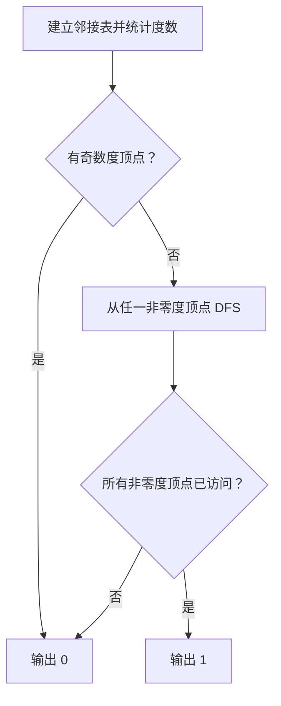
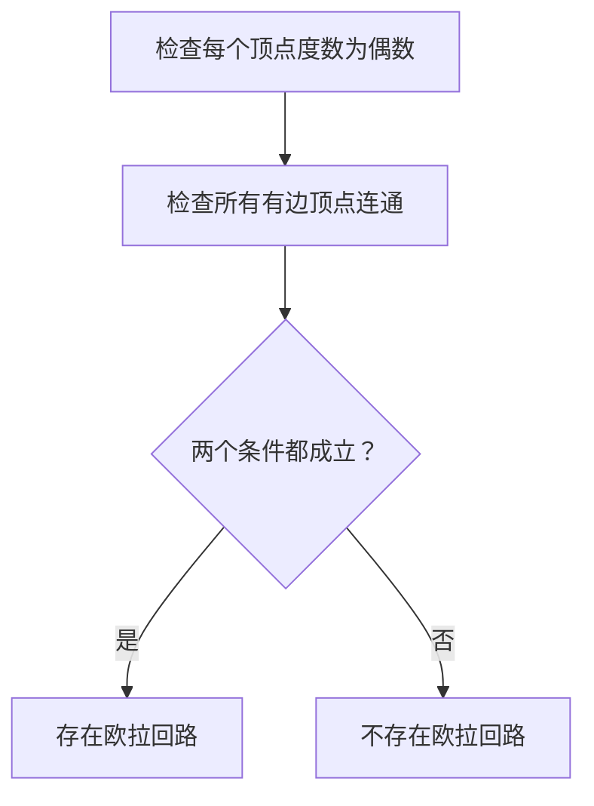

# 7-32 哥尼斯堡的“七桥问题”

- **分值：** 25分

## 题目描述

哥尼斯堡是位于普累格河上的一座城市，它包含两个岛屿及连接它们的七座桥，如下图所示。


可否走过这样的七座桥，而且每桥只走过一次？瑞士数学家欧拉(Leonhard Euler，1707—1783)最终解决了这个问题，并由此创立了拓扑学。

这个问题如今可以描述为判断欧拉回路是否存在的问题。欧拉回路是指不令笔离开纸面，可画过图中每条边仅一次，且可以回到起点的一条回路。现给定一个无向图，问是否存在欧拉回路？

## 输入格式

输入第一行给出两个正整数，分别是节点数 $$n$$ （$$1\le n\le 1000$$）和边数 $$m$$；随后的 $$m$$ 行对应 $$m$$ 条边，每行给出一对正整数，分别是该条边直接连通的两个节点的编号（节点从1到 $$n$$ 编号）。

## 输出格式

若欧拉回路存在则输出 1，否则输出 0。

## 输入样例1
```
6 10
1 2
2 3
3 1
4 5
5 6
6 4
1 4
1 6
3 4
3 6
```

## 输出样例1
```
1
```

## 输入样例2
```
5 8
1 2
1 3
2 3
2 4
2 5
5 3
5 4
3 4
```

## 输出样例2
```
0
```

### 解题思路

无向图存在欧拉回路当且仅当所有非零度顶点属于同一个连通分量且每个顶点度数为偶数。先统计度数，再从任一非零度顶点 DFS/BFS 检查连通性。

### 代码流程说明

1. 读取题目要求的输入并建立必要的数据结构。
2. 按上述算法处理数据，维护中间结果和边界条件。
3. 按题目规定的顺序与格式输出结果。

### 代码实现

```java
static boolean hasEulerCircuit(int n, List<Integer>[] g) {
    int start = -1;
    for (int i = 0; i < n; i++) {
        if ((g[i].size() & 1) != 0) return false;
        if (!g[i].isEmpty()) start = i;
    }
    if (start < 0) return true;
    boolean[] vis = new boolean[n];
    ArrayDeque<Integer> q = new ArrayDeque<>();
    q.offer(start); vis[start] = true;
    while (!q.isEmpty()) for (int v : g[q.poll()])
        if (!vis[v]) { vis[v] = true; q.offer(v); }
    for (int i = 0; i < n; i++)
        if (!g[i].isEmpty() && !vis[i]) return false;
    return true;
}
```
### 代码流程图



### 解题流程图



### 复杂度分析

检查度数并 BFS 连通性，时间 O(n+m)，空间 O(n)。

### 常见易错点

- 孤立点不影响边的欧拉回路；连通性只需检查有边的顶点；每条无向边要让两个端点度数都加一。
- 输入规模较大时，应选择与数据范围匹配的复杂度和数值类型。
- 输出分隔符、换行和特殊结果必须严格遵循题目格式。
