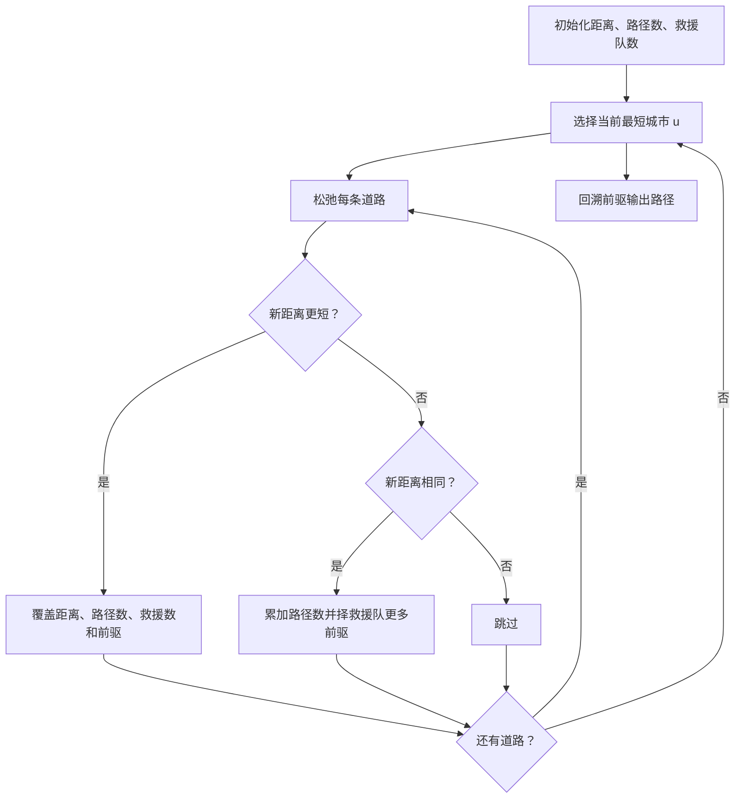
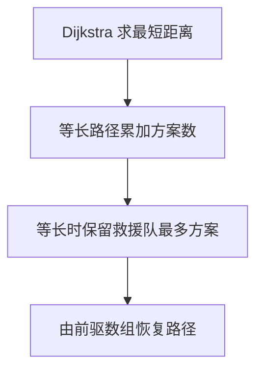

# 7-35 城市间紧急救援

- **分值：** 25分

## 题目描述

作为一个城市的应急救援队伍的负责人，你有一张特殊的全国地图。在地图上显示有多个分散的城市和一些连接城市的快速道路。每个城市的救援队数量和每一条连接两个城市的快速道路长度都标在地图上。当其他城市有紧急求助电话给你的时候，你的任务是带领你的救援队尽快赶往事发地，同时，一路上召集尽可能多的救援队。

## 输入格式

输入第一行给出 4 个正整数 $$n$$、$$m$$、$$s$$、$$d$$，其中 $$n$$（$$2\le n\le 500$$）是城市的个数，顺便假设城市的编号为 0 ~ $$(n-1)$$；$$m$$ 是快速道路的条数；$$s$$ 是出发地的城市编号；$$d$$是目的地的城市编号。

第二行给出 $$n$$ 个正整数，其中第 $$i$$ 个数是第 $$i$$ 个城市的救援队的数目，数字间以空格分隔。随后的 $$m$$ 行中，每行给出一条快速道路的信息，分别是：城市 1、城市 2、快速道路的长度，中间用空格分开，数字均为整数且不超过 500。输入保证救援可行且最优解唯一。

## 输出格式

第一行输出最短路径的条数和能够召集的最多的救援队数量。第二行输出从 $$s$$ 到 $$d$$ 的路径中经过的城市编号。数字间以空格分隔，输出结尾不能有多余空格。

## 输入样例
```
4 5 0 3
20 30 40 10
0 1 1
1 3 2
0 3 3
0 2 2
2 3 2
```

## 输出样例
```
2 60
0 1 3
```

### 解题思路

使用 Dijkstra 同时维护最短距离、最短路径条数和路径上救援队总数。发现更短路径时覆盖；发现等长路径时累加条数，并在救援队更多时更新前驱。

### 代码流程说明

1. 读取题目要求的输入并建立必要的数据结构。
2. 按上述算法处理数据，维护中间结果和边界条件。
3. 按题目规定的顺序与格式输出结果。

### 代码实现

```java
// 实现原理：使用 Dijkstra 同时维护最短距离、最短路径条数和路径上救援队总数。发现更短路径时覆盖；发现等长路径时累加条数，并在救援队更多时更新前驱。
static class State {
  long distance = Long.MAX_VALUE / 4;
  long ways;
  int rescue;
  int previous = -1;
}

static State[] emergency(int n, List<int[]>[] g, int[] teams, int s) {
  State[] a = new State[n];
  for (int i = 0; i < n; i++) a[i] = new State();
  a[s].distance = 0;
  a[s].ways = 1;
  a[s].rescue = teams[s];
  boolean[] done = new boolean[n];
  for (int step = 0; step < n; step++) {
    int u = -1;
    for (int i = 0; i < n; i++)
      if (!done[i]
          && a[i].distance < Long.MAX_VALUE / 4
          && (u < 0 || a[i].distance < a[u].distance)) u = i;
    if (u < 0) break;
    done[u] = true;
    for (int[] e : g[u]) {
      int v = e[0];
      long nd = a[u].distance + e[1];
      if (nd < a[v].distance) {
        a[v].distance = nd;
        a[v].ways = a[u].ways;
        a[v].rescue = a[u].rescue + e[2];
        a[v].previous = u;
      } else if (nd == a[v].distance) {
        a[v].ways += a[u].ways;
        if (a[u].rescue + e[2] > a[v].rescue) {
          a[v].rescue = a[u].rescue + e[2];
          a[v].previous = u;
        }
      }
    }
  }
  return a;
}
```
### 代码流程图



### 解题流程图



### 复杂度分析

数组版 Dijkstra 时间 O(n²+m)，空间 O(n+m)。

### 常见易错点

- 路径数在等长时要累加而不是覆盖；救援队数量也要包含起点和终点；回溯路径后要反转；使用长整型保存路径数或距离更稳妥。
- 输入规模较大时，应选择与数据范围匹配的复杂度和数值类型。
- 输出分隔符、换行和特殊结果必须严格遵循题目格式。
