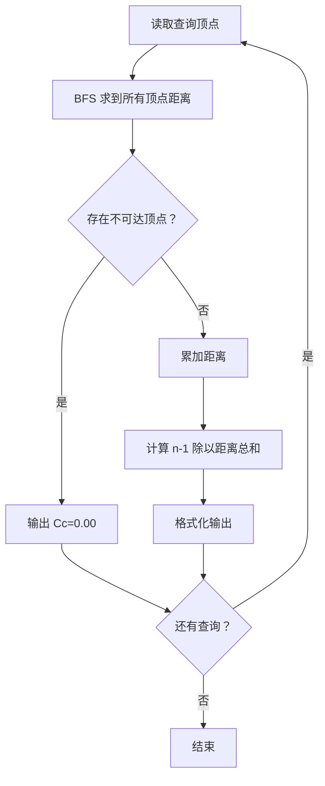
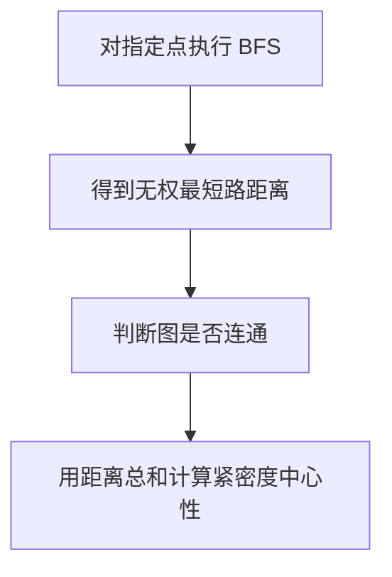

# 7-36 社交网络图中结点的“重要性”计算

- **分值：** 30分

## 题目描述

在社交网络中，个人或单位（结点）之间通过某些关系（边）联系起来。他们受到这些关系的影响，这种影响可以理解为网络中相互连接的结点之间蔓延的一种相互作用，可以增强也可以减弱。而结点根据其所处的位置不同，其在网络中体现的重要性也不尽相同。

“紧密度中心性”是用来衡量一个结点到达其它结点的“快慢”的指标，即一个有较高中心性的结点比有较低中心性的结点能够更快地（平均意义下）到达网络中的其它结点，因而在该网络的传播过程中有更重要的价值。在有 $$n$$ 个结点的网络中，结点 $$v_i$$ 的“紧密度中心性” $$Cc(v_i)$$ 数学上定义为 $$v_i$$ 到其余所有结点 $$v_j$$ ($$j\ne i$$) 的最短距离 $$d(v_i, v_j)$$ 的平均值的倒数：


对于非连通图，所有结点的紧密度中心性都是 0。

给定一个无权的无向图以及其中的一组结点，计算这组结点中每个结点的紧密度中心性。

## 输入格式

输入第一行给出两个正整数 $$n$$ 和 $$m$$，其中 $$n$$（$$\le 10^3$$）是图中结点个数，顺便假设结点从 1 到 $$n$$ 编号；$$m$$（$$\le 10^4$$）是边的条数。随后的 $$m$$ 行中，每行给出一条边的信息，即该边连接的两个结点编号，中间用空格分隔。最后一行给出需要计算紧密度中心性的这组结点的个数 $$k$$（$$\le 100$$）以及 $$k$$ 个结点编号，用空格分隔。

## 输出格式

按照 `Cc(i)=x.xx` 的格式输出 $$k$$ 个给定结点的紧密度中心性，每个输出占一行，结果保留到小数点后 2 位。

## 输入样例
```
9 14
1 2
1 3
1 4
2 3
3 4
4 5
4 6
5 6
5 7
5 8
6 7
6 8
7 8
7 9
3 3 4 9
```

## 输出样例
```
Cc(3)=0.47
Cc(4)=0.62
Cc(9)=0.35
```

### 解题思路

无权无向图中从一个源点到所有点的最短距离由 BFS 得到。对每个查询点求距离总和，再计算 `Cc = (n-1)/sum`；若图不连通则按题意输出 0。

### 代码流程说明

1. 读取题目要求的输入并建立必要的数据结构。
2. 按上述算法处理数据，维护中间结果和边界条件。
3. 按题目规定的顺序与格式输出结果。

### 代码实现

```java
// 实现原理：无权无向图中从一个源点到所有点的最短距离由 BFS 得到。对每个查询点求距离总和，再计算 Cc = (n-1)/sum；若图不连通则按题意输出 0。
static double closeness(int s, List<Integer>[] g) {
  int[] d = new int[g.length];
  // 先统一设置初始状态，再在遍历中逐步更新可达结果。
  // 先统一设置初始状态，再在遍历中逐步更新可达结果。
// 先统一设置初始状态，再在遍历中逐步更新可达结果。
// 先统一设置初始状态，再在遍历中逐步更新可达结果。
  Arrays.fill(d, -1);
  // 用队列/栈保存尚未处理的元素，保证遍历或模拟的处理顺序。
  // 用队列/栈保存尚未处理的元素，保证遍历或模拟的处理顺序。
// 用队列/栈保存尚未处理的元素，保证遍历或模拟的处理顺序。
// 用队列/栈保存尚未处理的元素，保证遍历或模拟的处理顺序。
  ArrayDeque<Integer> q = new ArrayDeque<>();
  d[s] = 0;
  q.offer(s);
  while (!q.isEmpty()) {
    int v = q.poll();
    for (int u : g[v])
      if (d[u] < 0) {
        d[u] = d[v] + 1;
        q.offer(u);
      }
  }
  long sum = 0;
  for (int x : d) {
    if (x < 0) return 0.0;
    sum += x;
  }
  return (g.length - 1.0) / sum;
}
```
### 代码流程图



### 解题流程图



### 复杂度分析

单个查询点 BFS 时间 O(n+m)，空间 O(n)。

### 常见易错点

- 中心性使用距离总和的倒数，公式应为 `(n-1)/sum`；要排除 distance[s]=0；发现任意不可达点就输出 0。
- 输入规模较大时，应选择与数据范围匹配的复杂度和数值类型。
- 输出分隔符、换行和特殊结果必须严格遵循题目格式。
