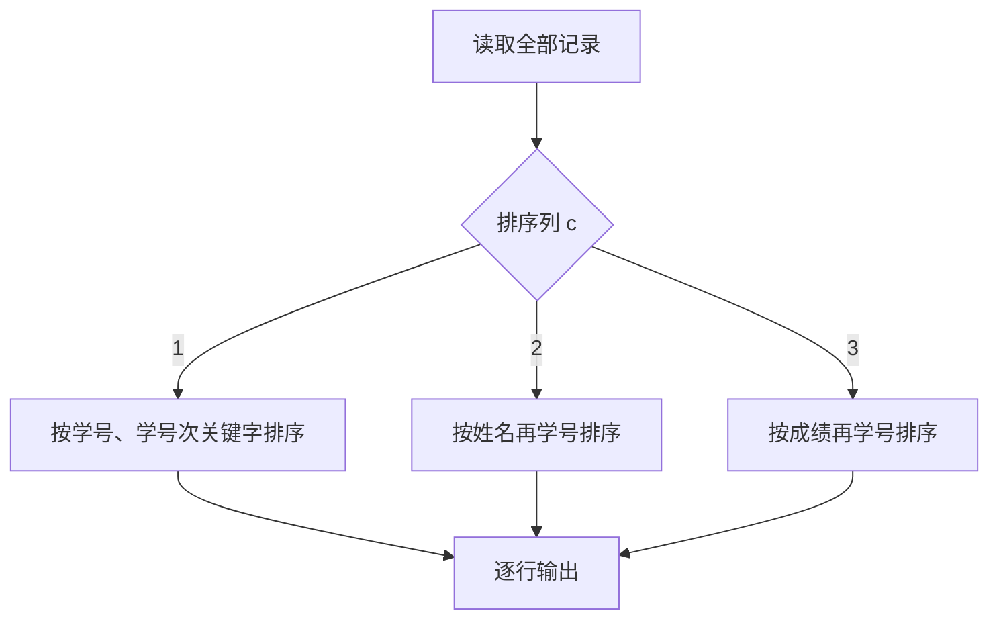
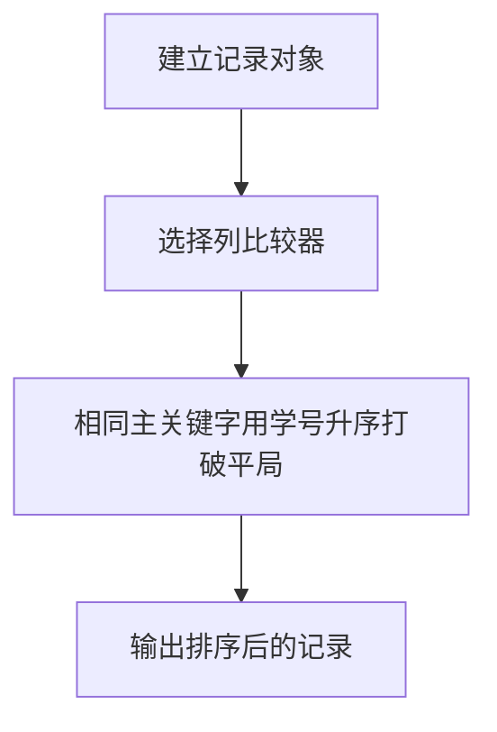

## 7-37 模拟EXCEL排序

- **分值：** 25分

## 题目描述

Excel可以对一组纪录按任意指定列排序。现请编写程序实现类似功能。

## 输入格式

输入的第一行包含两个正整数 n (\le 10^5) 和 c，其中 n 是纪录的条数，c 是指定排序的列号。之后有 n 行，每行包含一条学生纪录。每条学生纪录由学号（6 位数字，保证没有重复的学号）、姓名（不超过 8 位且不包含空格的字符串）、成绩（[0, 100] 内的整数）组成，相邻属性用 1 个空格隔开。

## 输出格式

在 n 行中输出按要求排序后的结果，即：当 c=1 时，按学号递增排序；当 c=2 时，按姓名的非递减字典序排序；当 c=3 时，按成绩的非递减排序。当若干学生具有相同姓名或者相同成绩时，则按他们的学号递增排序。

## 输入样例
```
3 1
000007 James 85
000010 Amy 90
000001 Zoe 60
```

## 输出样例
```
000001 Zoe 60
000007 James 85
000010 Amy 90
```

## 解题思路

将记录封装为学号、姓名、成绩，根据列号选择比较器，并始终追加学号升序作为次关键字。使用稳定且高效的排序后逐行输出。

## 代码流程说明

1. 读取题目要求的输入并建立必要的数据结构。
2. 按上述算法处理数据，维护中间结果和边界条件。
3. 按题目规定的顺序与格式输出结果。

## 代码实现

```java
// 实现原理：将记录封装为学号、姓名、成绩，根据列号选择比较器，并始终追加学号升序作为次关键字。使用稳定且高效的排序后逐行输出。
static class Record {
  String id, name;
  int score;

  Record(String id, String name, int score) {
    this.id = id;
    this.name = name;
    this.score = score;
  }
}

static void sortRecords(List<Record> a, int column) {
  Comparator<Record> cmp =
      column == 1
          ? Comparator.comparing(r -> r.id)
          : column == 2
              ? Comparator.comparing((Record r) -> r.name).thenComparing(r -> r.id)
              : Comparator.comparingInt((Record r) -> r.score).thenComparing(r -> r.id);
  a.sort(cmp);
}
```
## 代码流程图



## 解题流程图



## 复杂度分析

排序时间 O(n log n)，空间 O(n)。

## 常见易错点

- 姓名比较使用字典序；成绩相同仍要按学号；学号要按固定六位字符串或数值正确比较并保留前导零。
- 输入规模较大时，应选择与数据范围匹配的复杂度和数值类型。
- 输出分隔符、换行和特殊结果必须严格遵循题目格式。
