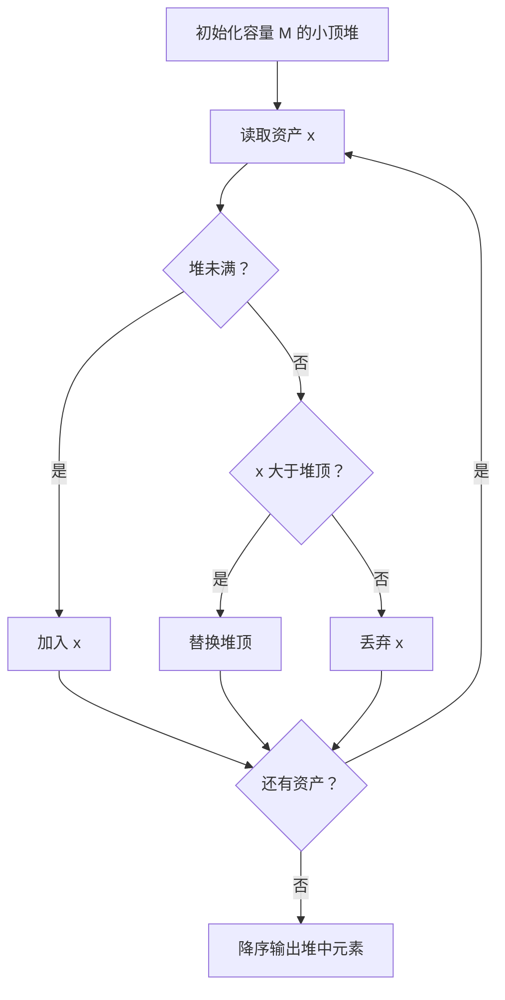
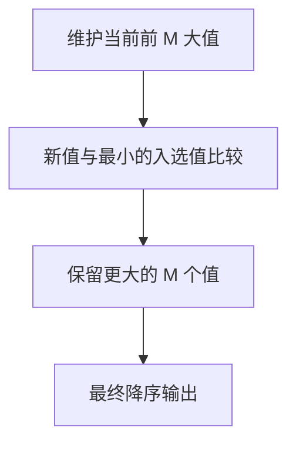

# 7-38 寻找大富翁

- **分值：** 25分

## 题目描述

胡润研究院的调查显示，截至2017年底，中国个人资产超过1亿元的高净值人群达15万人。假设给出N个人的个人资产值，请快速找出资产排前M位的大富翁。

## 输入格式

输入首先给出两个正整数$$N$$（$$\le 10^6$$）和$$M$$（$$\le 10$$），其中$$N$$为总人数，$$M$$为需要找出的大富翁数；接下来一行给出$$N$$个人的个人资产值，以百万元为单位，为不超过长整型范围的整数。数字间以空格分隔。

## 输出格式

在一行内按非递增顺序输出资产排前$$M$$位的大富翁的个人资产值。数字间以空格分隔，但结尾不得有多余空格。

## 输入样例
```
8 3
8 12 7 3 20 9 5 18
```

## 输出样例
```
20 18 12
```

### 解题思路

只需维护最大的 M 个资产。使用大小为 M 的小顶堆：堆顶是当前前 M 名中的最小值，新值大于堆顶时替换。最后将堆中元素按降序输出。

### 代码流程说明

1. 读取题目要求的输入并建立必要的数据结构。
2. 按上述算法处理数据，维护中间结果和边界条件。
3. 按题目规定的顺序与格式输出结果。

### 代码实现

```java
// 实现原理：只需维护最大的 M 个资产。使用大小为 M 的小顶堆：堆顶是当前前 M 名中的最小值，新值大于堆顶时替换。最后将堆中元素按降序输出。
static long[] topM(long[] assets, int m) {
  // 小顶堆的堆顶保存当前最小元素，用于每次取最优候选。
  // 小顶堆的堆顶保存当前最小元素，用于每次取最优候选。
// 小顶堆的堆顶保存当前最小元素，用于每次取最优候选。
// 小顶堆的堆顶保存当前最小元素，用于每次取最优候选。
  PriorityQueue<Long> q = new PriorityQueue<>();
  for (long x : assets) {
    if (q.size() < m) q.offer(x);
    else if (x > q.peek()) {
      q.poll();
      q.offer(x);
    }
  }
  long[] result = new long[q.size()];
  for (int i = result.length - 1; i >= 0; i--) result[i] = q.poll();
  return result;
}
```
### 代码流程图



### 解题流程图



### 复杂度分析

维护大小为 M 的小顶堆，时间 O(N log M)，空间 O(M)。

### 常见易错点

- 堆顶是前 M 名中的最小值；M 可能大于或等于 N；使用长整型保存资产值和输出结果。
- 输入规模较大时，应选择与数据范围匹配的复杂度和数值类型。
- 输出分隔符、换行和特殊结果必须严格遵循题目格式。
