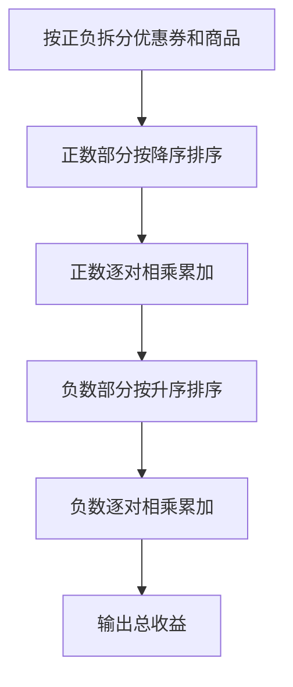
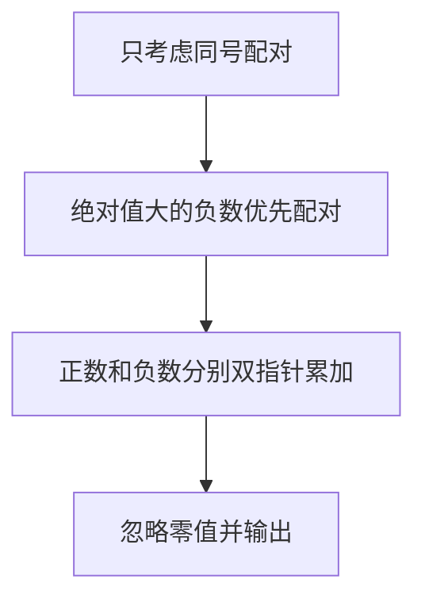

## 7-39 魔法优惠券

- **分值：** 25分

## 题目描述

在火星上有个魔法商店，提供魔法优惠券。每个优惠劵上印有一个整数面值K，表示若你在购买某商品时使用这张优惠劵，可以得到K倍该商品价值的回报！该商店还免费赠送一些有价值的商品，但是如果你在领取免费赠品的时候使用面值为正的优惠劵，则必须倒贴给商店K倍该商品价值的金额…… 但是不要紧，还有面值为负的优惠劵可以用！（真是神奇的火星）

例如，给定一组优惠劵，面值分别为1、2、4、-1；对应一组商品，价值为火星币M$7、6、-2、-3，其中负的价值表示该商品是免费赠品。我们可以将优惠劵3用在商品1上，得到M$28的回报；优惠劵2用在商品2上，得到M$12的回报；优惠劵4用在商品4上，得到M$3的回报。但是如果一不小心把优惠劵3用在商品4上，你必须倒贴给商店M$12。同样，当你一不小心把优惠劵4用在商品1上，你必须倒贴给商店M$7。

规定每张优惠券和每件商品都只能最多被使用一次，求你可以得到的最大回报。

## 输入格式

输入有两行。第一行首先给出优惠劵的个数N，随后给出N个优惠劵的整数面值。第二行首先给出商品的个数M，随后给出M个商品的整数价值。N和M在[1, $$10^6$$]之间，所有的数据大小不超过$$2^{30}$$，数字间以空格分隔。

## 输出格式

输出可以得到的最大回报。

## 输入样例
```
4 1 2 4 -1
4 7 6 -2 -3
```

## 输出样例
```
43
```

## 解题思路

正优惠券与正商品配对、负优惠券与负商品配对时乘积为正。分别排序后用双指针配对正数和负数，只有乘积为正才加入答案；零不产生收益。

## 代码流程说明

1. 读取题目要求的输入并建立必要的数据结构。
2. 按上述算法处理数据，维护中间结果和边界条件。
3. 按题目规定的顺序与格式输出结果。

## 代码实现

```java
// 实现原理：正优惠券与正商品配对、负优惠券与负商品配对时乘积为正。分别排序后用双指针配对正数和负数，只有乘积为正才加入答案；零不产生收益。
static long maxCouponValue(long[] coupons, long[] products) {
  List<Long> cp = new ArrayList<>(), cn = new ArrayList<>();
  List<Long> pp = new ArrayList<>(), pn = new ArrayList<>();
  for (long x : coupons)
    if (x > 0) cp.add(x);
    else if (x < 0) cn.add(x);
  for (long x : products)
    if (x > 0) pp.add(x);
    else if (x < 0) pn.add(x);
  cp.sort(Collections.reverseOrder());
  pp.sort(Collections.reverseOrder());
  Collections.sort(cn);
  Collections.sort(pn);
  long ans = 0;
  for (int i = 0; i < Math.min(cp.size(), pp.size()); i++) ans += cp.get(i) * pp.get(i);
  for (int i = 0; i < Math.min(cn.size(), pn.size()); i++) ans += cn.get(i) * pn.get(i);
  return ans;
}
```
## 代码流程图



## 解题流程图



## 复杂度分析

分类、排序时间 O(N log N+M log M)，空间 O(N+M)。

## 常见易错点

- 只配对同号正数；负数要按绝对值从大到小配对；零不能带来收益；乘积和使用长整型。
- 输入规模较大时，应选择与数据范围匹配的复杂度和数值类型。
- 输出分隔符、换行和特殊结果必须严格遵循题目格式。
