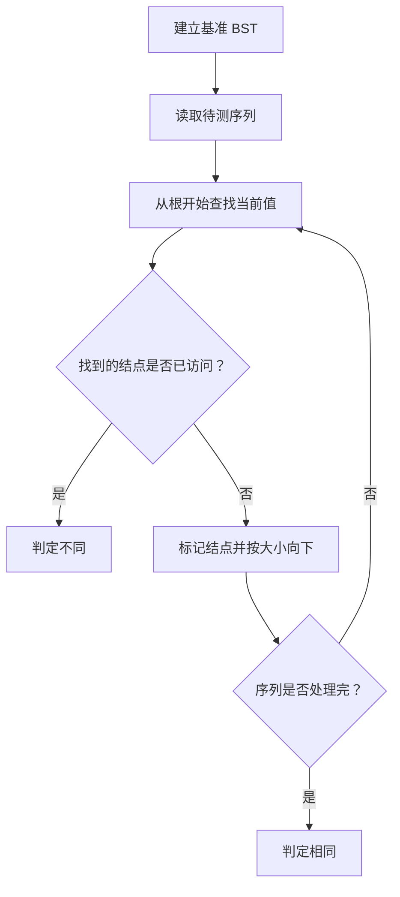
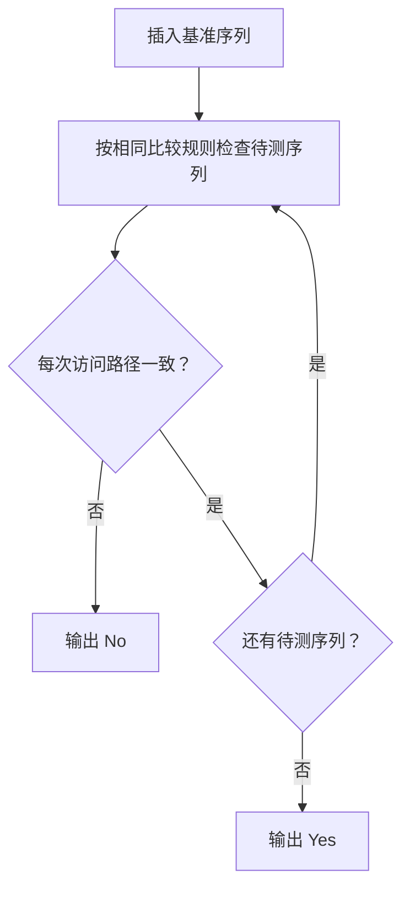

## 7-4 是否同一棵二叉搜索树

- **分值：** 25分

## 题目描述

给定一个插入序列就可以唯一确定一棵二叉搜索树。然而，一棵给定的二叉搜索树却可以由多种不同的插入序列得到。例如分别按照序列{2, 1, 3}和{2, 3, 1}插入初始为空的二叉搜索树，都得到一样的结果。于是对于输入的各种插入序列，你需要判断它们是否能生成一样的二叉搜索树。

## 输入格式

输入包含若干组测试数据。每组数据的第1行给出两个正整数N (\le 10)和L，分别是每个序列插入元素的个数和需要检查的序列个数。第2行给出N个以空格分隔的正整数，作为初始插入序列。随后L行，每行给出N个插入的元素，属于L个需要检查的序列。

简单起见，我们保证每个插入序列都是1到N的一个排列。当读到N为0时，标志输入结束，这组数据不要处理。

## 输出格式

对每一组需要检查的序列，如果其生成的二叉搜索树跟对应的初始序列生成的一样，输出“Yes”，否则输出“No”。

## 输入样例
```
4 2
3 1 4 2
3 4 1 2
3 2 4 1
2 1
2 1
1 2
0
```

## 输出样例
```
Yes
No
No
```

**鸣谢青岛大学周强老师补充测试数据！**

## 解题思路

将第一棵树的插入序列作为基准。对每个待判断序列，从根开始比较：小于当前值走左子树，大于等于当前值走右子树；若访问路径上的结构与基准一致则同构。也可递归按根值把序列划分为左、右部分。

## 代码流程说明

1. 读取题目要求的输入并建立必要的数据结构。
2. 按上述算法处理数据，维护中间结果和边界条件。
3. 按题目规定的顺序与格式输出结果。

## 代码实现

```java
// 实现原理：将第一棵树的插入序列作为基准。对每个待判断序列，从根开始比较：小于当前值走左子树，大于等于当前值走右子树；若访问路径上的结构与基准一致则同构。也可递归按根值把序列划分为
// 左、右部分。
static class BstNode {
  int key;
  BstNode left, right;

  BstNode(int key) {
    this.key = key;
  }
}

static BstNode insert(BstNode root, int x) {
  if (root == null) return new BstNode(x);
  if (x < root.key) root.left = insert(root.left, x);
  else root.right = insert(root.right, x);
  return root;
}

static boolean sameShape(BstNode root, int[] sequence) {
  Set<BstNode> used = Collections.newSetFromMap(new IdentityHashMap<>());
  for (int x : sequence) {
    BstNode p = root;
    while (p != null && p.key != x) {
      used.add(p);
      p = x < p.key ? p.left : p.right;
    }
    if (p == null || used.contains(p)) return false;
    used.add(p);
  }
  return true;
}
```
## 代码流程图



## 解题流程图



## 复杂度分析

每个待检查序列逐次查找插入位置，时间 O(N²)，空间 O(N)。

## 常见易错点

- 重复键必须按照题目规定进入右子树；每组测试要重置访问标记；不能只比较排序结果，因为插入顺序决定树形。
- 输入规模较大时，应选择与数据范围匹配的复杂度和数值类型。
- 输出分隔符、换行和特殊结果必须严格遵循题目格式。
