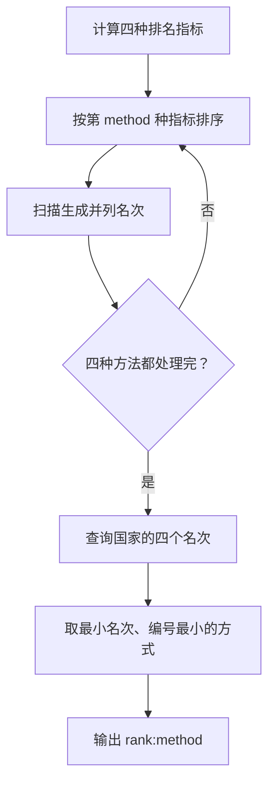
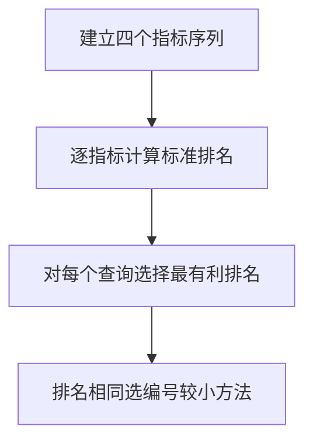

## 7-40 奥运排行榜

- **分值：** 25分

## 题目描述

每年奥运会各大媒体都会公布一个排行榜，但是细心的读者发现，不同国家的排行榜略有不同。比如中国金牌总数列第一的时候，中国媒体就公布“金牌榜”；而美国的奖牌总数第一，于是美国媒体就公布“奖牌榜”。如果人口少的国家公布一个“国民人均奖牌榜”，说不定非洲的国家会成为榜魁…… 现在就请你写一个程序，对每个前来咨询的国家按照对其最有利的方式计算它的排名。

## 输入格式

输入的第一行给出两个正整数$$N$$和$$M$$（$$\le 224$$，因为世界上共有224个国家和地区），分别是参与排名的国家和地区的总个数、以及前来咨询的国家的个数。为简单起见，我们把国家从0 ~ $$N-1$$编号。之后有$$N$$行输入，第$$i$$行给出编号为$$i-1$$的国家的金牌数、奖牌数、国民人口数（单位为百万），数字均为[0,1000]区间内的整数，用空格分隔。最后面一行给出$$M$$个前来咨询的国家的编号，用空格分隔。

## 输出格式

在一行里顺序输出前来咨询的国家的`排名:计算方式编号`。其排名按照对该国家最有利的方式计算；计算方式编号为：金牌榜=1，奖牌榜=2，国民人均金牌榜=3，国民人均奖牌榜=4。输出间以空格分隔，输出结尾不能有多余空格。

若某国在不同排名方式下有相同名次，则输出编号最小的计算方式。

## 输入样例
```
4 4
51 100 1000
36 110 300
6 14 32
5 18 40
0 1 2 3
```

## 输出样例
```
1:1 1:2 1:3 1:4
```

## 解题思路

对每个国家计算四种排名指标，并按该指标对全部国家排序。名次为前面严格更优国家数加 1；查询国家选择四种名次中的最小值，若并列则选编号最小的方式。

## 代码流程说明

1. 读取题目要求的输入并建立必要的数据结构。
2. 按上述算法处理数据，维护中间结果和边界条件。
3. 按题目规定的顺序与格式输出结果。

## 代码实现

```java
// 实现原理：对每个国家计算四种排名指标，并按该指标对全部国家排序。名次为前面严格更优国家数加 1；查询国家选择四种名次中的最小值，若并列则选编号最小的方式。
static int[][] ranks(int[][] country) {
  int n = country.length;
  int[][] rank = new int[n][4];
  for (int method = 0; method < 4; method++) {
    Integer[] order = new Integer[n];
    for (int i = 0; i < n; i++) order[i] = i;
    final int k = method;
    // 先按题目要求排序，使后续扫描或贪心选择保持正确顺序。
    // 先按题目要求排序，使后续扫描或贪心选择保持正确顺序。
// 先按题目要求排序，使后续扫描或贪心选择保持正确顺序。
// 先按题目要求排序，使后续扫描或贪心选择保持正确顺序。
    Arrays.sort(order, (a, b) -> compareValue(country, b, a, k));
    for (int i = 0; i < n; i++)
      rank[order[i]][method] =
          i > 0 && compareValue(country, order[i], order[i - 1], k) == 0
              ? rank[order[i - 1]][method]
              : i + 1;
  }
  return rank;
}

static int compareValue(int[][] c, int a, int b, int method) {
  if (method == 0) return Integer.compare(c[a][0], c[b][0]);
  if (method == 1) return Integer.compare(c[a][1], c[b][1]);
  long left = (long) c[a][method == 2 ? 0 : 1] * c[b][2];
  long right = (long) c[b][method == 2 ? 0 : 1] * c[a][2];
  return Long.compare(left, right);
}
```
## 代码流程图



## 解题流程图



## 复杂度分析

四种排名各排序一次，时间 O(4N log N)，空间 O(N)。

## 常见易错点

- 人均指标应比较交叉乘积而不是比较浮点数；排名相等时名次相同；选择“最有利”是最小名次，不是最大指标；方式编号从 1 开始。
- 输入规模较大时，应选择与数据范围匹配的复杂度和数值类型。
- 输出分隔符、换行和特殊结果必须严格遵循题目格式。
