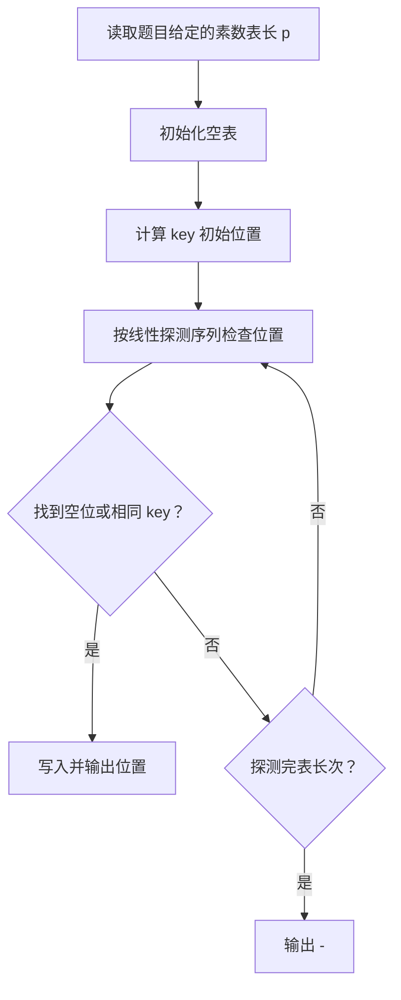
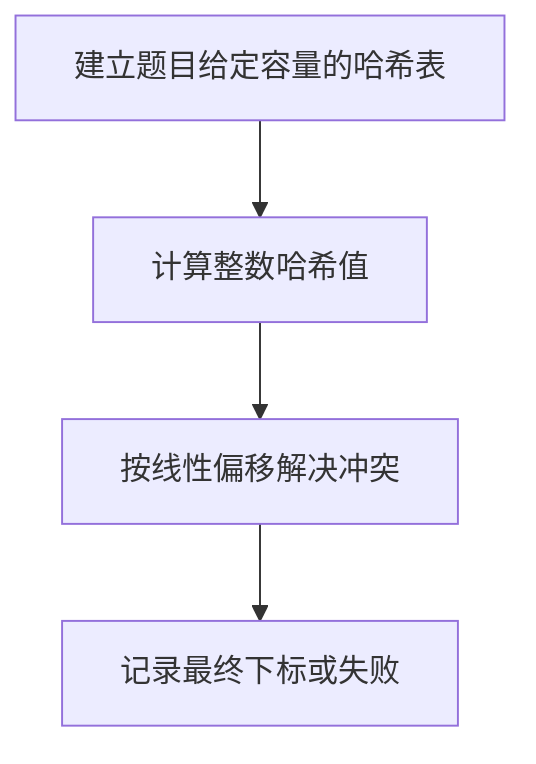

## 7-42 整型关键字的散列映射

- **分值：** 25分

## 题目描述

给定一系列整型关键字和素数 $p$，用除留余数法定义的散列函数 $H(key) = key \% p$ 将关键字映射到长度为 $p$ 的散列表中。用线性探测法解决冲突。

## 输入格式

输入第一行首先给出两个正整数 $n$（$\le 1000$）和 $p$（$\ge n$ 的最小素数），分别为待插入的关键字总数、以及散列表的长度。第二行给出 $n$ 个整型关键字。数字间以空格分隔。

## 输出格式

在一行内输出每个整型关键字在散列表中的位置。数字间以空格分隔，但行末尾不得有多余空格。

## 输入样例
```
4 5
24 15 61 88
```

## 输出样例
```
4 0 1 3
```

## 解题思路

使用开放定址法建立哈希表。初始散列位置为 `key % TableSize`，冲突时按线性探测依次检查后继位置，找到空位即插入。

## 代码流程说明

1. 读取题目要求的输入并建立必要的数据结构。
2. 按上述算法处理数据，维护中间结果和边界条件。
3. 按题目规定的顺序与格式输出结果。

## 代码实现

```java
// 实现原理：使用开放定址法建立哈希表。初始散列位置为 key % TableSize，冲突时按线性探测依次检查后继位置，找到空位即插入。
static int insertInteger(Integer[] table, int key) {
  int size = table.length, h = Math.floorMod(key, size);
  for (int step = 0; step < size; step++) {
    int pos = (h + step) % size;
    if (table[pos] == null || table[pos] == key) {
      table[pos] = key;
      return pos;
    }
  }
  return -1;
}
```
## 代码流程图



## 解题流程图



## 复杂度分析

每个关键字最多探测 p 次，时间 O(n·p)，空间 O(p)。

## 常见易错点

- 表大小由题目给出且为素数；负模要规范化（本题通常为非负键）；线性探测顺序和输出位置要符合题目规定；不能把重复键当成新元素。
- 输入规模较大时，应选择与数据范围匹配的复杂度和数值类型。
- 输出分隔符、换行和特殊结果必须严格遵循题目格式。
