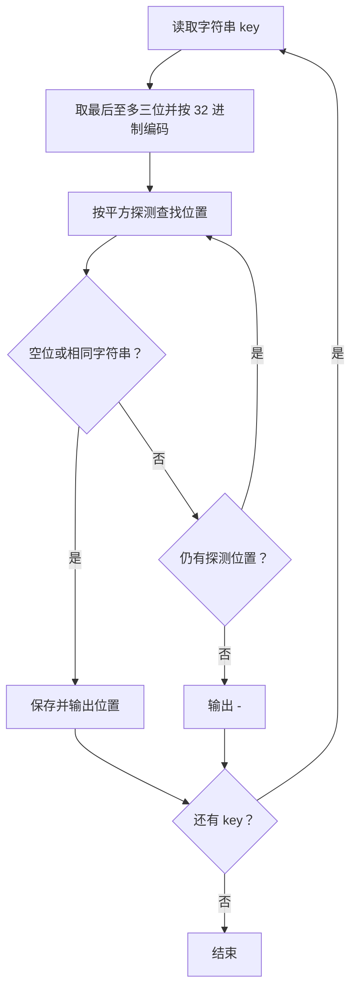
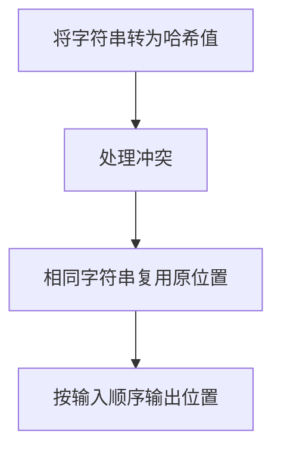

# 7-43 字符串关键字的散列映射

- **分值：** 25分

## 题目描述

给定一系列由大写英文字母组成的字符串关键字和素数$$P$$，用移位法定义的散列函数$$H(Key)$$将关键字$$Key$$中的最后3个字符映射为整数，每个字符占5位；再用除留余数法将整数映射到长度为$$P$$的散列表中。例如将字符串`AZDEG`插入长度为1009的散列表中，我们首先将26个大写英文字母顺序映射到整数0~25；再通过移位将其映射为$$3\times 32^2 + 4 \times 32 + 6 = 3206$$；然后根据表长得到$$3206 \% 1009 = 179$$，即是该字符串的散列映射位置。

发生冲突时请用平方探测法解决。

## 输入格式

输入第一行首先给出两个正整数$$N$$（$$\le 500$$）和$$P$$（$$\ge 2N$$的最小素数），分别为待插入的关键字总数、以及散列表的长度。第二行给出$$N$$个字符串关键字，每个长度不超过8位，其间以空格分隔。

## 输出格式

在一行内输出每个字符串关键字在散列表中的位置。数字间以空格分隔，但行末尾不得有多余空格。

## 输入样例1
```
4 11
HELLO ANNK ZOE LOLI
```

## 输出样例1
```
3 10 4 0
```

## 输入样例2
```
6 11
LLO ANNA NNK ZOJ INNK AAA
```

## 输出样例2
```
3 0 10 9 6 1
```

### 解题思路

对字符串计算多项式哈希，再使用平方探测解决冲突。按照题意将字符映射为权值并累加，取模得到初始位置；依次探测空位，输出插入位置或 `-`。

### 代码流程说明

1. 读取题目要求的输入并建立必要的数据结构。
2. 按上述算法处理数据，维护中间结果和边界条件。
3. 按题目规定的顺序与格式输出结果。

### 代码实现

```java
// 实现原理：对字符串计算多项式哈希，再使用平方探测解决冲突。按照题意将字符映射为权值并累加，取模得到初始位置；依次探测空位，输出插入位置或 -。
static int stringHash(String s, int size) {
  int begin = Math.max(0, s.length() - 3);
  long value = 0;
  for (int i = begin; i < s.length(); i++) value = value * 32 + (s.charAt(i) - 'A');
  return (int) (value % size);
}

static int insertString(String[] table, String key) {
  int h = stringHash(key, table.length);
  for (int k = 0; k < table.length; k++) {
    int step = (k + 1) / 2;
    if ((k & 1) == 0) step = -step;
    int pos = Math.floorMod(h + step * step, table.length);
    if (table[pos] == null || table[pos].equals(key)) {
      table[pos] = key;
      return pos;
    }
  }
  return -1;
}
```
### 代码流程图



### 解题流程图



### 复杂度分析

每个关键字哈希 O(|key|)，冲突探测最坏 O(P)，空间 O(P)。

### 常见易错点

- 哈希计算中的字符权值和乘法顺序不能写错；表大小取素数；探测下标要取模并处理负值；重复字符串应复用原位置。
- 输入规模较大时，应选择与数据范围匹配的复杂度和数值类型。
- 输出分隔符、换行和特殊结果必须严格遵循题目格式。
