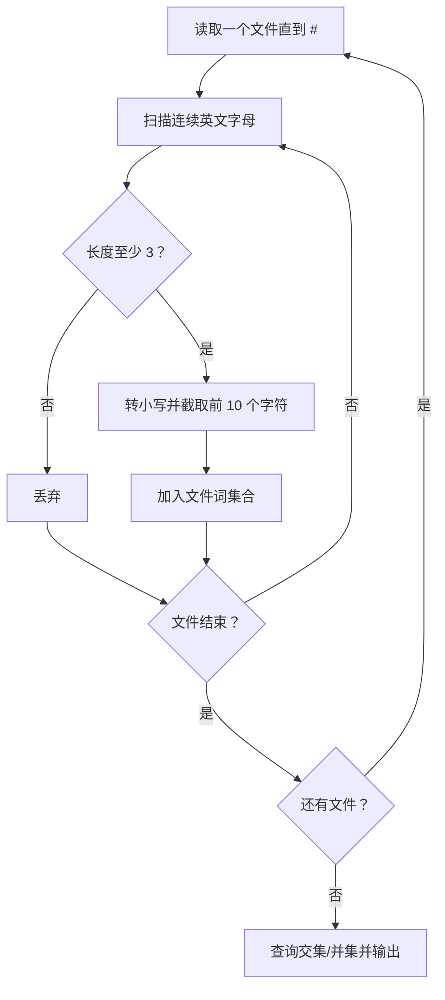
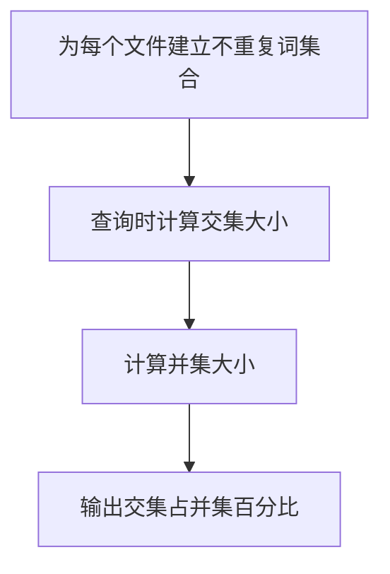

## 7-44 基于词频的文件相似度

- **分值：** 30分

## 题目描述

实现一种简单原始的文件相似度计算，即以两文件的公共词汇占总词汇的比例来定义相似度。为简化问题，这里不考虑中文（因为分词太难了），只考虑长度不小于3、且不超过10的英文单词，长度超过10的只考虑前10个字母。

## 输入格式

输入首先给出正整数N（\le 100），为文件总数。随后按以下格式给出每个文件的内容：首先给出文件正文，最后在一行中只给出一个字符`#`，表示文件结束。在N个文件内容结束之后，给出查询总数M（\le 10^4），随后M行，每行给出一对文件编号，其间以空格分隔。这里假设文件按给出的顺序从1到N编号。

## 输出格式

针对每一条查询，在一行中输出两文件的相似度，即两文件的公共词汇量占两文件总词汇量的百分比，精确到小数点后1位。注意这里的一个“单词”只包括仅由英文字母组成的、长度不小于3、且不超过10的英文单词，长度超过10的只考虑前10个字母。单词间以任何非英文字母隔开。另外，大小写不同的同一单词被认为是相同的单词，例如“You”和“you”是同一个单词。

## 输入样例
```
3
Aaa Bbb Ccc
##
Bbb Ccc Ddd
##
Aaa2 ccc Eee
is at Ddd@Fff
##
2
1 2
1 3
```

## 输出样例
```
50.0%
33.3%
```

## 解题思路

每个文件只保存出现过的不同单词集合。扫描正文时按连续英文字母分词，转小写并截取前 10 个字符；查询时求两个集合交集大小和并集大小，按 `交集/并集` 计算百分比。

## 代码流程说明

1. 读取题目要求的输入并建立必要的数据结构。
2. 按上述算法处理数据，维护中间结果和边界条件。
3. 按题目规定的顺序与格式输出结果。

## 代码实现

```java
// 实现原理：每个文件只保存出现过的不同单词集合。扫描正文时按连续英文字母分词，转小写并截取前 10 个字符；查询时求两个集合交集大小和并集大小，按 交集/并集 计算百分比。
static Set<String> words(String text) {
  Set<String> result = new HashSet<>();
  int i = 0;
  while (i < text.length()) {
    while (i < text.length() && !isEnglishLetter(text.charAt(i))) i++;
    int begin = i;
    while (i < text.length() && isEnglishLetter(text.charAt(i))) i++;
    if (i - begin >= 3) {
      String word = text.substring(begin, i).toLowerCase(Locale.ROOT);
      result.add(word.substring(0, Math.min(10, word.length())));
    }
  }
  return result;
}

static boolean isEnglishLetter(char c) {
  return c >= 'A' && c <= 'Z' || c >= 'a' && c <= 'z';
}

static double similarity(Set<String> a, Set<String> b) {
  Set<String> common = new HashSet<>(a);
  common.retainAll(b);
  Set<String> union = new HashSet<>(a);
  union.addAll(b);
  return union.isEmpty() ? 0.0 : 100.0 * common.size() / union.size();
}
```
## 代码流程图



## 解题流程图



## 复杂度分析

设文本总长度为 L，词集合构建时间 O(L)，空间 O(W)，W 为不同词数。

## 常见易错点

- 单词按字母连续片段提取；大小写要统一；长度超过 10 只保留前 10 个字符；相似度分母是并集而非两个集合大小之和。
- 输入规模较大时，应选择与数据范围匹配的复杂度和数值类型。
- 输出分隔符、换行和特殊结果必须严格遵循题目格式。
