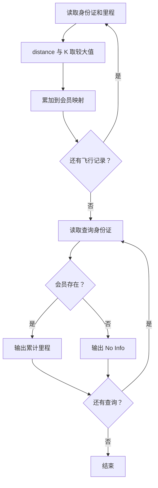
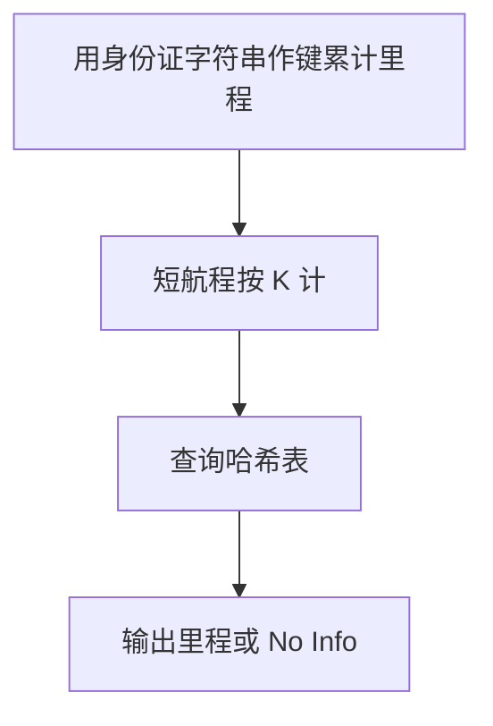

## 7-45 航空公司VIP客户查询

- **分值：** 25分

## 题目描述

不少航空公司都会提供优惠的会员服务，当某顾客飞行里程累积达到一定数量后，可以使用里程积分直接兑换奖励机票或奖励升舱等服务。现给定某航空公司全体会员的飞行记录，要求实现根据身份证号码快速查询会员里程积分的功能。

## 输入格式

输入首先给出两个正整数$$N$$（$$\le 10^5$$）和$$K$$（$$\le 500$$）。其中$$K$$是最低里程，即为照顾乘坐短程航班的会员,航空公司还会将航程低于$$K$$公里的航班也按$$K$$公里累积。随后$$N$$行，每行给出一条飞行记录。飞行记录的输入格式为：`18位身份证号码（空格）飞行里程`。其中身份证号码由17位数字加最后一位校验码组成，校验码的取值范围为0~9和x共11个符号；飞行里程单位为公里，是(0, 15 000]区间内的整数。然后给出一个正整数$$M$$（$$\le 10^5$$），随后给出$$M$$行查询人的身份证号码。

## 输出格式

对每个查询人，给出其当前的里程累积值。如果该人不是会员，则输出`No Info`。每个查询结果占一行。

## 输入样例
```
4 500
330106199010080419 499
110108198403100012 15000
120104195510156021 800
330106199010080419 1
4
120104195510156021
110108198403100012
330106199010080419
33010619901008041x
```

## 输出样例
```
800
15000
1000
No Info
```

## 解题思路

用哈希表按身份证号累计里程。每条航程计入 `max(distance,K)`，查询时直接查表；不存在的身份证号输出 `No Info`。

## 代码流程说明

1. 读取题目要求的输入并建立必要的数据结构。
2. 按上述算法处理数据，维护中间结果和边界条件。
3. 按题目规定的顺序与格式输出结果。

## 代码实现

```java
// 实现原理：用哈希表按身份证号累计里程。每条航程计入 max(distance,K)，查询时直接查表；不存在的身份证号输出 No Info。
static Map<String, Long> mileage(List<String[]> records, int k) {
  Map<String, Long> result = new HashMap<>();
  for (String[] r : records) {
    long distance = Math.max(Long.parseLong(r[1]), k);
    result.merge(r[0], distance, Long::sum);
  }
  return result;
}
```
## 代码流程图



## 解题流程图



## 复杂度分析

建表和查询期望时间 O(N+M)，空间 O(U)，U 为会员数。

## 常见易错点

- 身份证号码必须作为字符串保存以保留末位 x；每一条航程都至少按 K 计；同一会员的多条记录要累加。
- 输入规模较大时，应选择与数据范围匹配的复杂度和数值类型。
- 输出分隔符、换行和特殊结果必须严格遵循题目格式。
