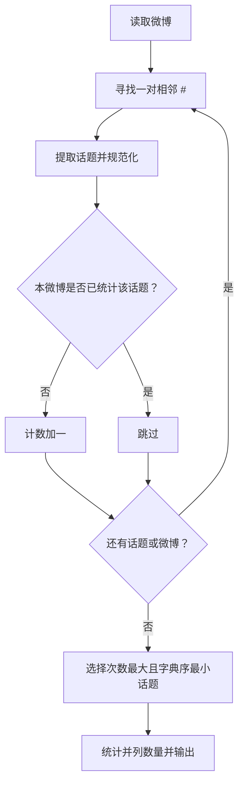
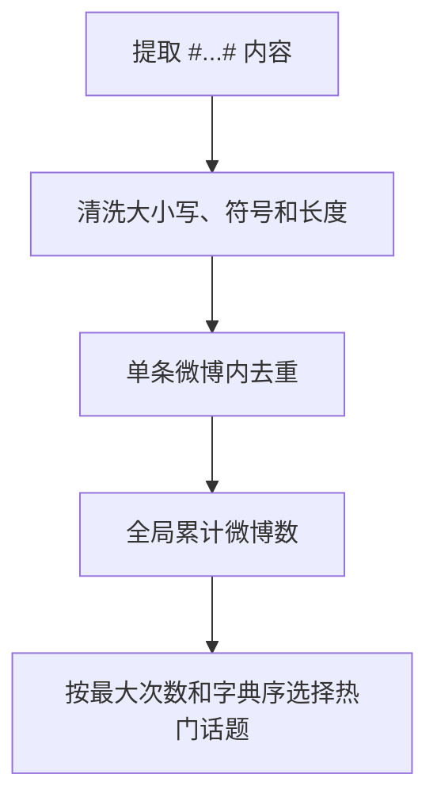

## 7-46 新浪微博热门话题

- **分值：** 30分

## 题目描述

新浪微博可以在发言中嵌入“话题”，即将发言中的话题文字写在一对“#”之间，就可以生成话题链接，点击链接可以看到有多少人在跟自己讨论相同或者相似的话题。新浪微博还会随时更新热门话题列表，并将最热门的话题放在醒目的位置推荐大家关注。

本题目要求实现一个简化的热门话题推荐功能，从大量英文（因为中文分词处理比较麻烦）微博中解析出话题，找出被最多条微博提到的话题。

## 输入格式

输入说明：输入首先给出一个正整数 $n$（$\le 10^5$），随后 $n$ 行，每行给出一条英文微博，其长度不超过 140 个字符。任何包含在一对最近的“#”中的内容均被认为是一个话题，如果长度超过40个字符，则只保留前40个字符。输入保证“#”成对出现。

## 输出格式

第一行输出被最多条微博提到的话题，第二行输出其被提到的微博条数。如果这样的话题不唯一，则输出按字母序最小的话题，并在第三行输出 `And k more ...`，其中 `k` 是另外几条热门话题的条数。输入保证至少存在一条话题。

注意：两条话题被认为是相同的，如果在去掉所有非英文字母和数字的符号、并忽略大小写区别后，它们是相同的字符串；同时它们有完全相同的分词。输出时除首字母大写外，只保留小写英文字母和数字，并用一个空格分隔原文中的单词。

## 输入样例
```
4
This is a #test of topic#.
Another #Test of topic.#
This is a #Hot# #Hot# topic
Another #hot!# #Hot# topic
```

## 输出样例
```
Hot
2
And 1 more ...
```

## 解题思路

解析每条微博中成对 `#` 之间的内容。对话题清洗：只保留英文字母和数字，转小写并按单词规范化；同一条微博内重复话题只计一次。统计规范化话题到出现微博数的映射，并按出现次数最大、规范化文本字典序最小选择答案。

## 代码流程说明

1. 读取题目要求的输入并建立必要的数据结构。
2. 按上述算法处理数据，维护中间结果和边界条件。
3. 按题目规定的顺序与格式输出结果。

## 代码实现

```java
// 实现原理：解析每条微博中成对 # 之间的内容。对话题清洗：只保留英文字母和数字，转小写并按单词规范化；同一条微博内重复话题只计一次。统计规范化话题到出现微博数的映射，并按出现次数
// 最大、规范化文本字典序最小选择答案。
static String normalizeTopic(String raw) {
  StringBuilder s = new StringBuilder();
  for (String word : raw.split("[^A-Za-z0-9]+")) {
    if (word.isEmpty()) continue;
    if (s.length() > 0) s.append(' ');
    s.append(word.toLowerCase(Locale.ROOT));
  }
  if (s.length() > 40) s.setLength(40);
  if (s.length() == 0) return "";
  s.setCharAt(0, Character.toUpperCase(s.charAt(0)));
  return s.toString();
}

static class TopicResult {
  String topic;
  int count;
  int tied;
}

static TopicResult countTopics(List<String> posts) {
  Map<String, Integer> count = new HashMap<>();
  for (String post : posts) {
    Set<String> once = new HashSet<>();
    int p = 0;
    while ((p = post.indexOf('#', p)) >= 0) {
      int q = post.indexOf('#', p + 1);
      String topic = normalizeTopic(post.substring(p + 1, q));
      if (!topic.isEmpty() && once.add(topic)) count.merge(topic, 1, Integer::sum);
      p = q + 1;
    }
  }
  TopicResult result = new TopicResult();
  for (Map.Entry<String, Integer> e : count.entrySet()) {
    if (e.getValue() > result.count
        || e.getValue() == result.count
            && (result.topic == null || e.getKey().compareTo(result.topic) < 0)) {
      result.topic = e.getKey();
      result.count = e.getValue();
    }
  }
  for (int value : count.values()) if (value == result.count) result.tied++;
  if (result.tied > 0) result.tied--;
  return result;
}
```
## 代码流程图



## 解题流程图



## 复杂度分析

设微博总字符数为 L，解析和统计时间 O(L)，空间 O(U)，U 为不同话题数。

## 常见易错点

- 同一微博重复出现不能重复计数；比较的是规范化后的内容；输出首字母大写、其余按题意小写并以空格分词；要统计并列热门话题数量。
- 输入规模较大时，应选择与数据范围匹配的复杂度和数值类型。
- 输出分隔符、换行和特殊结果必须严格遵循题目格式。
