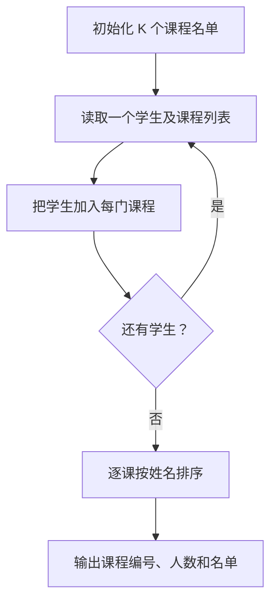
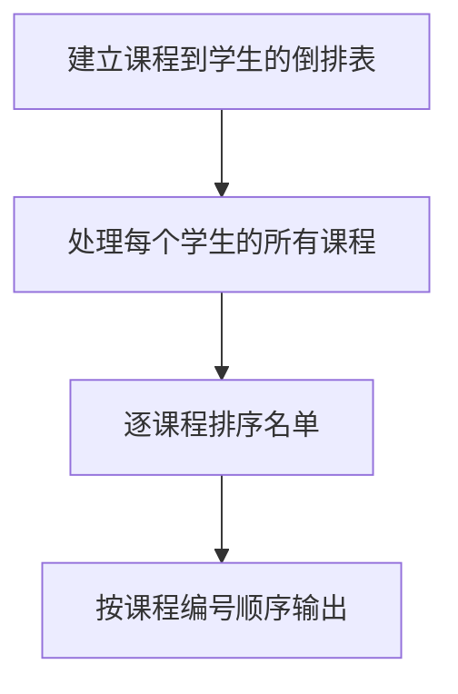

# 7-47 打印选课学生名单

- **分值：** 25分

## 题目描述

假设全校有最多40000名学生和最多2500门课程。现给出每个学生的选课清单，要求输出每门课的选课学生名单。

## 输入格式

输入的第一行是两个正整数：N（$$\le$$40000），为全校学生总数；K（$$\le$$2500），为总课程数。此后N行，每行包括一个学生姓名（3个大写英文字母+1位数字）、一个正整数C（$$\le$$20）代表该生所选的课程门数、随后是C个课程编号。简单起见，课程从1到K编号。

## 输出格式

顺序输出课程1到K的选课学生名单。格式为：对每一门课，首先在一行中输出课程编号和选课学生总数（之间用空格分隔），之后在第二行按字典序输出学生名单，每个学生名字占一行。

## 输入样例
```
10 5
ZOE1 2 4 5
ANN0 3 5 2 1
BOB5 5 3 4 2 1 5
JOE4 1 2
JAY9 4 1 2 5 4
FRA8 3 4 2 5
DON2 2 4 5
AMY7 1 5
KAT3 3 5 4 2
LOR6 4 2 4 1 5
```

## 输出样例
```
1 4
ANN0
BOB5
JAY9
LOR6
2 7
ANN0
BOB5
FRA8
JAY9
JOE4
KAT3
LOR6
3 1
BOB5
4 7
BOB5
DON2
FRA8
JAY9
KAT3
LOR6
ZOE1
5 9
AMY7
ANN0
BOB5
DON2
FRA8
JAY9
KAT3
LOR6
ZOE1
```

### 解题思路

建立“课程 → 学生名单”的倒排表。读取每位学生的课程编号并加入相应列表，最后对每门课的名单按字典序排序后输出。

### 代码流程说明

1. 读取题目要求的输入并建立必要的数据结构。
2. 按上述算法处理数据，维护中间结果和边界条件。
3. 按题目规定的顺序与格式输出结果。

### 代码实现

```java
static Map<Integer, List<String>> studentsByCourse(
        List<String[]> selections, int courseCount) {
    Map<Integer, List<String>> result = new HashMap<>();
    for (int i = 1; i <= courseCount; i++) result.put(i, new ArrayList<>());
    for (String[] row : selections) {
        String name = row[0];
        for (int i = 1; i < row.length; i++)
            result.get(Integer.parseInt(row[i])).add(name);
    }
    for (List<String> names : result.values()) Collections.sort(names);
    return result;
}
```
### 代码流程图



### 解题流程图



### 复杂度分析

设选课记录总数为 S，加入名单 O(S)，名单排序总时间为各课程排序开销之和，空间 O(S+K)。

### 常见易错点

- 学生姓名不能误当课程编号；课程要按 1 到 K 输出，即使人数为 0；名单排序和输出格式要严格遵守题面。
- 输入规模较大时，应选择与数据范围匹配的复杂度和数值类型。
- 输出分隔符、换行和特殊结果必须严格遵循题目格式。
